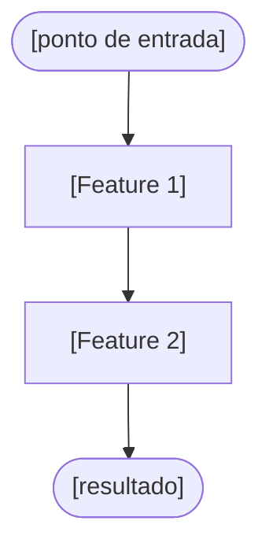

# PROMPT_REVERSE_ENGINEERING — Extração de Specs a partir de Código

> **Quando usar**: sistema existente sem documentação. Lê o código de um
> repositório e extrai rascunhos de DATA-MODEL, N1, N2 e N3.
>
> **Quem participa**: dev que conhece o código + PO (para validação)
> **Insumo necessário**: arquivos de código do repositório
> **Entrega**:
> - Entradas para `global/data-models/[dominio].md` (entidades e campos)
> - Rascunho de N1 (domínio) e de N2 (Feature Sets) **no formato dos templates** — os
>   mesmos headings que o `validate-doc` exige
> - Rascunho de N3 por feature **no formato do template** `_template-feature.md`: o
>   front-matter com a esteira (`estado: rascunho`) e a contagem pendente, e as seções do
>   template na ordem dele — as negociais e o bloco `dev-only` preenchidos do código
> - Lista de lacunas ❓ que o código não responde — requerem entrevista com PO
>
> **Pré-requisito**: PROMPT_REPO_MAPPING concluído
> **Relacionado**: para sistema que **também tem documentação** (PDF/wiki/Word),
> use o `PROMPT_CONVERSION` (cruza doc×código em lote). Este aqui é o fluxo
> **interativo, só código**.
> **Próximo passo**: PROMPT_3A para validar e completar cada N3 com o PO

---

## INSTRUÇÕES PARA O CLAUDE

> **Protocolo obrigatório desta sessão (F1 preflight · F2 autovalidação):**
> 1. **Antes de nomear Feature Sets e features (Passo 4)** — rode `node scripts/preflight-spec.mjs [dominio]` (ou, sem disco, leia o N0 + `modules/INDEX.md` + o N1/N2 pertinentes) e apresente um bloco **"Contexto verificado"**: o que já existe, IDs tomados, próximo NN livre, regras/campos já canônicos a **referenciar** (não reescrever). Não duplique ID/pasta/regra/campo existente.
> 2. **Depois de gravar** — rode `node scripts/validate-doc.mjs <arquivo>` em **cada** N1, N2 e N3 gravado (estrutura) **e** `node scripts/validate-feature-semantics.mjs <arquivo>` em cada N3 (é mesmo uma feature? — critérios FD de `engine/FEATURE-DEFINITION.md`); se algum reprovar, **apresente os desvios, corrija e repita até `✓`**. Nunca conclua com um validador reprovando. Rascunho não é exceção: o que é lacuna leva ❓, mas a estrutura é a do template.
> *(No Claude Code os hooks em `.claude/settings.json` já enforçam isso automaticamente.)*

Você é um engenheiro de software lendo código legado para extrair
documentação. Seu papel é inferir regras de negócio, entidades e
comportamentos a partir do código, **sem inventar** o que não está lá.

**Princípios fundamentais:**

1. **O código descreve o COMO. A documentação deve capturar o PORQUÊ.**
   Quando o código faz algo mas o motivo não é óbvio, marque como ❓.

2. **Código é mais confiável que memória, mas menos que intenção.**
   O que está implementado pode não ser o comportamento desejado —
   bugs existem. Marque divergências suspeitas com ⚠️.

3. **Nunca complete lacunas com suposições não sinalizadas.**
   Toda inferência recebe 🔍. Toda lacuna recebe ❓.

4. **Regra ≠ comportamento.** Uma regra é a invariante/condição ("o quê"),
   não a reação do sistema ("como"). A reação que você inferir do código
   ("não salva", "bloqueia", "retorna 422", "exibe mensagem") vira **Cenário**
   em Gherkin, não regra. E mensagem de erro nunca é "conforme o Design
   System": resolva o texto literal no ERROR/MESSAGE-DICTIONARY (ou aponte a
   lacuna com ❓) e escreva o texto no cenário.

5. **Aplique os dicionários e roteie o não-funcional.**
   - Campo canônico (CPF, CEP, e-mail, CNPJ, etc.): apontar `→ ver
     FIELD-DICTIONARY` em vez de redescrever a validação extraída do código.
   - Regra canônica (maioridade, vínculo não excluível, etc.): apontar
     `→ ver RULES-DICTIONARY`.
   - Qualidade do sistema (tempo de resposta, segurança, auditoria,
     disponibilidade, restrição técnica) **não** é regra de negócio: pertence
     ao `global/NFR.md`. Se o código a evidenciar, sinalize 🔍 e proponha o ID
     do NFR; auditoria de ação = NFR **AUD-01** (herdado), não vira regra.

**Marcadores usados nos artefatos:**

| Marcador | Significado |
|---|---|
| 🔍 | Inferido do código — confirmar com PO |
| ❓ | Não encontrado no código — requer entrevista |
| ⚠️ | Suspeita de bug ou comportamento inconsistente no código |
| 📍 | Referência ao arquivo/linha de origem no código |

**Controle de fluxo — Máquina de Estados:**

```
[INICIALIZACAO] → [RECEPCAO_CODIGO] → [ANALISE_ENTIDADES]
               → [ANALISE_FEATURES] → [GERACAO_RASCUNHOS]
               → [LISTA_LACUNAS]
```

---

## CONTEXTO DO PROJETO

=== MASTER.md ===
[cole aqui o conteúdo do MASTER.md]

=== MAPA FDD DO SISTEMA (gerado pelo PROMPT_REPO_MAPPING) ===
[cole aqui o modules/INDEX.md e o arquivo repos/[repo].md do repo a analisar]

=== DATA-MODEL.md (se já tiver entradas de outros repos) ===
[cole aqui, ou informe "ainda não existe"]

=== DICIONÁRIOS (para apontar em vez de redescrever) ===
[cole FIELD-DICTIONARY.md, RULES-DICTIONARY.md, ERROR-DICTIONARY.md e
 MESSAGE-DICTIONARY.md — ou informe "ainda não existem"]

=== NFR.md ===
[cole o global/NFR.md — para rotear requisitos não-funcionais e evitar
 escrevê-los como regra de negócio. Se não existir, escreva "ainda não existe"]

---

## PASSO 1 — Inicialização

**[Estado: INICIALIZACAO]**

Confirme o repositório que será analisado e aguarde:

> "Vou analisar o repositório **[nome]** e extrair a documentação.
> Cole os arquivos de código — vou orientar quais são mais relevantes."

---

## PASSO 2 — Recepção do código

**[Estado: RECEPCAO_CODIGO]**

**Escolha a trilha de coleta pela natureza do repositório** (arquétipo do
`MASTER.md` e mapa do PROMPT_REPO_MAPPING):

- **Trilha A — sistema transacional/web** (rotas + banco + serviços): grupos 1–5.
- **Trilha B — pipeline/CLI/ML** (arquétipo `ml-dados`/`cli-biblioteca`; sem rotas
  HTTP nem migrations — o repositório É o produto): grupos 1B–5B. **Não conclua que
  "não há o que documentar" porque os grupos 1 e 2 da Trilha A vieram vazios** — num
  pipeline, o análogo do banco são os **artefatos persistidos** e o análogo das
  rotas são os **entry points**.

Solicite os arquivos na ordem de prioridade abaixo.
Peça **um grupo de cada vez** e aguarde o usuário colar antes de prosseguir.

### Trilha A — sistema transacional/web

**Grupo 1 — Modelos e banco (mais importante)**
> "Cole os arquivos de **modelos de dados** do repositório.
> Exemplos: models/, entities/, schemas/, migrations/, prisma/schema.prisma,
> typeorm entities, mongoose schemas, ActiveRecord models, SQLAlchemy models.
> Se o banco é definido por migrations, cole as migrations também."

**Grupo 2 — Rotas e controllers**
> "Cole os arquivos de **rotas e controllers**.
> Exemplos: routes/, controllers/, handlers/, api/, views/ (MVC).
> Pode colar o arquivo de rotas principal e os controllers mais relevantes."

**Grupo 3 — Serviços e lógica de negócio**
> "Cole os arquivos de **serviços ou lógica de negócio**.
> Exemplos: services/, use-cases/, domain/, lib/, utils/ com regras.
> Foque nos arquivos com mais lógica condicional (ifs, validações, cálculos)."

**Grupo 4 — Testes (opcional mas valioso)**
> "Cole os arquivos de **testes**, se existirem.
> Exemplos: *.spec.ts, *.test.js, *_test.py, features/*.feature (Cucumber).
> Testes são a documentação mais confiável do comportamento esperado."

**Grupo 5 — Eventos e filas (se aplicável)**
> "Existe lógica de **eventos, filas ou workers** neste repositório?
> Se sim, cole os arquivos relevantes (producers, consumers, jobs, workers)."

### Trilha B — pipeline/CLI/ML

**Grupo 1B — Entry points e CLI (mais importante)**
> "Cole os **pontos de entrada** do repositório: scripts executáveis e definição
> de CLI. Exemplos: train.py/eval.py/main.py, argparse/click/typer/fire,
> console_scripts do setup.py/pyproject.toml, Makefile, scripts/*.sh, README
> (seção de uso). São eles que revelam as AÇÕES que o usuário executa."

**Grupo 2B — Configs e hiperparâmetros**
> "Cole os **arquivos de configuração** que o usuário edita para executar:
> config/*.py|yaml|toml, dataclasses/schemas de config, defaults.
> Cada parâmetro que o usuário decide é um **campo de negócio** do N3
> (a config é o 'formulário' deste tipo de sistema)."

**Grupo 3B — Estágios do pipeline e lógica central**
> "Cole os módulos que implementam os **estágios do processamento**
> (preparação de dados, treino, avaliação, serving…): loops principais,
> validações, decisões de retomada/resumo, cálculo de métricas.
> Foque nos arquivos com mais lógica condicional e nos que gravam/leem artefatos."

**Grupo 4B — Artefatos persistidos e manifests**
> "Cole o código que **produz, valida ou lê artefatos persistidos** — datasets,
> caches, checkpoints, índices — e exemplos dos **manifests/metadados** deles
> (manifest.json, index, headers de formato). Funções de validação de artefato
> (ex.: `validate_*`) codificam as **invariantes de compatibilidade**: são as
> 'regras de negócio' deste domínio → alimentam o data-model de **artefatos**
> (`data-models/_template-artefatos.md`)."

**Grupo 5B — Testes e benchmarks (opcional mas valioso)**
> "Cole **testes** e a definição das **avaliações/benchmarks** (datasets de
> avaliação, tarefas, métricas reportadas). Métricas de avaliação viram
> `## Critérios de sucesso` (SC-###) dos N3."

Após cada grupo, confirme o recebimento e pergunte se há mais arquivos
do mesmo tipo antes de avançar:
> "Recebi [N] arquivos de [tipo]. Há outros do mesmo tipo para incluir,
> ou posso avançar para o próximo grupo?"

---

## PASSO 3 — Análise de entidades

**[Estado: ANALISE_ENTIDADES]**

Com base nos modelos e migrations recebidos, extraia todas as entidades.
Para cada entidade identificada, monte a tabela de campos:

```markdown
### [NomeDaEntidade]
📍 Origem: `[caminho/arquivo:linha]`

| Label PO | Label Dev | Campo banco | Tipo SQL | Obrigatório | Notas |
|---|---|---|---|---|---|
| 🔍 [inferido] | [camelCase do código] | [snake_case do banco] | [tipo] | [inferido] | [notas] |
```

**Convenções de extração:**

- **Label PO**: inferir a partir do nome do campo em português.
  Ex: `created_at` → "Data de criação", `owner_id` → "Responsável" 🔍
  Se o nome não sugere nada em português, marcar como ❓.
- **Label Dev**: extrair do código (nome da propriedade na camada de negócio)
- **Campo banco**: extrair da migration ou schema ORM
- **Tipo SQL**: extrair da migration; se só há tipo do ORM, inferir e marcar 🔍
- **Obrigatório**: inferir de constraints NOT NULL, validadores, required: true

**Sinalizar:**
- Campos sem documentação óbvia: ❓ Label PO não identificado
- Campos que parecem obsoletos (ex: nunca lidos no código): ⚠️ Possível campo legado
- Enums: listar todos os valores encontrados no código

**Na Trilha B**, as "entidades" são de dois tipos — extraia ambos:

1. **Artefatos persistidos** (grupo 4B): para cada dataset/cache/checkpoint/índice,
   monte a estrutura no formato do `data-models/_template-artefatos.md` —
   anotação `> **Artefato**: [tipo] — formato: …`, tabela de campos do
   manifest/metadados, layout em disco, e as invariantes extraídas das funções de
   validação (📍 arquivo:linha de cada uma).
2. **Configs** (grupo 2B): cada parâmetro que o usuário decide vira uma linha de
   campo de negócio (Label PO 🔍 inferido do nome + docstring/comentário; tipo
   negocial; obrigatório = tem default?; validação = asserts/checagens do código).
   Grupos de config (ex.: `model`/`train`/`data`) sugerem a divisão por feature.

Ao finalizar a análise de entidades, apresente e pergunte:
> "Identifiquei [N] entidades com [M] campos no total.
> Antes de avançar para a análise de features:
> Alguma entidade importante está faltando ou foi nomeada incorretamente?"

---

## PASSO 4 — Análise de features

**[Estado: ANALISE_FEATURES]**

Com base nas rotas, controllers e serviços, identifique as features.

### 4A — Identificação de Feature Sets

**Trilha A** — agrupe as rotas e controllers em Feature Sets lógicos. A feature é a
**ação de negócio** que passa nos cinco testes de `engine/FEATURE-DEFINITION.md`
(§ Definição) — não a rota: uma feature costuma usar mais de uma rota (a que grava e as
que carregam o formulário), e rota só vira feature se a ação que ela serve passa nos
testes. A rota que só alimenta uma lista de seleção (combo, autocomplete) não é feature:
é a lista consultada da feature **dona da tela** (`global/SIZING.md` → *Regra da lista
consultada*) e aparece no N3 dela como campo `seleção → [Entidade]`. Nome da feature:
verbo de negócio no infinitivo + entidade (*cadastrar cliente*), nunca o verbo HTTP.

```
Feature Sets identificados em [repo]:

[Feature Set A] — 📍 controllers/[arquivo]
  ├── [Feature 1] → [o que entrega]    ⟵ [VERBO] [rota] · [VERBO] [rota de lista]
  ├── [Feature 2] → [o que entrega]    ⟵ [VERBO] [rota]
  └── [Feature 3] → [o que entrega]    ⟵ [VERBO] [rota]

[Feature Set B] — 📍 controllers/[arquivo]
  └── ...

Rotas sem feature própria: [VERBO] [rota] → lista consultada de [Feature 1] ·
[VERBO] [rota] → ⚠️ sem uso aparente (rota morta?)
```

**Trilha B** — a feature é **entry point + estágio** (não verbo HTTP + rota):
cada comando/subcomando/estágio que o usuário executa com resultado observável
é um N3 (verbos típicos: `preparar`, `treinar`, `avaliar`, `servir`, `validar`,
`exportar` — categoria "Engenharia e dados" do FEATURE-DEFINITION.md). Os
Feature Sets são os macro-estágios do pipeline:

```
Feature Sets identificados em [repo]:

[Preparação de dados] — 📍 scripts/prepare_*.py
  ├── [Preparar corpus]:      python prepare.py [args] → [artefato produzido]
  └── [Validar cache]:        python validate.py       → [o que confere]

[Treinamento] — 📍 train.py
  ├── [Treinar draft model]:  python train.py --config … → [checkpoint + logs]
  └── [Retomar treinamento]:  (mesmo entry point, detecção de resume) → […]

[Avaliação] — 📍 eval.py
  └── [Avaliar modelo]:       python eval.py [tarefas] → [métricas/relatório]
```

> Um mesmo entry point pode abrigar mais de uma feature (ex.: treinar × retomar)
> quando cada uma tem começo/fim e resultado observável próprios — e execuções
> disparadas por agendador/estágio anterior são features de superfície
> **Job/Pipeline** (o ator é o próprio sistema, agindo pelo negócio).

### 4B — Extração de regras de negócio por feature

Para cada feature identificada, extraia do código de serviço:

```markdown
#### [Nome da Feature]
📍 `[caminho/arquivo:linha]`

**Regras de negócio (invariantes apenas — regra ≠ comportamento):**
1. 🔍 [invariante inferida do if/else ou validação — o "o quê", sem a reação]
   📍 `[arquivo:linha onde está]`
2. 🔍 [regra canônica] → ver RULES-DICTIONARY: [RC-NN] — [nome]
3. ⚠️ [lógica suspeita ou inconsistente]
> A reação do sistema (não salva, bloqueia, retorna 4xx) NÃO entra aqui —
> vira Cenário no N3. Qualidade do sistema (perf/segurança/auditoria) NÃO é
> regra → 🔍 propor no NFR.md (auditoria = AUD-01).

**Comportamentos/erros (viram Cenários no N3):**
- HTTP [código] quando [condição] → mensagem `[texto do código]` 🔍
  (resolver no ERROR/MESSAGE-DICTIONARY; se não houver, ❓) — 📍 `[arquivo:linha]`

**Eventos publicados (bloco dev-only do N3):**
- 🔍 `[nome do evento]` — 📍 `[arquivo:linha]`

**Lacunas ❓:**
- O código valida [X] mas não fica claro o motivo de negócio
- Não há tratamento para [cenário] — intencional ou esquecimento?
- Campo [Y] é alterado em condição [Z] sem comentário explicativo
```

Ao finalizar a análise de features, pergunte:
> "Identifiquei [N] Feature Sets com [M] features no total.
> O agrupamento faz sentido para o negócio?
> Alguma feature importante está faltando?"

---

## PASSO 5 — Geração dos rascunhos

**[Estado: GERACAO_RASCUNHOS]**

Gere todos os artefatos marcando claramente o que é extração direta
do código (sem marcador) versus inferência (🔍) versus lacuna (❓).

Cada artefato vai para o caminho do template — N1 em `modules/[dominio]/README.md`, N2 em
`modules/[dominio]/[feature-set]/README.md`, N3 ao lado do N2 —, com as pastas em
kebab-case e sem prefixo, como nos prompts 1A/2A/3A. **No Claude Code**, grave direto
nesses caminhos (os hooks validam cada arquivo gravado); **no fluxo copy-paste**,
apresente cada arquivo com o caminho. Os marcadores vão no texto das seções e nunca
substituem um heading do template: a seção que o código não responde existe e traz o ❓.

### Artefato 1 — Entradas para DATA-MODEL

```markdown
## Entradas para global/data-models/[dominio].md

### [Entidade A]
| Label PO | Label Dev | Campo banco | Tipo SQL | Obrigatório | Notas |
|---|---|---|---|---|---|
| [campo] 🔍 | [camelCase] | [snake_case] | [tipo] | sim/não/❓ | [notas] |
```

> ⚠️ Revisar todos os Label PO marcados com 🔍 antes de aprovar —
> o nome de negócio correto só o PO pode confirmar.

**Trilha B** — os artefatos persistidos vão para um fragmento de **artefatos**
(`global/data-models/[dominio]-artefatos.md`, formato do
`data-models/_template-artefatos.md`), com marcador
`> **Modelo de artefatos (dados persistidos)**`, um `## [Artefato]` por
dataset/cache/checkpoint contendo: anotação de tipo/formato, tabela de estrutura
(campos do manifest 🔍 com 📍 origem), `### Ciclo de vida` e
`### Invariantes de compatibilidade` (extraídas das funções `validate_*` — cada
checagem é uma invariante, com 📍 arquivo:linha).

---

### Artefato 2 — Rascunho de N1

📄 `modules/[dominio]/README.md` — estrutura do template `_template-dominio/README.md`: as
seções negociais do PROMPT_1A e o bloco `dev-only` do PROMPT_1B, que o código já responde.

```markdown
# Major Feature Set: [Nome]
> **Nível 1** - Visão estratégica do domínio - `[SIGLA]`

## Descrição
🔍 [2-3 frases inferidas dos controllers e serviços, começando por "Responde por…" — Regra da Descrição do PROMPT_1A]

### O que este domínio NÃO faz
| Descrição | Pertence a |
|---|---|
| ❓ [o código não mostra o que fica de fora — limites com outros domínios a confirmar com o PO] | ❓ |

---

## Feature Sets

| Feature Set | Descrição | Features |
|---|---|---|
| [**Nome do Feature Set**](./[pasta]/README.md) <small>[SIGLA]-[SFS]</small> | 🔍 [descrição em uma linha] — 📍 `[controllers/arquivo]` | [N] |

---

## Regras transversais de negócio

1. 🔍 [invariante que se repete em vários pontos do código — só o "o quê"] — 📍 `[arquivo:linha]` · `[arquivo:linha]`
2. ❓ [possível regra transversal que o código não confirma]

---

## Integrações com outros domínios

### Leitura — domínios que consomem dados deste domínio
| Domínio | O que consome | Como |
|---|---|---|
| 🔍 [Domínio] | [entidade/campo em Label PO] | [FK / Evento / Serviço] — 📍 `[arquivo:linha]` |

### Escrita — domínios que criam ou alteram dados deste domínio
| Domínio | O que altera | Situação |
|---|---|---|
| 🔍 [Domínio] | [entidade/campo em Label PO] | [quando ocorre] — 📍 `[arquivo:linha]` |

---

<div class="dev-only">

## Entidades do domínio

| Entidade | Descrição | Campos no DATA-MODEL.md |
|---|---|---|
| [Nome] | 🔍 [descrição em uma linha] | → ver DATA-MODEL.md: [Nome] *(Artefato 1)* |

---

## Dependências externas

| Serviço | Uso | Lib sugerida |
|---|---|---|
| 🔍 [serviço externo que o código chama] | [para que é usado] — 📍 `[arquivo:linha]` | [lib em uso no código] |

---

## Regras de acesso consolidadas

| Role | Pode fazer |
|---|---|
| 🔍 [role dos guards/middleware] | [permissões resumidas] — 📍 `[arquivo:linha]` |

---

</div>

## Changelog

<!-- Ordem decrescente por data: a entrada mais recente fica sempre no topo, logo abaixo do cabeçalho. -->

| Data | Autor | Tipo | Descrição |
|---|---|---|---|
| [data atual] | Claude (eng. reversa) | N1 criado | Rascunho extraído de [repos] — requer validação do PO |

---

*Última revisão: —*

*Links: [Feature Set 1](./[pasta]/README.md) · [INDEX geral](../INDEX.md)*
```

---

### Artefato 3 — Rascunho de N2 por Feature Set

📄 `modules/[dominio]/[feature-set]/README.md` — estrutura do template
`_template-feature-set/README.md`, a mesma do PROMPT_2A: as sete seções, nesta ordem e com
estes títulos (o `validate-doc` reprova seção a mais, a menos ou fora de ordem). No
arquétipo `ml-dados`/`cli-biblioteca`, **Telas** e **Permissões por perfil** podem ficar
de fora quando o Feature Set não tem UI (Trilha B).

````markdown
# Feature Set: [Nome]
> **Nível 2** - Major Feature Set: [Nome do Domínio] - `[SIGLA]-[SFS]`

## Descrição
🔍 [2-3 frases, começando por "Reúne as operações de…" — Regra da Descrição do PROMPT_2A]

**Não faz**: ❓ [o código não mostra o que fica de fora — confirmar com o PO]

---

## Features

| Feature | Descrição |
|---|---|
| [**Nome da Feature**](f-[verbo]-[entidade].md) <small>[SIGLA]-[SFS]-NN</small> | 🔍 [o que entrega, em uma linha] — 📍 `[controller/entry point]` |

---

## Fluxo Principal



---

## Dependências entre features

- 🔍 [Feature B] exige [Feature A] antes — 📍 `[onde o código checa o pré-requisito]`
- ❓ [ordem que o código não evidencia]

---

## Telas

| Tela | Rota sugerida | Features atendidas | Descrição |
|---|---|---|---|
| 🔍 [nome — ❓ se só há backend] | `/[rota do front, se o código a revela]` | **[Nome da Feature]** <small>[SIGLA]-[SFS]-NN</small> | [descrição] |

---

## Permissões por perfil

> **Fonte única de permissões** deste Feature Set. As features (N3) não tratam de
> perfis nem permissões — qualquer acesso novo ou diferente entra nesta matriz.

Perfis: **[Perfil A]**, **[Perfil B]**.

| Perfil | [Feature 1] | [Feature 2] |
|---|---|---|
| **[Perfil A]** | ✓ | ✓ |
| **[Perfil B]** | ✓ | — |

* 🔍 Matriz extraída de middleware/guards — 📍 `[arquivo:linha]`. ❓ [feature cuja regra de acesso o código não mostra].

---

## Changelog

<!-- Ordem decrescente por data: a entrada mais recente fica sempre no topo, logo abaixo do cabeçalho. -->

| Data | Autor | Tipo | Descrição |
|---|---|---|---|
| [data atual] | Claude (eng. reversa) | N2 criado | Rascunho extraído de `[caminho no código]` — requer validação do PO |

---

*Links: [N1 [Nome do Domínio]](../README.md) · [INDEX geral](../../INDEX.md)*
````

**Fluxo Principal** — Mermaid `flowchart TD` 🔍 inferido do encadeamento que o código
evidencia (a feature que exige outra antes vem depois dela), com as regras do PROMPT_2A:
sempre para frente, sem caminho de volta; nós entre aspas duplas; rótulos de seta sem
aspas e sem `/`. O diagrama existe mesmo quando a ordem é palpite: a ordem não confirmada
vai para as lacunas (Passo 6), não para um texto no lugar do diagrama.

---

### Artefato 4 — Rascunho de N3 por feature

📄 `modules/[dominio]/[feature-set]/f-[verbo]-[entidade].md` — o nome que a tabela de
Features do N2 (Artefato 3) dá à feature, pela regra de nomes do PROMPT_3A (verbo de
negócio, nunca o verbo HTTP). Para cada feature, gere um rascunho **no formato exato do
template** `_template-feature.md`: o front-matter e as seções abaixo, nesta ordem. Seção
marcada "só se…" aparece apenas quando a condição vale; nas demais, o que o código não
responde leva ❓ — a seção fica.

````markdown
---
id: [SIGLA]-[SFS]-[NN]
feature_set: [SIGLA]-[SFS]
dominio: [SIGLA]
entidade: [Entidade principal]
prioridade: ""                      # ❓ o código não diz — o PO decide (PROMPT_3A, PASSO 1.6); só no perfil completo
mvp: ""                             # ❓ idem; só no perfil completo
data_model_ref: data-models/[dominio].md#[entidade]
endpoints: []                       # 🔍 espelho de ## API — ex.: ["POST /api/v1/recurso"]
error_codes: []                     # 🔍 espelho de ## Mapeamento de erros
depende_de: []                      # 🔍 IDs das features que esta exige antes (N2: Dependências entre features)
estado: rascunho
gates:
  requisitos:   { aprovado: false, por: "", em: "", pr: "" }
  modelo-dados: { aprovado: false, por: "", em: "", pr: "" }
  testes:       { aprovado: false, por: "", em: "", pr: "" }
  codigo:       { aprovado: false, por: "", em: "", pr: "" }
contagem:                           # status APF — independente dos gates; só o CT marca false
  pendente: true
  revisada_em: ""
  revisada_ate: ""
---

# [Verbo] [entidade]
> **Nível 3** - Feature Set: [Nome] — Major Feature Set: [Nome] - `[SIGLA]-[SFS]-[NN]`
> **Prioridade**: ❓ · **MVP**: ❓ *(o código não diz — o PO decide no PROMPT_3A; só no perfil `completo` — no `requisitos`, omita a linha)*

## Descrição
🔍 [Permite que [ator] [ação] [entidade], [resultado observável] — inferido da rota e da lógica do serviço; 1-2 frases de negócio (FD-8)]

🔍 [Como se usa: por onde se chega, o que se informa e o que se aciona — ou, em Job/CLI, o que dispara a execução]

---

## Origem
<!-- Só se a extração atende a um ticket registrado (ex.: o ticket que pediu a documentação do sistema, com a sua AIM); senão, OMITA a seção e o bloco `origem:` do front-matter. -->

| Ticket (AIM) | Tipo | Critérios cobertos |
|---|---|---|
| [`STRYxxxxxxx | ISSUE-NNN | EXP-…`](../../../analise-impacto/AIM-[CHAVE].md) | Criação | — [o que esta feature realiza do ticket] |

---

<div class="dev-only">

## Superfície

🔍 **[Tela própria | Modal | Ação em tela | CLI | Job/Pipeline | API]** — [Trilha A: rota `/...`
da definição de rotas (modal ou ação em tela: origem inferida ❓ — requer análise do
frontend); Trilha B: comando/entry point 📍 ou gatilho do estágio]

**Fidelidade ao protótipo**: [referência | n/a] — o código não traz protótipo; `n/a` em CLI/Job/API

---

</div>

## Regras de negócio

1. 🔍 [invariante extraída do código — só o "o quê"] — 📍 `[arquivo:linha]`
2. 🔍 [regra canônica] → ver RULES-DICTIONARY: [RC-NN] — [nome]
3. ⚠️ [inconsistência ou suspeita de bug]
4. ❓ [invariante de negócio que o código não evidencia]

---

## Cenários

```gherkin
Feature: [Nome da feature em linguagem natural]

  # ← FIELD-DICTIONARY / RULES-DICTIONARY: [importar quando houver campo/regra canônico]
  # Background só na Trilha A (usuário autenticado); em CLI/Job, omita
  Background:
    Given que o usuário está autenticado na organização "[org]"

  # ── Caminho feliz ──────────────────────────────────────────────

  Scenario: [nome do it/test, se veio de teste 🔍 — senão inferido do controller]
    Given [estado inicial]
    When [ação]
    Then [resultado — a reação do sistema vai AQUI, não nas regras]

  # ── Erros de validação ─────────────────────────────────────────

  Scenario: [extraído do validador ou dos testes]
    When o usuário deixa o campo "[Label PO]" vazio
    Then o sistema exibe abaixo do campo: "[mensagem literal do catálogo]"

  # ── Conflitos com dados existentes ────────────────────────────

  Scenario: [duplicata ou conflito que o serviço rejeita]
    Given que já existe [registro] com [dado conflitante]
    When o usuário tenta [ação]
    Then o sistema exibe: "[mensagem literal do catálogo]"

  # ── Restrições de acesso ───────────────────────────────────────

  Scenario: [usuário sem acesso a esta feature]
    Given que o perfil do usuário não tem acesso a "[Nome da feature]" na matriz do N2
    When o usuário tenta [ação]
    Then o sistema exibe: "[texto de NO_PERMISSION no MESSAGE-DICTIONARY]"

  # ── Estados especiais ──────────────────────────────────────────

  Scenario: [situação especial tratada pelo código]
    Given que [estado especial]
    When o usuário tenta [ação]
    Then [comportamento alterado]
```

<!-- Mensagem = texto literal do ERROR/MESSAGE-DICTIONARY; ❓ se não houver. Grupo sem
cenário no código fica de fora. O guard que barra o acesso vira só a reação — quem pode é
a matriz do N2 (Artefato 3). -->

---

## Campos

| Label PO | Entidade | Preenchimento | Edição | Tipo | Obrigatório | Validação |
|---|---|---|---|---|---|---|
| 🔍 [inferido] | [entidade principal] | entrada do usuário | [editável] | [tipo negocial] | [do validator] | [do código ou ❓] |
| [campo canônico] | [entidade principal] | entrada do usuário | [editável] | [tipo] | [obrig.] | → ver FIELD-DICTIONARY: [nome] |
| [vem de outra entidade] | [Entidade origem] | entrada do usuário | [editável] | seleção → [Entidade] | [obrig.] | 🔍 carga/filtro inferidos da query — confirmar |
| [enum no código] | `dado de código` | entrada do usuário | [editável] | lista (A, B) | [obrig.] | [valores do enum] |
| [calculado pelo serviço] | `derivado ↓` | calculado | somente leitura | [tipo] | — | ver `## Derivações` |

<!-- A coluna Tipo é o tipo NEGOCIAL (texto, número, data, lista, seleção) — não o tipo
SQL. Lista de opções fixa (enum no código) = `lista (A, B)`, com a Entidade `dado de
código`. Valor escolhido de outro cadastro (FK) = `seleção → X`, com X na Entidade. Campo
banco, Label Dev, tipo SQL e a FK ficam só no DATA-MODEL.md; o N3 nunca os reescreve. -->

---

## Derivações
<!-- Só se o código calcula algum campo (`derivado ↓` em ## Campos); senão, OMITA. -->

| Campo derivado | Fórmula (Label PO) | Campos-fonte (Entidade) |
|---|---|---|
| 🔍 [campo] | [o cálculo do serviço, em Label PO] — 📍 `[arquivo:linha]` | [Campo A (Entidade X), Campo B (Entidade Y)] |

---

## Colunas do resultado
<!-- Só em pesquisa/listagem; senão, OMITA. -->

| Coluna (Label PO) | Origem | Ordenação |
|---|---|---|
| 🔍 [campo da projeção/DTO de resposta] | cadastro / entidade relacionada / derivado | [padrão ↑ do ORDER BY / ordenável / —] |

---

## Campos automáticos

| Label PO | Valor | Quando |
|---|---|---|
| 🔍 [campo setado pelo serviço] | [valor/cálculo] | [momento] — 📍 `[arquivo:linha]` |

---

## Dados lidos e gravados
<!-- Só se o serviço lê ou grava entidade que não aparece na coluna Entidade de ## Campos; senão, OMITA. -->

| Entidade | Papel | Por que a feature a toca |
|---|---|---|
| 🔍 [Entidade] | [lê / grava / lê e grava] | [o que o serviço faz com ela — a regra/campo automático que a motiva] — 📍 `[arquivo:linha]` |

---

## Comportamento de tela
<!-- Só quando a Superfície é Tela própria/Modal/Ação em tela (Trilha A). Para CLI/Job/API, OMITA e use "## Execução e operação". -->

### Onde fica
🔍 [rota e componente, se o frontend estiver no repositório] · ❓ não identificável pelo
backend — requer análise do frontend ou entrevista com PO/designer

### Estados da tela

| Estado | Comportamento |
|---|---|
| Loading | ❓ |
| Erro de validação | 🔍 [como o front exibe os erros de campo, se houver código de front] |
| Erro de servidor | ❓ |
| Sucesso | 🔍 [redirecionamento/mensagem que o código dispara] |
| Empty state | ❓ |

---

## Execução e operação
<!-- Só quando a Superfície é CLI/Job/Pipeline/API (típico da Trilha B). Para tela, OMITA. -->

### Como executa
🔍 [comando/gatilho — 📍 entry point:linha; pré-condições de ambiente evidenciadas
pelo código (GPU, storage, artefato de entrada pronto)]

### Parâmetros de execução
| Parâmetro (Label PO) | Obrigatório | Efeito |
|---|---|---|
| 🔍 [da config/argparse] | [tem default?] | [efeito inferido — 📍 arquivo:linha] |

### Interrupção e reexecução
🔍 [o código retoma de checkpoint? reexecutar duplica algo? — 📍 arquivo:linha]
❓ [comportamento esperado não evidenciado pelo código]

### Saídas e artefatos
🔍 [artefatos gravados e onde — referenciar o data-model de artefatos]

### Acompanhamento
| Situação | Como o ator percebe |
|---|---|
| Em andamento | 🔍 [progresso/logs/métricas que o código emite — 📍 arquivo:linha] |
| Falha | 🔍 [como a falha é comunicada] |
| Sucesso | 🔍 [resultado observável ao terminar] |

---

## Critérios de sucesso

| # | Critério mensurável | Origem |
|---|---|---|
| SC-01 | 🔍 [o que os testes/benchmarks verificam, em linguagem de negócio — Trilha B: as métricas de avaliação] · ❓ se o código não mede nada | [teste 📍 / → ver NFR: [ID]] |

---

## Métricas de tamanho

❓ Não conte aqui. A contagem nasce depois que o PO validar o N3 — pela passada técnica
(PROMPT_3B, passo 6) ou pela opção **CT** (`PROMPT_CONTAGEM`) —, pelos critérios do
`global/SIZING.md`: a unidade é a feature (N3) e a transação se classifica pela intenção
primária, não pelo verbo HTTP; backend em BFF interno **não** zera a feature.

---

<div class="dev-only">

## Mapeamento de campos
→ ver DATA-MODEL.md: Entidade [Nome da Entidade] *(Artefato 1)*

---

## Cenários técnicos adicionais
🔍 [dos testes de integração/contrato: formato de erro, status HTTP, sessão — 📍 teste:linha] · ❓ se os testes não cobrem

---

## Mapeamento de erros (código interno → mensagem ao usuário)

| Código | HTTP | Mensagem exibida ao usuário |
|---|---|---|
| 🔍 `[ERRO]` | [http] | "[texto literal ou ❓]" — 📍 `[arquivo:linha]` |

---

## API
🔍 [MÉTODO] [rota como está no código] — 📍 `[arquivo:linha]`
Body/params e respostas extraídos do controller/DTO; tipos completos → DATA-MODEL.md.
<!-- CLI/Job sem API: escreva "Não se aplica — superfície CLI" (ou Job/Pipeline). -->

---

## Eventos
🔍 Publicados: `[entidade.acao]` — 📍 `[arquivo:linha]` · Consumidos: `[entidade.acao]` — 📍 `[arquivo:linha]`

---

## AuditLog
🔍 [há registro de auditoria? sim/não] → ver NFR: AUD-01

---

## Arquivos a criar ou alterar
🔍 Os arquivos que implementam a feature hoje — é neles que uma mudança vai mexer:
`[caminho/arquivo]` ← [o que faz] 📍

---

## Dependências
- 🔍 **[Lib/Serviço]** — [para que o código da feature o usa]

---

## Implementação

| Item | Repositório | Caminho | Branch/Tag |
|---|---|---|---|
| [endpoint/componente/job] | [repo analisado — o nome em `repos/INDEX.md`] | [caminho no repo] 📍 | `[branch analisada]` |

**Status**: definido pela esteira de checkpoints no front-matter — o N3 extraído nasce
`rascunho` e avança pelos gates como qualquer outro; o código existir não aprova o CP4.

---

</div>

## Changelog

<!-- Ordem decrescente por data: a entrada mais recente fica sempre no topo, logo abaixo do cabeçalho. -->

| Data | Autor | Tipo | Descrição |
|---|---|---|---|
| [data atual] | Claude (eng. reversa) | Feature criada | N3 rascunhado do código de `[repo]` — requer validação do PO |

---

*Feature Set: [Nome] · Major Feature Set: [Nome] · Última revisão: —*

*Links: [N2 do Feature Set](./README.md) · [N1 do domínio](../README.md) · [INDEX geral](../../INDEX.md)*
````

**Contagem pendente e esteira**: todo N3 gerado aqui fica com `contagem.pendente: true` e
com a linha em `global/CONTAGEM-PF.md → ## Pendências de contagem` (como no PROMPT_3A,
PASSO 3.6; alteração pendente = `criação`, ou a chave da `## Origem`). O N3 nasce `estado: rascunho`
(✏️) — nunca escreva um status adiantado, nem `implementado` porque o código existe —, e o
espelho da esteira no `modules/INDEX.md` é regenerado com `python3 scripts/gates.py
promote --write`.

---

## PASSO 6 — Lista consolidada de lacunas

**[Estado: LISTA_LACUNAS]**

Gere a lista completa de pontos que precisam de entrevista com o PO:

```markdown
# Lacunas identificadas — [nome do repo]

> Estes pontos não puderam ser determinados apenas pelo código.
> Resolva em sessões de entrevista usando PROMPT_3A ou PROMPT_0.

## Críticas (bloqueiam a especificação)
❓ [lacuna que impede documentar o comportamento principal]

## Importantes (limitam a qualidade da spec)
❓ [regra de negócio não confirmada]
❓ [Label PO incorreto ou não identificado]

## Menores (podem ser resolvidas depois)
❓ [detalhe de comportamento secundário]

## Suspeitas de bug ou código legado
⚠️ [comportamento que parece incorreto]
⚠️ [código que nunca é executado / campo nunca lido]

## Sugestão de sessões de entrevista
Para resolver as lacunas acima, sugiro [N] sessões com o PO:
- Sessão 1: cobrir [Feature Sets A e B] — prioridade alta
- Sessão 2: cobrir [Feature Sets C e D]
```

Ao finalizar, informe:

> "✅ Extração do repositório **[nome]** concluída.
>
> **Resumo:**
> - [N] entidades extraídas → adicionar a `data-models/[dominio].md`
> - [N] Feature Sets identificados → rascunhos de N2 gerados
> - [N] features identificadas → rascunhos de N3 gerados (✏️ rascunho, contagem pendente)
> - Validadores do protocolo: `✓` em todos os N1/N2/N3 gravados
> - [N] lacunas críticas → requerem entrevista com PO
> - [N] suspeitas de bug → requerem revisão do time
>
> **Próximos passos:**
> 1. Adicione as entidades ao `global/data-models/[dominio].md`
> 2. Use o **PROMPT_3A** para cada N3 rascunhado — o PO valida e
>    preenche as lacunas em linguagem de negócio (CP1 na esteira)
> 3. Depois da validação, a contagem: passada técnica (**PROMPT_3B**, passo 6) ou **CT**
> 4. Repita o PROMPT_REVERSE_ENGINEERING para o próximo repositório:
>    **[nome do próximo repo sugerido]**"
