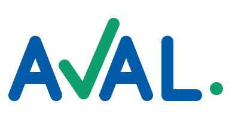

# Identidade Visual — Aval (v1.3)

> Conceito **"O Visto"**: o V de AVAL é desenhado como o gesto de aprovar —
> **em verde e mais alto que as demais letras** — e o **ponto final verde** é o
> gate humano: a esteira (e o logotipo) só terminam quando alguém dá o aval.
>
> Regra de cor da marca: **o azul constrói, o verde aprova.**
>
> Board completo e navegável: abra [`aval-identidade.html`](./aval-identidade.html)
> no navegador (arquivo autocontido, com tema claro/escuro e a linha de evolução
> v1 → v1.3).

  

## Arquivos da marca

| Arquivo | Uso |
|---|---|
| [`logos/aval-logo.svg`](./logos/aval-logo.svg) | Principal — sobre fundo claro |
| [`logos/aval-logo-branca.svg`](./logos/aval-logo-branca.svg) | Inversa — sobre fundo escuro (Marinho `#0A2440`) |
| [`logos/aval-logo-mono.svg`](./logos/aval-logo-mono.svg) | Monocromática — carimbo, gravação e depósito no INPI |
| [`logos/aval-simbolo.svg`](./logos/aval-simbolo.svg) | Símbolo/ícone do app — fundo azul, visto branco (mesma geometria do V do logotipo) |
| [`logos/aval-simbolo-azul.svg`](./logos/aval-simbolo-azul.svg) | Símbolo sem fundo — visto azul, ponto verde |
| [`logos/aval-simbolo-verde.svg`](./logos/aval-simbolo-verde.svg) | Símbolo sem fundo — todo em Verde Visto |
| [`logos/aval-simbolo-azul-mini.svg`](./logos/aval-simbolo-azul-mini.svg) | Versão mini (sem ponto, traço grosso) para usos abaixo de 32 px |
| [`logos/aval-simbolo-verde-mini.svg`](./logos/aval-simbolo-verde-mini.svg) | Versão mini em Verde Visto |

### PNGs prontos (fundo transparente)

Em [`logos/png/`](./logos/png/): as duas variações sem fundo em **96, 48 e 24 px** — os tamanhos 96/48 usam o símbolo completo (visto + ponto); o 24 usa a versão mini, conforme a regra de redução da marca.

O logotipo é **desenho vetorial próprio** (letras de traço reto construídas em SVG) — não existe fonte que o reproduza. Nunca recompor digitando "AVAL".

### Especificações da v1.3

- Traço único de **20 unidades** (viewBox 388×200), pontas e junções arredondadas.
- Letras A/A/L com **90 de altura**; o visto mantém **120** — destaque por
  altura e cor, nunca por espessura.
- Respiros de **13 unidades** no ponto de maior aproximação de cada par de
  letras (medidos nas diagonais, não no eixo).
- Ponto final: raio 11, alinhado à linha de base, sempre verde.

## Paleta

| Cor | Hex | Uso |
|---|---|---|
| Azul Aval | `#005CA9` | Estrutura: letras, ações, links |
| Marinho | `#0A2440` | Texto forte, fundos escuros |
| **Verde Visto** | `#0E9F6E` (`#25C08A` sobre escuro) | **Só aprovação**: o visto, o ponto, checks, estado ok |
| Névoa | `#E3EEF8` | Tints, chips, fundos de apoio |
| Papel Frio | `#F6FAFD` | Fundo claro padrão |
| Grafite Azulado | `#526981` | Texto secundário |

## Tipografia (Google Fonts, gratuitas)

- **Archivo** — títulos e rótulos (caixa alta com tracking nos gates)
- **IBM Plex Sans** — texto e interface
- **IBM Plex Mono** — logs de agentes, código, IDs e dados

## Sistema de formas (estados do produto)

| Forma | Estado |
|---|---|
| ○ círculo vazado | Agentes executando |
| ● círculo cheio (azul) | Validação técnica |
| ✓ visto (verde) | **Aprovação humana — o gate** |
| ■ quadrado (marinho) | Lançamento / em produção |

## Regras de ouro

1. Fundo claro → logo azul; fundo escuro → logo branca. **O visto e o ponto são
   sempre verdes, nas duas.**
2. **O verde é só do aval** — nada mais na marca usa o verde. Sem recolorir,
   sem gradiente.
3. **Nunca laranja junto ao azul** — azul `#005CA9` + laranja é o conjunto da CAIXA.
4. Sem listras nem monograma "A" — distância visual deliberada da marca AVAL
   registrada na classe 42 (Aval Engenharia), o que fortalece a convivência da nossa **marca mista** no INPI.
5. Área de proteção: 2× o diâmetro do ponto verde, em todos os lados.
6. Abaixo de 32 px, usar o símbolo sem o ponto (versão de favicon, traço mais grosso).

## Backronym

**A**gentes · **V**alidação · **A**provação · **L**ançamento — as quatro batidas da esteira, na ordem em que acontecem.
