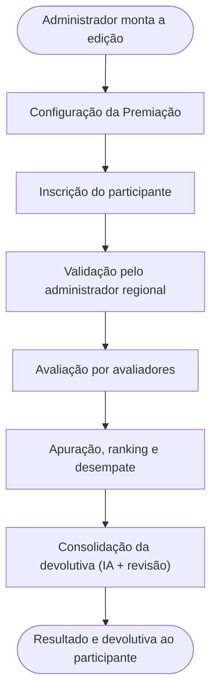

<!-- docqui: 2.8.0 | prompt: PROMPT_0 | atualizado: 2026-08-19 -->
# Base de Conhecimento Extraída: Prêmio IEL de Talentos
> **Origem**: 14 transcrições de reuniões de refinamento (abr–jul/2026) em `arquivos/transcricoes/`
> **Gerado por**: PROMPT_0 (Extração de Insumos Desestruturados)
> **Status**: 🧱 Insumo bruto — ainda não especificado (proposta de N1/N2/N3 para validação do PO)

<!-- Este arquivo NÃO é um nível de spec (N0–N3): é o INSUMO de extração (o "Raw Spec Document") que organiza o material desestruturado das reuniões para alimentar os PROMPTS N0 / 1A / 2A / 3A. Vive em `modules/_base-conhecimento/`, é descartável e regenerável; ao avançar para os N1/N2/N3 a verdade migra para os artefatos finais. Tudo aqui é PROVISÓRIO e RASTREÁVEL às transcrições: o que não estava no material entra em "Pontos de Atenção / Lacunas" como ❓, não como fato. Marcadores: 🔍 inferência a confirmar · ⚠️ conflito/ambiguidade · ❓ lacuna. -->

---

## Visão Geral e Atores

- **Propósito**: dar ao **Prêmio IEL de Talentos** uma plataforma própria, **configurável e transparente**, que substitua os controles manuais (planilhas, Pipefy) e permita ao inscrito **acompanhar sua inscrição e receber uma devolutiva** sobre a nota recebida — algo que hoje não existe ("mandavam a inscrição e acabou"). Antes, o candidato só sabia do resultado perto da cerimônia; a plataforma traz rastreabilidade ponta a ponta e permite **escalar o prêmio** e **reaproveitar a estrutura em outras edições e premiações**.
- **Proposta de valor**: um único sistema parametrizável que conduz o ciclo completo da premiação — da montagem da edição à devolutiva ao participante — com transparência para o inscrito, controle para os regionais e reaproveitamento entre edições/anos.
- **Dono do produto (negócio)**: IEL (Instituto Euvaldo Lodi), do Sistema Indústria (CNI). PO principal: **Isa/Isabelle** (administradora nacional). **Fornecedor de desenvolvimento**: PHL Group (citado também como "PHM").

### Atores / usuários

- **Participante / Inscrito** — pessoa ou organização que se inscreve e concorre. Tipos citados: instituição de ensino, empresa (grande/média/pequena/microempresa), estagiário/estudante bolsista, empreendedor, projeto de educação inovadora. Preenche a inscrição, anexa documentos, acompanha o status e recebe a devolutiva.
- **Avaliador** — voluntário externo (professores, coordenadores de curso, parceiros, ex-participantes) que dá **notas por questão** e um **parecer** aos projetos que lhe são alocados. Pode ser de etapa regional e/ou nacional.
- **Administrador Regional** — vinculado a uma ou mais UFs (DRs). Valida inscrições, cadastra e aloca avaliadores, acompanha avaliações, revisa o feedback consolidado, ranqueia e seleciona quem avança de etapa.
- **Administrador Nacional** — perfil master (hoje só a Isa). Configura a premiação, define etapas e modo de avaliação, conduz a etapa nacional e resolve desempates.
- **Sistema / IA** — a Inteligência Artificial consolida os pareceres dos avaliadores em uma devolutiva única (sempre com revisão humana antes do envio).

---

## Contexto do sistema (estado atual e ambiente)

- **Situação**: sistema **em produção** desde ~15/04/2026 (inscrição e validação entregues); o **módulo de Avaliação** (Sprint 3) foi para produção ~29/05/2026; **devolutiva com IA** em evolução (documento de uso aprovado; custo depende de chamado/CR). 🔍
- **Ambientes**: Homologação e Produção (com necessidade recorrente de **equalizar dados** entre eles, ex.: categorias). GMUD como pacote de mudança/deploy.
- **Números citados (26/05/2026)**: 94 inscrições concluídas, 404 em andamento, 521 em rascunho; **prazo final de inscrição: 15/06/2026**. 🔍
- **Etapas do prêmio**: **Regional → Nacional** (cerimônia nacional em Curitiba na edição 2026). A inscrição ocorre **só na etapa regional**; os vencedores avançam ao nacional sem nova inscrição.
- **Uso majoritário**: computador (informado pelos DRs); telas pensadas responsivas, mas o foco é desktop.
- **Hierarquia de configuração**: **Premiação → Categoria → Modalidade → Tipo de participante → Submodalidade**.

> ⚠️ Itens de stack (frontend/backend/SGBD) não foram detalhados nas reuniões: sabe-se que o backend é em **Java**, com **integração ao Active Directory (AD)** e **login pelo sistema Corporativo** (padrão SNA, 1 perfil por usuário). Confirmar antes de preencher o MASTER.md.

---

## Fluxo macro do produto

- **Configuração**: o administrador monta a edição — estrutura (categoria/modalidade/tipo/submodalidade), formulários dinâmicos, questionários, etapas, e-mails, critérios de desempate.
- **Inscrição**: o participante acessa por um link público, cria acesso (senha temporária por e-mail), seleciona a submodalidade, preenche o formulário e o questionário, anexa documentos e finaliza; pode salvar e retomar.
- **Validação**: o administrador regional confere dados, documentos e termos, e **aprova ou rejeita**; pode **solicitar ajustes** (com auditoria por rodadas).
- **Avaliação**: avaliadores alocados dão **nota por questão** (estrelas 1–5) e um **parecer por projeto**.
- **Apuração**: o sistema calcula a **média**, ranqueia, aplica **critérios de desempate** e o regional seleciona quem avança.
- **Devolutiva**: a IA consolida os pareceres em um texto único, o regional **revisa**, e a devolutiva/relatório é liberada ao participante após o evento.
- **Gestão** (transversal): acesso/perfis, usuários, notificações por e-mail, relatórios e exportação.

---

## Árvore de Funcionalidades (Domínios → Feature Sets → Features)

> Hipótese de estrutura para virar N1/N2/N3. As **SIGLAs são propostas** (⚠️) — o ID
> oficial é fixado na criação do N1/N2. Nomes de feature seguem o padrão canônico
> **verbo no infinitivo + entidade**. Granularidade a refinar no PROMPT_3A; features
> marcadas 🔍 são candidatas cuja existência/atomicidade precisa de confirmação.

- 1. **Configuração da Premiação** `CFG`
  - 1.1 Premiação `CFG-PRE`
    - 1.1.1 Cadastrar Premiação
    - 1.1.2 Editar Premiação
    - 1.1.3 Configurar Termos da Premiação
    - 1.1.4 Configurar E-mails da Premiação
    - 1.1.5 Duplicar Premiação 🔍
  - 1.2 Estrutura de Categorias `CFG-EST`
    - 1.2.1 Criar Categoria
    - 1.2.2 Duplicar Categoria
    - 1.2.3 Criar Modalidade
    - 1.2.4 Criar Tipo de Participante
    - 1.2.5 Configurar Submodalidade
  - 1.3 Formulário de Inscrição `CFG-FOR`
    - 1.3.1 Configurar Formulário de Inscrição
    - 1.3.2 Adicionar Campo ao Formulário
    - 1.3.3 Configurar Anexo
    - 1.3.4 Gerar Link Público de Inscrição
    - 1.3.5 Visualizar Prévia do Formulário 🔍
  - 1.4 Questionário de Avaliação `CFG-QUE`
    - 1.4.1 Configurar Questionário
    - 1.4.2 Adicionar Questão
    - 1.4.3 Definir Peso da Questão
  - 1.5 Etapas `CFG-ETA`
    - 1.5.1 Cadastrar Etapa
    - 1.5.2 Reordenar Etapas
    - 1.5.3 Configurar Modo de Avaliação (aberta/confidencial)
  - 1.6 Critérios de Desempate `CFG-DSP`
    - 1.6.1 Cadastrar Critério de Desempate
    - 1.6.2 Reordenar Critérios de Desempate
  - 1.7 Aparência das Telas Públicas `CFG-IDV` ⚠️ *(parte pode ser design-system/NFR, não feature)*
    - 1.7.1 Configurar Aparência do Link de Inscrição 🔍
    - 1.7.2 Configurar Imagens da Premiação 🔍
- 2. **Inscrição** `INS`
  - 2.1 Inscrição do Participante `INS-CAD`
    - 2.1.1 Cadastrar Participante
    - 2.1.2 Preencher Inscrição
    - 2.1.3 Responder Questionário
    - 2.1.4 Anexar Documentos
    - 2.1.5 Salvar Inscrição
    - 2.1.6 Finalizar Inscrição
  - 2.2 Acompanhamento da Inscrição `INS-ACO`
    - 2.2.1 Acompanhar Inscrição
    - 2.2.2 Pesquisar Inscrições 🔍 *(painel do participante por case/edição)*
- 3. **Validação** `VAL`
  - 3.1 Validação de Inscrições `VAL-INS`
    - 3.1.1 Pesquisar Inscrições
    - 3.1.2 Visualizar Inscrição
    - 3.1.3 Validar Inscrição
    - 3.1.4 Rejeitar Inscrição
  - 3.2 Ajustes de Inscrição `VAL-AJU`
    - 3.2.1 Solicitar Ajuste
    - 3.2.2 Reenviar Inscrição Ajustada
    - 3.2.3 Aprovar Ajuste
    - 3.2.4 Auditar Ajustes
- 4. **Avaliação** `AVL`
  - 4.1 Avaliadores `AVL-AVD`
    - 4.1.1 Cadastrar Avaliador
    - 4.1.2 Editar Avaliador
    - 4.1.3 Excluir Avaliador
  - 4.2 Grupos e Alocação `AVL-ALO`
    - 4.2.1 Configurar Grupo de Avaliadores
    - 4.2.2 Alocar Avaliadores
    - 4.2.3 Remover Avaliador da Inscrição
    - 4.2.4 Substituir Avaliador
    - 4.2.5 Acompanhar Alocação
    - 4.2.6 Notificar Avaliador
  - 4.3 Avaliação de Projetos `AVL-PRJ`
    - 4.3.1 Avaliar Projeto
    - 4.3.2 Desfazer Avaliação
    - 4.3.3 Acompanhar Avaliações
- 5. **Apuração e Resultados** `RES`
  - 5.1 Apuração de Notas `RES-APU`
    - 5.1.1 Calcular Nota Final
    - 5.1.2 Ranquear Participantes
  - 5.2 Fechamento de Etapa `RES-FEC`
    - 5.2.1 Fechar Etapa
    - 5.2.2 Desempatar Candidatos
    - 5.2.3 Selecionar Classificados
    - 5.2.4 Avançar Participantes de Etapa
- 6. **Devolutiva** `DEV`
  - 6.1 Consolidação de Feedback `DEV-CON`
    - 6.1.1 Consolidar Feedback
    - 6.1.2 Revisar Feedback Consolidado
    - 6.1.3 Liberar Devolutiva
  - 6.2 Relatório de Avaliação `DEV-REL`
    - 6.2.1 Gerar Relatório de Avaliação
    - 6.2.2 Visualizar Devolutiva
- 7. **Acesso e Gestão** `ACS` *(transversal)*
  - 7.1 Autenticação e Acesso `ACS-AUT`
    - 7.1.1 Autenticar Usuário
    - 7.1.2 Recuperar Senha
    - 7.1.3 Redefinir Senha
  - 7.2 Usuários e Administradores `ACS-USU`
    - 7.2.1 Cadastrar Administrador Regional
    - 7.2.2 Editar Usuário
    - 7.2.3 Vincular Usuário a UF
  - 7.3 Notificações `ACS-NOT`
    - 7.3.1 Notificar Participante
    - 7.3.2 Notificar Novas Inscrições 🔍 *(pedido de backlog, herdado do Pipefy)*
  - 7.4 Relatórios e Exportação `ACS-REL`
    - 7.4.1 Exportar Inscrições
    - 7.4.2 Acompanhar Inscrições

> **Nota de permissões**: perfis e permissões (Administrador Nacional × Regional × Avaliador × Participante) vivem na matriz **Permissões por perfil do N2**, não como features — não gerar feature de "acesso por perfil".

---

## Proposta de Domínios (N1)

| # | Domínio | SIGLA ⚠️ | Responsabilidade (uma frase) | Feature Sets |
|---|---|---|---|---|
| 1 | Configuração da Premiação | `CFG` | Montar a edição do prêmio: estrutura, formulários, questionários, etapas, e-mails e critérios | 7 |
| 2 | Inscrição | `INS` | Permitir que o participante se inscreva, anexe documentos e acompanhe o andamento | 2 |
| 3 | Validação | `VAL` | Conferir e aprovar/rejeitar inscrições e conduzir ajustes com auditoria | 2 |
| 4 | Avaliação | `AVL` | Cadastrar e alocar avaliadores e registrar notas e pareceres dos projetos | 3 |
| 5 | Apuração e Resultados | `RES` | Calcular médias, ranquear, desempatar e selecionar quem avança de etapa | 2 |
| 6 | Devolutiva | `DEV` | Consolidar o feedback (IA + revisão) e entregar devolutiva/relatório ao participante | 2 |
| 7 | Acesso e Gestão | `ACS` | Autenticação/perfis, usuários, notificações e relatórios (transversal) | 4 |

> **Alternativas de recorte a decidir com o PO** (⚠️ — o recorte acima é uma proposta):
> **(a)** fundir **Inscrição + Validação** num domínio "Candidatura" (mesmo ciclo da inscrição, atores distintos); **(b)** fundir **Apuração + Devolutiva** num domínio "Resultados"; **(c)** manter **Aparência das Telas Públicas** como parte de Configuração ou tratá-la como Design System/NFR (fora de N3).

---

## Dicionário de Campos Extraídos

> Apenas campos **mencionados** nas reuniões, em linguagem de negócio (Label PO). Label Dev,
> campo banco e tipo SQL nascem depois no data-model — não aqui. Campos canônicos apontam
> para o FIELD-DICTIONARY (não reescrever as validações).

| Campo mencionado | Tipo inferido | Regras mencionadas | Entidade |
|---|---|---|---|
| Protocolo | texto/código | Sempre visível ao avaliador; usado em buscas; único por inscrição | Inscrição |
| Nome do projeto | texto | Visível mesmo em modo confidencial; não diferencia (vários projetos com mesmo nome) | Inscrição |
| Categoria | lista de opções | Estágio, Sistema S, Inova, Aprendizagem (varia por edição) | Inscrição |
| Modalidade / Submodalidade | lista de opções | Ex.: Educação Inovadora (níveis Técnico/Graduação); porte (micro/média/grande) | Inscrição |
| Tipo de participante | lista de opções | Instituição de ensino, empresa, estagiário, empreendedor, projeto inovador | Inscrição |
| Estado (UF/DR) | lista de opções | Obrigatório; participante concorre no DR do seu estado; filtro | Inscrição |
| Status da inscrição | lista de opções | Rascunho / Em andamento / Concluída / Validada (Aprovada) / Rejeitada | Inscrição |
| Razão social / Nome fantasia | texto | Identificação interna (empresa/instituição); candidato a "campo identificador" | Participante |
| Nome do estagiário/bolsista | texto | Campo identificador quando o tipo é estagiário | Participante |
| CNPJ | texto (14 dígitos) | Cadastro de empresa | Participante · → ver FIELD-DICTIONARY: CNPJ |
| CPF | texto (11 dígitos) | Membro de equipe / avaliador (pode ser removido do cadastro de avaliador) | Membro · Avaliador · → ver FIELD-DICTIONARY: CPF |
| E-mail | texto | Pode repetir entre registros; e-mail de login é o que recebe comunicações | Usuário · → ver FIELD-DICTIONARY: E-mail |
| Login | texto | **Único**; externo = e-mail; interno ≠ e-mail (padrão SNA) | Usuário |
| Senha | texto | Mín. 8 caracteres, maiúscula+minúscula; sem palavras do nome/login; não repetir as 6 últimas; troca obrigatória no 1º acesso | Usuário · → ver FIELD-DICTIONARY: Senha |
| Telefone | texto | Campo de membro de equipe | Membro · → ver FIELD-DICTIONARY: Telefone |
| Anexo (documento) | arquivo | Nome, descrição, obrigatoriedade, tamanho máximo, extensões permitidas | Inscrição/Anexo |
| Vídeo | arquivo (mídia) | Obrigatório em alguns casos (Goiás); mostra empresa/rosto (quebra anonimato) | Inscrição/Anexo |
| Link adicional | URL | Complementar; deve aparecer ao avaliador quando existir | Inscrição · → ver FIELD-DICTIONARY: URL |
| Campo do formulário | configurável | Tipos: texto curto, texto longo, numérico, data, e-mail, combo box, anexo, caixa de seleção, termo de aceite | Formulário |
| Rótulo / Dica do campo | texto | Configuráveis pelo organizador; dica é opcional | Formulário |
| Título/Enunciado da questão | texto | — | Questão |
| Tipo da questão | lista de opções | Objetiva ou discursiva | Questão |
| Peso da questão | número | Compõe o valor total do projeto (ex.: peso 20) | Questão |
| Questão eliminatória | sim/não | Configurável no construtor de questionário (para desempate) 🔍 | Questão |
| Nota | número (1 a 5) | Por estrela e por questão; régua 1=20, 2=40, 3=60, 4=80, 5=100 | Avaliação |
| Parecer / Feedback | texto | Por projeto (geral), não por questão; escrito pelo avaliador | Avaliação |
| Status da avaliação | lista de opções | A iniciar / Em andamento / Finalizada; "aguardando avaliadores" (0–2 de 3) | Avaliação |
| Nota final / Média | número (decimal) | Média das (3) avaliações; arredondamento (≥ 0,5 sobe; < 0,5 desce) | Inscrição/Avaliação |
| Feedback consolidado | texto | Gerado por IA; coerente com a média; revisado pelo regional antes do envio | Devolutiva |
| Nome / Ordem da etapa | texto / número | Etapas ordenadas e pré-definidas; limite inicial de 5 | Etapa |
| Data de início / fim (etapa) | data | Início ≤ fim | Etapa · → ver RULES-DICTIONARY: Período de vigência |
| Modo de avaliação | lista de opções | Aberta (vê dados) × Confidencial (só projeto + protocolo) | Premiação/Etapa |
| Termo de aceite | texto | Ao menos um termo obrigatório na premiação | Premiação |
| Template de e-mail | texto | Editável na premiação (alocação, etapa encerrada, etapa pronta, aprovação, rejeição) | Premiação |
| Critério de desempate | lista ordenável | 5 critérios ativos; ordem configurável e dinâmica; aplicado só em empate | Premiação/Critério |
| Grupo (pool) de avaliadores | agrupamento | Por segmento/tipo de participante; por premiação; vincula avaliadores elegíveis | Grupo |
| Rodada (de ajuste) | sequencial | Uma rodada = uma versão da inscrição, até o participante reenviar | Ajuste |
| Corpo da solicitação de ajuste | texto | Até 200 linhas | Ajuste |

---

## Regras de Negócio e Casos de Erro Mapeados

> Invariantes ("o quê") extraídas das reuniões, agrupadas por domínio. A **reação** do
> sistema ("bloqueia", "exibe mensagem") vira **cenário** no N3 — aqui listada só como
> apoio. Quebrar as compostas ao promover ao N3. Regras candidatas a canônicas apontam
> para o RULES-DICTIONARY.

### Configuração da Premiação
1. Não podem existir duas categorias com o mesmo nome dentro da premiação.
2. Não podem existir duas modalidades com o mesmo nome dentro da mesma categoria da premiação.
3. Um tipo de participante já vinculado a uma modalidade não pode ser recriado com o mesmo nome (deve editar).
4. Só é possível duplicar categorias **não vinculadas** à premiação; a duplicação gera uma cópia (sufixo "cópia").
5. As etapas são ordenadas e pré-definidas; há um **limite inicial de 5 etapas** por premiação. ⚠️ *(limite a confirmar)*
6. A data de início da etapa é ≤ data de fim. → ver RULES-DICTIONARY: Período de vigência.
7. Os critérios de desempate são cadastráveis por modalidade/tipo e **ordenáveis** — a ordem é dinâmica (altera o ranking em tempo real); não podem ser fixos em código.
8. Cada categoria/tipo de participante gera um **link público de inscrição distinto**. → ver RULES-DICTIONARY: Slug único público.
9. A estrutura da premiação deve ser reaproveitável entre edições/anos (nada fixo que impeça reuso).

### Inscrição
10. Ao se cadastrar, o participante já se vincula automaticamente a concorrer na premiação/modalidade selecionada.
11. Cada inscrição seleciona **uma** submodalidade; para concorrer em outra, é preciso novo cadastro (pode usar o mesmo login).
12. No autocadastro do participante, um e-mail já existente bloqueia o novo cadastro. *(reação → cenário)*
13. A inscrição pode ser salva como rascunho e retomada sem perda de dados.
14. Upload de anexo respeita tamanho máximo, tipos/extensões permitidas e obrigatoriedade configurados. → ver RULES-DICTIONARY: Arquivo com tamanho máximo.
15. O e-mail principal (o do login) é o que recebe as comunicações; e-mails adicionais do formulário só refletem no formulário.

### Validação
16. Só entram na avaliação inscrições previamente **validadas** pelo administrador regional.
17. Uma rodada de ajuste corresponde a uma versão da inscrição; várias solicitações contam como uma rodada até o participante reenviar.
18. O participante responde ao conjunto de ajustes (não a um ajuste específico); a solicitação de ajuste tem limite de 200 linhas.
19. O administrador decide se o ajuste foi atendido: pode aprovar (mesmo com itens não conferidos), rejeitar ou solicitar novamente.

### Avaliação
20. Um projeto é avaliado, por via de regra, por **3 avaliadores** (às vezes 2; no mínimo 1).
21. Um participante pode ter no máximo **3 avaliadores** alocados; recomenda-se número ímpar.
22. Não há limite de projetos que um mesmo avaliador pode avaliar.
23. A nota é **por questão**; o parecer/feedback é **por projeto** (geral).
24. Só aparecem, na alocação por participante, os avaliadores pré-selecionados no **grupo** correspondente ao tipo/categoria; a alocação só é efetivada ao salvar.
25. O login de avaliador é único no sistema; cadastro com login existente é bloqueado. *(reação → cenário)*
26. A exclusão de avaliador é **lógica (soft delete)**: o histórico permanece inativo.
27. Não é possível remover do grupo um avaliador com avaliação finalizada ou em andamento — antes é preciso retirá-lo das inscrições. → ver RULES-DICTIONARY: Registro vinculado não pode ser excluído.
28. Ao remover: não iniciada → remove; finalizada → mantém; em andamento → decisão do regional (não automático).
29. A nota é gravada incrementalmente (assim que o avaliador a seleciona), sobrevivendo a sair da tela.
30. IEL e o próprio administrador regional não podem avaliar; um avaliador não avalia projeto/aluno da própria instituição (conflito de interesse) — triagem manual antes de vincular.
31. Avaliações são independentes: um avaliador vê que outro finalizou, mas não a nota/parecer dele.
32. O avaliador tem acesso a anexos, questionário e termo de aceite; **não** aos dados identificáveis do formulário quando a avaliação é confidencial (só o regional vê o participante).
33. Anexos e links adicionais do projeto devem ser exibidos ao avaliador quando existirem.

### Apuração e Resultados
34. Nota final = **média** das notas dos avaliadores; número quebrado é arredondado (≥ 0,5 sobe; < 0,5 desce).
35. O ranking é ordenado pela média; havendo empate, aplicam-se os critérios de desempate **na ordem configurada**, passando ao próximo só se o empate persistir.
36. Persistindo o empate após todos os critérios, decide-se **manualmente** (com justificativa) — os casos excepcionais passam pelo nacional (conflito de interesse no regional); pode-se **premiar os dois** empatados.
37. Hierarquia de etapas: para estar na etapa N, o participante precisa ter sido classificado em todas as anteriores.
38. Os primeiros colocados do regional avançam automaticamente para o nacional (top N configurável: 3/5/10/20).

### Devolutiva
39. A devolutiva é um **texto único consolidado por IA** a partir dos pareceres dos avaliadores, coerente com a média.
40. A IA **apoia, não decide**: há **revisão humana obrigatória** (administrador regional) antes de liberar ao participante.
41. O participante não sabe quem o avaliou até a divulgação dos resultados (cerimônia); nota final/relatório só ficam visíveis **após o evento**.

### Acesso e Gestão
42. Login é único; e-mail não é único. Login de usuário externo = e-mail; usuário interno tem login próprio (≠ e-mail) — padrão SNA.
43. O Corporativo aceita **um perfil de acesso por usuário** (um usuário não acumula perfis); menu e login vêm do Corporativo.
44. O administrador regional é vinculado a uma UF (DR); vinculado a várias, aloca em uma ou em todas.
45. Política de senha: mín. 8 caracteres, ao menos uma maiúscula e uma minúscula; sem palavras do nome/login; não repetir as 6 últimas; alteração obrigatória no primeiro acesso.
46. A exportação em Excel é restrita à administradora (não a todos os administradores).
47. A busca de inscrições filtra simultaneamente por protocolo e e-mail; há filtros por UF e por status.

### Casos de erro / exceções observados
- Cadastro (categoria/modalidade/tipo/avaliador/participante) com nome/login/e-mail já existente → bloqueio com mensagem orientando editar.
- Remover avaliador com avaliação vinculada → aviso de que a remoção **descarta notas parciais** / apaga a avaliação; orienta pedir ao avaliador para finalizar antes.
- Empate total (todas as notas iguais) → desempate manual pela administradora.
- KPIs de avaliação divergentes (contagem por avaliador × por participante) → nomenclatura a corrigir.
- Divergência de categorias entre Homologação e Produção → equalização manual necessária.
- Anexos/links não aparecem ao avaliador (bug de configuração/cache 304) → investigar. ❓
- Mensagem de erro de senha existe no log mas não aparecia na tela → corrigido.
- Substituição de avaliador: desistência total → invalidar avaliações feitas e realocar; substituição parcial → realocar só os pendentes sem invalidar os concluídos.

---

## Entidades identificadas (candidatas ao data-model)

> Para orientar o `PROMPT_DM` (modelo de dados negocial). Nomes em Label PO; campos e
> tipos físicos serão definidos no data-model, não aqui.

| Entidade | Descrição (uma linha) | Domínio de origem |
|---|---|---|
| Premiação | Edição do prêmio (ano) com termos, e-mails, etapas e modo de avaliação | Configuração |
| Categoria / Modalidade / Tipo de Participante / Submodalidade | Níveis da estrutura configurável da premiação | Configuração |
| Formulário / Campo de Formulário | Formulário dinâmico de inscrição e seus campos | Configuração |
| Questionário / Questão | Questões (objetivas/discursivas) com peso, avaliadas por nota | Configuração |
| Etapa | Fase ordenada da premiação (regional, nacional…) com datas | Configuração |
| Critério de Desempate | Critério ordenável aplicado em empate | Configuração |
| Participante | Pessoa/organização inscrita | Inscrição |
| Inscrição / Projeto | Candidatura do participante (protocolo, anexos, respostas) | Inscrição |
| Anexo | Documento/mídia anexado à inscrição | Inscrição |
| Membro (de equipe) | Integrante da inscrição (nome, CPF, e-mail, telefone) ⚠️ pode ser campo/lista da inscrição | Inscrição |
| Ajuste | Rodada de solicitação/retorno de ajuste na validação | Validação |
| Avaliador | Voluntário que avalia projetos | Avaliação |
| Grupo (pool) de Avaliadores | Agrupamento de avaliadores por segmento/premiação | Avaliação |
| Alocação | Vínculo avaliador × inscrição × etapa | Avaliação |
| Avaliação | Notas por questão + parecer de um avaliador sobre um projeto | Avaliação |
| Devolutiva / Feedback Consolidado | Texto consolidado (IA + revisão) entregue ao participante | Devolutiva |
| Usuário / Administrador | Conta de acesso (nacional, regional) e vínculo a UF | Acesso e Gestão |

---

## Integrações e Migrações

| Item | Tipo | Descrição |
|---|---|---|
| Corporativo (SNA) | SSO / identidade | Login, menu e regra de 1 perfil por usuário; padrão de login/e-mail herdado | 
| Active Directory (AD) | Autenticação | Integração de segurança/senha já existente |
| IA (OpenAI/ChatGPT via API da CNI) | Serviço externo | Consolidação da devolutiva; custo por requisição arcado pela CNI; provisionamento via STI e chamado/CR |
| Serviço de e-mail | Notificação | Envio de e-mails transacionais (aprovação, rejeição, alocação, etapa) |
| Site institucional | Origem | Links públicos de inscrição por categoria embutidos no site |
| Design System (Digitais) | UX | Tipografia/modais/padrão visual do institucional (contato: Victor) |
| Pipefy | Legado (migração) | Sistema anterior de gestão de inscrições; nem tudo migrou (ex.: notificação de novas inscrições → backlog) |
| Excel | Exportação | Formato do relatório/exportação para a administradora |
| PNI (Prêmio Nacional de Inovação) | Iniciativa futura | Estudo de reúso da plataforma para migrar o PNI (convênio 50-50 com SEBRAE); modalidade acima de categoria; conceito de "case" (empresa com vários cases). **Fora do escopo atual** — anotado como visão de expansão |

---

## Pontos de Atenção / Lacunas

> Perguntas para o PO resolver antes (ou durante) a especificação — nunca preenchidas por suposição.

### Estrutura da documentação (a decidir com o PO)
- ❓ Recorte de domínios: fundir **Inscrição + Validação** ("Candidatura")? Fundir **Apuração + Devolutiva** ("Resultados")?
- ❓ **Aparência das Telas Públicas** é Configuração (features) ou Design System/NFR (fora de N3)?
- ❓ **Notificações**: domínio transversal próprio (`ACS-NOT`) ou features distribuídas em cada domínio que dispara o e-mail?

### Avaliação e resultados
- ❓ Comportamento exato ao remover avaliador **em andamento** (remover × manter) — hoje é decisão caso a caso; falta regra fechada.
- ❓ Como calcular a média quando o nº de avaliadores é variável (1, 2 ou 3)?
- ❓ Um avaliador cadastrado no grupo é **obrigado** a avaliar?
- ❓ Empate total: quais critérios/questões subsidiam a decisão manual? Registra-se a justificativa como dado?
- ❓ Distinção final entre **Avaliador Regional × Nacional** (etiqueta, comitê misto).
- ❓ Convivência entre "modo confidencial" (só projeto + protocolo) e a decisão de "exibir tudo ao avaliador".

### Devolutiva / IA
- ❓ Modelo de IA a adotar (GPT-4/5/3.5, Gemini) — decisão por custo × qualidade após testes.
- ❓ Estimativa de custo e provisionamento da API (STI/CNI) e o chamado/CR.
- ❓ Formato do texto da devolutiva (faixas excelente/bom/regular; pontos positivos/negativos/melhoria).
- ❓ Limite de tamanho do parecer do avaliador — não definido.

### Inscrição / configuração
- ❓ Campo identificador por tipo de participante — como exibir a identidade nas listagens sem quebrar o formulário dinâmico (coluna, tooltip, modal)?
- ❓ Notificação de **novas inscrições** (modelo Pipefy: código + categoria + resumo) — está no backlog; impacto em pontos de função.
- ❓ Reforço da mensagem de **etapa regional** no fluxo (início, formulário ou link).
- ❓ Momento do aceite do **termo de confidencialidade** pelo avaliador.

### Técnico / dados (para o MASTER.md e data-model)
- ❓ Stack (frontend/backend além de Java, SGBD, mensageria, storage, e-mail).
- ❓ Estratégia de exclusão (confirmado soft delete ao menos para avaliador) e multitenancy por premiação/UF.
- ❓ Causa raiz do bug de anexos/links não exibidos ao avaliador (configuração × cache 304).
- ❓ Significado e escopo exatos de siglas do ambiente: **SNA**, **STI**, papéis "Corporativo".

---

## Glossário

| Termo / sigla | Significado |
|---|---|
| IEL | Instituto Euvaldo Lodi (do Sistema Indústria / CNI) — dono do prêmio |
| CNI | Confederação Nacional da Indústria — provê a API de IA |
| Sistema S | Sistema Indústria; também uma das categorias/bases do prêmio |
| Prêmio IEL de Talentos | O sistema/premiação objeto deste projeto |
| PHL Group (PHM) | Fornecedor de desenvolvimento do sistema |
| Premiação | Edição/instância do prêmio (ex.: 2026) |
| Categoria / Modalidade / Tipo de participante / Submodalidade | Níveis da estrutura configurável da inscrição |
| Case | (PNI) Inscrição de uma empresa em um tema; uma empresa pode ter vários cases |
| Etapa Regional / Nacional | Fases sequenciais do prêmio; inscrição só no regional |
| DR / DN | Departamento Regional / Departamento Nacional |
| Grupo / Pool | Agrupamento de avaliadores por segmento, por premiação |
| Modo aberto / confidencial | Avaliador vê os dados do participante × vê só projeto + protocolo |
| Régua de notas | Conversão estrela → pontos (1=20, 2=40, 3=60, 4=80, 5=100) |
| Nota final / Média | Média das notas dos avaliadores (com arredondamento) |
| Parecer / Feedback | Texto de devolutiva do avaliador (por projeto) |
| Devolutiva consolidada | Texto único gerado por IA e revisado pelo regional |
| Auditoria de ajustes | Histórico rastreável, por rodadas, das alterações solicitadas |
| Corporativo / SNA | Base de identidade/login do Sistema Indústria (1 perfil por usuário) |
| STI | Área de TI da CNI (provisiona a API de IA) |
| AD | Active Directory (autenticação/segurança) |
| Pipefy | Sistema legado de gestão de inscrições (origem de migração) |
| PNI | Prêmio Nacional de Inovação — sistema/premiação candidato a reúso futuro (convênio SEBRAE) |
| GMUD / CR | Gestão de Mudança (deploy) / Change Request (requisição de custo) |
| Homologação / Produção | Ambientes do sistema |
| KPI | Indicador exibido em cards (pendentes, em andamento, finalizadas, alocados) |

---

## Rastreabilidade às fontes (transcrições)

| Data | Reunião | Principais temas extraídos |
|---|---|---|
| 06/04 | Reunião de IDV | Visão do produto; identidade visual das telas públicas; fluxo de inscrição; login |
| 06/04 | Reunião sobre documentação | Metodologia de documentação (meta); Editar Prêmio (termos, e-mails, datas) |
| 08/04 | Homologação com a Isa | Regras de categorias/modalidades/tipos; unicidade de nome; duplicação |
| 13/04 | Reunião 13/04 | Migração para produção; e-mails de aprovação/rejeição; administrador regional por UF; Corporativo |
| 16/04 | Refinamento Sprint 3 | Desenho da Avaliação: etapas, alocação, notas 1–5, classificação, relatório PDF, IA (stand-by) |
| 23/04 | Apresentação/refinamento — Avaliação | Edição da premiação, e-mails, grupos/pool, alocação, régua de notas, feedback por IA, confidencialidade |
| 28/04 | Refinamento 28/04 | Grupos e alocação, proteção de notas parciais, limite de 3 avaliadores, campo identificador, perfis |
| 29/04 | IA no Prêmio IEL | Consolidação de pareceres por IA; revisão humana; camada de serviços/API Gateway; custo por modelo |
| 30/04 | Reunião 30/04 | Fechamento de etapa; critérios de desempate por modalidade; cadastro/alocação de avaliadores |
| 04/05 | Reunião 04/05 | Auditoria de ajustes por rodadas; notificação de novas inscrições (backlog); desempate |
| 07/05 | Reunião 07/05 | Login × e-mail (SNA); desempate dinâmico/manual; KPIs de avaliação |
| 26/05 | Reunião 26/05 | Política de senha; busca por e-mail/protocolo; exportação Excel; status de inscrição; custo de IA |
| 27/05 | Migração PNI | Fluxo macro; configurador (formulários, questionários, etapas); reúso da plataforma para o PNI |
| 07/07 | Fluxo de Avaliação | Tela do avaliador; exibição de anexos/links; iniciar/desfazer avaliação; bug de anexos |

---

## Próximos passos

1. **Validar com o PO** o recorte de domínios (N1) e as fusões alternativas (Inscrição+Validação; Apuração+Devolutiva).
2. **N0 (Visão de Produto)** — consolidar propósito, personas, KPIs e escopo (`PROMPT_N0`), usando esta base como insumo.
3. **N1 por domínio** aprovado (`PROMPT_1A`), fixando SIGLAs e regras transversais.
4. **N2/N3** por Feature Set — priorizar os já maduros em produção (Configuração, Inscrição, Validação, Avaliação); usar `PROMPT_CRUD` nos cadastros e `PROMPT_WIZARD` no fluxo de inscrição.
5. **Data-model negocial** (`PROMPT_DM`) a partir das entidades identificadas.
6. Promover campos canônicos (CPF, CNPJ, E-mail, Senha, Telefone, URL) e regras recorrentes (arquivo com tamanho máximo, registro vinculado não excluível, período de vigência) via referência aos dicionários.
7. Resolver as **lacunas ❓** — especialmente IA (modelo/custo), regra de remoção de avaliador em andamento e cálculo de média com nº variável de avaliadores.
