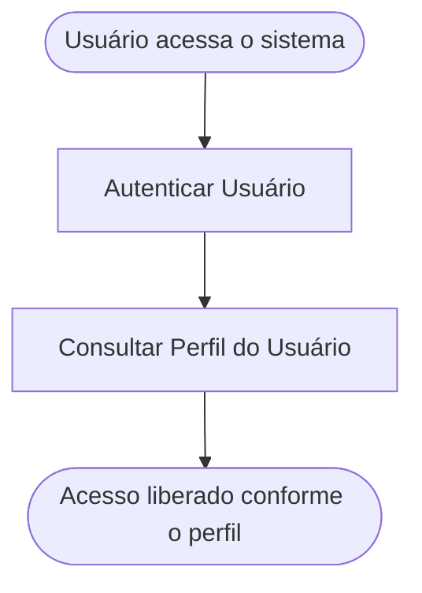

<!-- docqui: 2.8.0 | prompt: PROMPT_2A | atualizado: 2026-08-25 -->
# Feature Set: Acesso e Perfis
> **Nível 2** - Domínio: Acesso e Gestão - `ACS-ACE`

## Descrição
Cuida da entrada do usuário no sistema e da resolução do seu perfil e das funcionalidades autorizadas, apoiando-se no login corporativo (SSO/AD) para a identidade. O controle de acesso é por funcionalidade e nega por padrão, com um perfil por usuário (ver `global/AUTHZ.md`). ⚠️ *Feature Set sem HU dedicada — derivado de AUTHZ e do N0 (SSO); a confirmar.*

**Não faz**: manter cadastro próprio de senhas ou credenciais (isso é do login corporativo/SSO — externo), nem cadastrar administradores regionais e seu escopo por UF (isso é Administradores Regionais).

---

## Features

| Feature | Prioridade | Descrição |
|---|---|---|
| [**Autenticar Usuário**](f-autenticar-usuario.md) <small>ACS-ACE-01</small> | **P1** | Entrar no sistema via login corporativo (SSO/AD). ⚠️ *(autenticação é externa ao produto — a confirmar se figura como feature)* |
| [**Consultar Perfil do Usuário**](f-consultar-perfil-usuario.md) <small>ACS-ACE-02</small> | **P1** | Resolver, no login, o perfil e o conjunto de funcionalidades autorizadas do usuário. ⚠️ *(a confirmar com AUTHZ)* |
| [**Vincular Usuário ao Sistema**](f-vincular-usuario-sistema.md) <small>ACS-ACE-03</small> | **P1** | Dar acesso à premiação, com o perfil Participante, a quem já tem conta no Sistema Indústria e ainda não está habilitado aqui. |

---

## Fluxo Principal

---

## Dependências entre features

- Consultar Perfil do Usuário ocorre logo após Autenticar Usuário — sem identidade autenticada não há perfil a resolver.
- Ambas as features são a base de autorização consumida por todos os demais domínios; a granularidade de permissão é a Feature (ver `global/AUTHZ.md`). ⚠️ *(modelo a confirmar no detalhamento do domínio de Administração)*

---

## Telas

| Tela | Caminho de menu | Rota (implementada) | Features atendidas | Descrição |
|---|---|---|---|---|
| Login corporativo (SSO) | ⚠️ a conferir | `/login` ⚠️ | **Autenticar Usuário** <small>ACS-ACE-01</small> | Tela do login corporativo (externa); o produto redireciona para o SSO ⚠️ |
| Sem tela própria | ⚠️ a conferir | — | **Consultar Perfil do Usuário** <small>ACS-ACE-02</small> | Resolução do perfil e das funcionalidades no login, sem tela dedicada ⚠️ |
| Sem tela própria | ⚠️ a conferir | — | **Vincular Usuário ao Sistema** <small>ACS-ACE-03</small> | Disparada pela Landing Pública de Inscrição (`/inscricao/:token`) quando o login devolve acesso não permitido |
---

## Permissões por perfil

> **Fonte única de permissões** deste Feature Set. As features (N3) não tratam de perfis nem permissões — qualquer acesso novo entra nesta matriz.

Perfis: **Participante** `PIT.2`, **Avaliador** `PIT.4`, **Administrador Regional** `PIT.3`, **Administrador Nacional** `PIT.1`.

| Perfil | Autenticar | Consultar Perfil |
|---|---|---|
| **Participante** | ✓ | ✓ |
| **Avaliador** | ✓ | ✓ |
| **Administrador Regional** | ✓ | ✓ |
| **Administrador Nacional** | ✓ | ✓ |

* Todo usuário autenticado resolve o próprio perfil no login. ⚠️ *(derivado de AUTHZ/SSO — a confirmar; o acesso não autenticado ao link público de inscrição não passa por este Feature Set)*

---

## Changelog

| Data | Autor | Tipo | Descrição |
|---|---|---|---|
| 2026-08-25 | Engenharia reversa (docqui) | N2 criado | Derivado do N1, de `global/AUTHZ.md` e do N0 (login corporativo/SSO) — sem HU dedicada ⚠️ |

---

*Links: [N1 do domínio](../README.md) · [INDEX geral](../../INDEX.md)*
