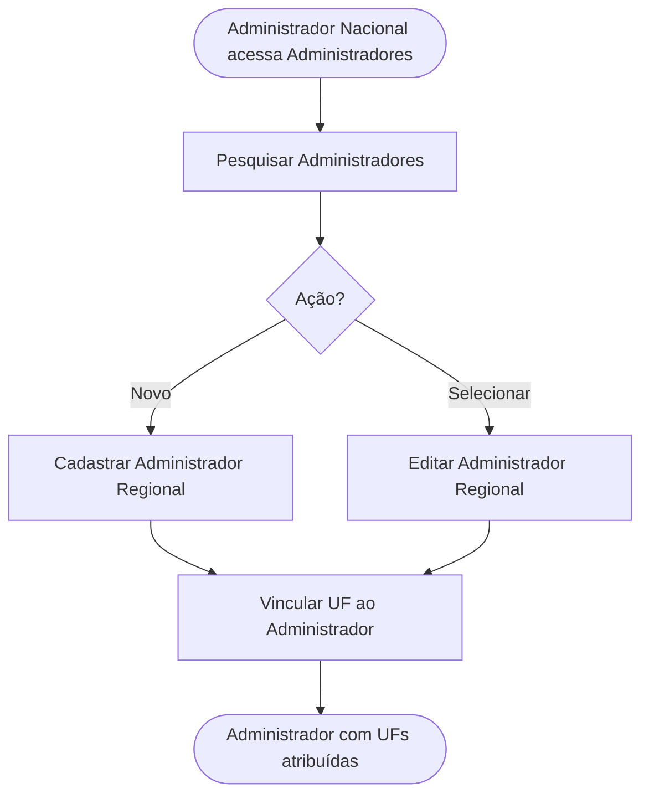

<!-- docqui: 2.8.0 | prompt: PROMPT_2A | atualizado: 2026-08-25 -->
# Feature Set: Administradores Regionais
> **Nível 2** - Domínio: Acesso e Gestão - `ACS-ADM`

## Descrição
Concentra o cadastro dos administradores regionais e o vínculo de cada um às UFs sob sua responsabilidade. O vínculo por UF define o escopo regional — quais inscrições o administrador enxerga e pode validar. A gestão é feita pelo Administrador Nacional.

**Não faz**: autenticar o usuário ou guardar senha (identidade vem do login corporativo/SSO), nem manter a tabela de referência das UFs (dado de sistema), nem validar inscrições (isso é do domínio Validação).

---

## Features

| Feature | Prioridade | Descrição |
|---|---|---|
| [**Pesquisar Administradores**](f-pesquisar-administrador.md) <small>ACS-ADM-01</small> | **P1** | Localizar administradores regionais para consulta, edição ou vínculo de UF. |
| [**Cadastrar Administrador Regional**](f-cadastrar-administrador-regional.md) <small>ACS-ADM-02</small> | **P1** | Registrar um usuário como administrador regional. ⚠️ *(identidade vem do SSO — a confirmar se é seleção de usuário existente)* |
| [**Editar Administrador Regional**](f-editar-administrador-regional.md) <small>ACS-ADM-03</small> | **P2** | Alterar os dados do administrador regional. |
| [**Vincular UF ao Administrador**](f-vincular-uf-administrador.md) <small>ACS-ADM-04</small> | **P1** | Atribuir uma ou mais UFs ao administrador regional, definindo seu escopo de validação. |

---

## Fluxo Principal

---

## Dependências entre features

- Editar Administrador Regional e Vincular UF ao Administrador exigem um administrador previamente localizado por Pesquisar Administradores.
- Vincular UF ao Administrador pressupõe um administrador já cadastrado; pelo menos uma UF deve ser atribuída (regra da HU-020), e a alteração passa a valer de imediato na visibilidade das inscrições em Validação.
- Cadastrar Administrador Regional não depende de outras features.

---

## Telas

| Tela | Caminho de menu | Rota (implementada) | Features atendidas | Descrição |
|---|---|---|---|---|
| Lista de Administradores | ⚠️ a conferir | `/administracao-usuarios` | **Pesquisar Administradores** <small>ACS-ADM-01</small> | Lista com busca dos administradores regionais |
| Formulário de Administrador | ⚠️ a conferir | `/administracao-usuario` | **Cadastrar Administrador Regional** <small>ACS-ADM-02</small> · **Editar Administrador Regional** <small>ACS-ADM-03</small> | Formulário de dados do administrador regional |
| Configuração de UFs do Administrador | ⚠️ a conferir | `/administracao-usuario/:login` *(campo “UFs de Atuação”)* | **Vincular UF ao Administrador** <small>ACS-ADM-04</small> | Seleção múltipla de UFs (sigla e nome) por administrador |
---

## Permissões por perfil

> **Fonte única de permissões** deste Feature Set. As features (N3) não tratam de perfis nem permissões — qualquer acesso novo entra nesta matriz.

Perfis: **Administrador Nacional** `PIT.1`.

| Perfil | Pesquisar | Cadastrar | Editar | Vincular UF |
|---|---|---|---|---|
| **Administrador Nacional** | ✓ | ✓ | ✓ | ✓ |

* **Administrador Nacional** — perfil máster; conforme a HU-020, somente ele gerencia os administradores regionais e as atribuições de UF. ⚠️ *(consulta pelo próprio administrador regional a confirmar)*

---

## Changelog

| Data | Autor | Tipo | Descrição |
|---|---|---|---|
| 2026-08-25 | Engenharia reversa (docqui) | N2 criado | Gerado do N1, da HU-020 e do inventário APF (módulo Usuário) |

---

*Links: [N1 do domínio](../README.md) · [INDEX geral](../../INDEX.md)*
