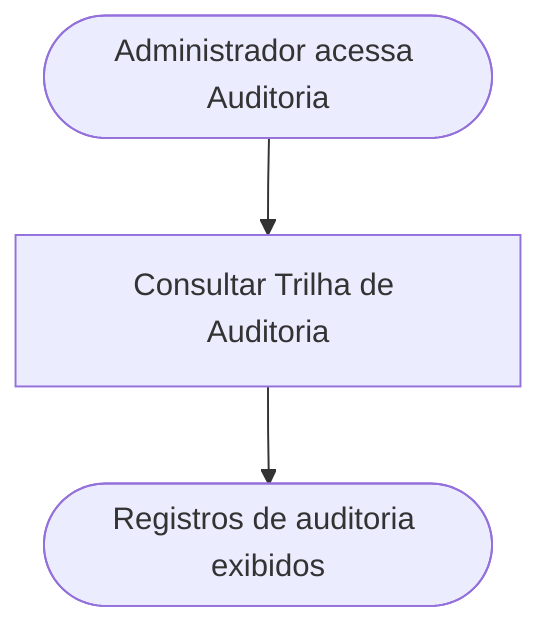

<!-- docqui: 2.8.0 | prompt: PROMPT_2A | atualizado: 2026-08-25 -->
# Feature Set: Auditoria
> **Nível 2** - Domínio: Acesso e Gestão - `ACS-AUD`

## Descrição
Reúne a consulta à trilha de auditoria do sistema — o registro append-only das ações críticas (quem fez, o que mudou e quando), alimentado por todos os domínios a cada validação, ajuste, avaliação ou configuração. ⚠️ *Feature Set sem HU dedicada — derivado do data-model (entidade Log de Auditoria); a confirmar.*

**Não faz**: gravar os registros de auditoria (a escrita é responsabilidade de cada domínio a cada ação crítica), nem a auditoria de ajustes por rodada de uma inscrição específica (isso é do domínio Validação).

---

## Features

| Feature | Prioridade | Descrição |
|---|---|---|
| [**Consultar Trilha de Auditoria**](f-consultar-trilha-auditoria.md) <small>ACS-AUD-01</small> | **P2** | Consultar o registro append-only das ações críticas por entidade, ação, usuário e data. ⚠️ *(escopo, filtros e perfil a confirmar)* |

---

## Fluxo Principal

---

## Dependências entre features

- Consultar Trilha de Auditoria não depende de outras features deste Feature Set; apenas lê o registro append-only alimentado pelas ações críticas dos demais domínios. ⚠️ *(a origem dos registros e a política de retenção a confirmar)*

---

## Telas

| Tela | Caminho de menu | Rota (implementada) | Features atendidas | Descrição |
|---|---|---|---|---|
| Trilha de Auditoria | ⚠️ a conferir | ⚠️ *sem tela implementada* | **Consultar Trilha de Auditoria** <small>ACS-AUD-01</small> | Lista consultável do log de auditoria (entidade auditada, ação, usuário, data e hora) ⚠️ |
---

## Permissões por perfil

> **Fonte única de permissões** deste Feature Set. As features (N3) não tratam de perfis nem permissões — qualquer acesso novo entra nesta matriz.

Perfis: **Administrador Nacional** `PIT.1`, **Administrador Regional** `PIT.3`.

| Perfil | Consultar |
|---|---|
| **Administrador Nacional** | ✓ |
| **Administrador Regional** | ✓ |

* **Administrador Nacional** — enxerga a trilha completa. **Administrador Regional** — acesso restrito ao seu escopo por UF. ⚠️ *(quem consulta a auditoria e o recorte por escopo a confirmar)*

---

## Changelog

| Data | Autor | Tipo | Descrição |
|---|---|---|---|
| 2026-08-25 | Engenharia reversa (docqui) | N2 criado | Derivado do N1 e do data-model (entidade Log de Auditoria) — sem HU dedicada ⚠️ |

---

*Links: [N1 do domínio](../README.md) · [INDEX geral](../../INDEX.md)*
