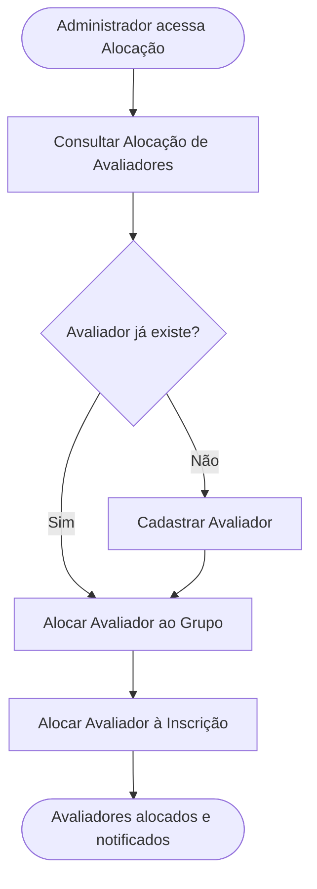

<!-- docqui: 2.8.0 | prompt: PROMPT_2A | atualizado: 2026-08-25 -->
# Feature Set: Alocação de Avaliadores
> **Nível 2** - Domínio: Avaliação - `AVL-ALO`

## Descrição

Define quem avalia quais inscrições em cada etapa, em duas camadas complementares: o pool de avaliadores por grupo (categoria × modalidade × tipo de participante) autoriza quem pode avaliar aquele grupo na etapa, e a alocação por inscrição designa os avaliadores específicos de cada inscrição elegível. Permite ainda cadastrar um novo avaliador sem sair do fluxo. A operação em cada etapa é restrita aos perfis autorizados pela capability daquela etapa e, para o Administrador Regional, às UFs vinculadas ao seu perfil.

**Não faz**: registrar notas ou pareceres (isso é Avaliação de Projetos), reabrir uma avaliação finalizada (isso é Avaliação de Projetos), nem autenticar o avaliador — a identidade vem do login corporativo (SSO).

---

## Features

| Feature | Prioridade | Descrição |
|---|---|---|
| [**Consultar Alocação de Avaliadores**](f-consultar-alocacao-avaliadores.md) <small>AVL-ALO-01</small> | **P1** | Visualizar, por premiação e etapa, os grupos, o número de inscrições e o pool atual de cada grupo. |
| [**Alocar Avaliador ao Grupo**](f-alocar-avaliador-grupo.md) <small>AVL-ALO-02</small> | **P1** | Compor e salvar o pool de avaliadores autorizados a avaliar um grupo em uma etapa. |
| [**Cadastrar Avaliador**](f-cadastrar-avaliador.md) <small>AVL-ALO-03</small> | **P1** | Criar, a partir do fluxo de alocação, um novo usuário com perfil Avaliador no cadastro corporativo. |
| [**Alocar Avaliador à Inscrição**](f-alocar-avaliador-inscricao.md) <small>AVL-ALO-04</small> | **P1** | Designar os avaliadores específicos de cada inscrição elegível, a partir do pool do grupo. |
| [**Consultar Panorama do Avaliador**](f-consultar-panorama-avaliador.md) <small>AVL-ALO-05</small> | **P2** | Ver a carga de um avaliador numa etapa — alocadas, a iniciar, em andamento e finalizadas —, separada por grupo. |
| [**Consultar Pendências de Alocação**](f-consultar-pendencias-alocacao.md) <small>AVL-ALO-06</small> | **P2** | Ser avisado das etapas em que há aprovados da etapa anterior ainda sem avaliadores designados. |
| [**Exportar Relatório de Alocação**](f-exportar-relatorio-alocacao.md) <small>AVL-ALO-07</small> | **P2** | Gerar em planilha a distribuição da alocação da etapa, por avaliador e — nas etapas regionais — por estado. |

---

## Fluxo Principal

---

## Dependências entre features

- Alocar Avaliador ao Grupo e Alocar Avaliador à Inscrição dependem de uma premiação e etapa selecionadas, consultadas em Consultar Alocação de Avaliadores.
- Alocar Avaliador à Inscrição herda do pool definido em Alocar Avaliador ao Grupo: só avaliadores no pool do grupo podem ser designados às inscrições daquele grupo na etapa.
- Cadastrar Avaliador é uma ação auxiliar acionável de dentro da alocação por grupo, quando o avaliador desejado ainda não existe no cadastro corporativo.
- As inscrições elegíveis dependem da Validação (na primeira etapa) e da Apuração da etapa anterior (nas etapas seguintes, em cascata); a etapa precisa existir em Etapas e Configuração da Avaliação.

---

## Telas

| Tela | Caminho de menu | Rota (implementada) | Features atendidas | Descrição |
|---|---|---|---|---|
| Alocação por Grupo | Avaliação › Alocação por Grupo | `/avaliacao-admin/alocacao-matriz` | **Consultar Alocação de Avaliadores** <small>AVL-ALO-01</small> · **Alocar Avaliador ao Grupo** <small>AVL-ALO-02</small> · **Exportar Relatório de Alocação** <small>AVL-ALO-07</small> | Matriz de grupos com inscrições, pool atual, picker de avaliadores por etapa e exportação da alocação em planilha |
| Panorama do Avaliador | — | `/avaliacao-admin/alocacao-matriz` (diálogo) · `/avaliacao-admin/alocacao-participante` (diálogo) | **Consultar Panorama do Avaliador** <small>AVL-ALO-05</small> | Diálogo com a carga do avaliador na etapa, separada por grupo, com contadores por situação |
| Cadastrar Avaliador | — | `/avaliacao-admin/alocacao-matriz` (diálogo) | **Cadastrar Avaliador** <small>AVL-ALO-03</small> | Diálogo inline de cadastro de avaliador com UFs vinculadas |
| Alocação por Inscrição | Avaliação › Alocação por Inscrição | `/avaliacao-admin/alocacao-participante` | **Alocar Avaliador à Inscrição** <small>AVL-ALO-04</small> | Lista de inscrições elegíveis com designação de avaliadores e indicador N/M |
| Aviso de pendências de alocação | — | *(componente das telas administrativas da premiação — ainda não montado em nenhuma tela)* | **Consultar Pendências de Alocação** <small>AVL-ALO-06</small> | Lista das etapas com aprovados da etapa anterior ainda sem avaliadores, com atalho para a alocação |
---

## Permissões por perfil

> **Fonte única de permissões** deste Feature Set. As features (N3) não tratam de perfis nem permissões — qualquer acesso novo entra nesta matriz.

Perfis: **Administrador Nacional** `PIT.1`, **Administrador Regional** `PIT.3`.

| Perfil | Consultar Alocação | Alocar ao Grupo | Cadastrar Avaliador | Alocar à Inscrição |
|---|---|---|---|---|
| **Administrador Nacional** | ✓ | ✓ | ✓ | ✓ |
| **Administrador Regional** | ✓ | ✓ | ✓ | ✓ |

* **Administrador Nacional** — visão completa, sem restrição geográfica; pode operar qualquer etapa cuja capability o autorize.
* **Administrador Regional** — visualiza e aloca apenas nas UFs vinculadas ao seu perfil e apenas nas etapas em que a capability autoriza o Regional; no cadastro inline só pode vincular avaliadores às suas próprias UFs.

---

## Changelog

| Data | Autor | Tipo | Descrição |
|---|---|---|---|
| 2026-08-25 | Engenharia reversa (docqui) | N2 criado | Gerado do N1, das HUs e do inventário APF |

---

*Links: [N1 do domínio](../README.md) · [INDEX geral](../../INDEX.md)*
