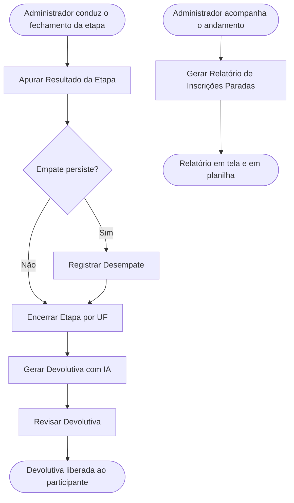

<!-- docqui: 2.23.0 | prompt: PROMPT_2A | atualizado: 2026-10-04 -->
# Feature Set: Apuração e Devolutiva
> **Nível 2** - Domínio: Avaliação - `AVL-APU`

## Descrição

Fecha o ciclo de avaliação de cada etapa: apura a média ponderada e o ranking das inscrições que competem entre si, resolve empates persistentes por decisão manual registrada, retira da disputa a inscrição que não pode avançar, encerra a etapa por UF definindo quem avança e avisa o participante de que a devolutiva está disponível. Cuida também da devolutiva ao participante — gerada com apoio de Inteligência Artificial a partir dos pareceres e sempre revisada por uma pessoa antes de ser liberada — e do relatório de inscrições paradas que apoia a operação. Toda decisão de desempate e todo fechamento ficam registrados com responsável e justificativa.

**Não faz**: registrar notas ou pareceres (isso é Avaliação de Projetos), redigir a consolidação manual do feedback (isso é Painel Administrativo de Avaliações), nem definir os critérios de desempate ou as etapas (isso é Etapas e Configuração da Avaliação).

---

## Features

| Feature | Prioridade | Descrição |
|---|---|---|
| [**Apurar Resultado da Etapa**](f-apurar-resultado-etapa.md) <small>AVL-APU-01</small> | **P1** | Calcular a média ponderada e a colocação das inscrições da etapa em blocos de estado e grupo de disputa, aplicando os cortes de classificação e de premiação da etapa. |
| [**Registrar Desempate**](f-registrar-desempate.md) <small>AVL-APU-02</small> | **P1** | Aplicar os critérios lexicográficos e, quando o empate persiste na linha de corte de classificação ou de premiação, registrar a decisão manual com a vencedora, a justificativa e o responsável. |
| [**Encerrar Etapa por UF**](f-encerrar-etapa-uf.md) <small>AVL-APU-03</small> | **P1** | Oficializar o fechamento da etapa por UF, registrando responsável e data e liberando quem avança para a etapa seguinte. |
| [**Gerar Devolutiva com IA**](f-gerar-devolutiva-ia.md) <small>AVL-APU-04</small> | **P2** | Produzir, com apoio de IA, uma sugestão de devolutiva a partir dos pareceres dos avaliadores finalizados, para revisão. |
| [**Revisar Devolutiva**](f-revisar-devolutiva.md) <small>AVL-APU-05</small> | **P1** | Revisar e editar a devolutiva (gerada por IA ou escrita à mão) e liberá-la ao participante, respeitada a data de liberação da etapa. |
| [**Gerar Relatório de Inscrições Paradas**](f-gerar-relatorio-inscricoes-paradas.md) <small>AVL-APU-06</small> | **P2** | Montar o relatório das inscrições Em Andamento ou Rascunho da premiação, segmentado por UF, status e tipo de participante, em tela e em planilha XLSX multi-abas com aba de resumo e uma aba por grupo. |
| [**Reabrir Etapa por UF**](f-reabrir-etapa-uf.md) <small>AVL-APU-12</small> | **P1** | Devolver à apuração um estado cuja etapa já foi encerrada, desfazendo o fechamento daquele escopo para que os cortes sejam recalculados. |
| [**Consultar Ranking da Etapa**](f-consultar-ranking-etapa.md) <small>AVL-APU-08</small> | **P2** | Consultar em tela própria, somente leitura, o resultado já apurado de uma etapa. |
| [**Exportar Relatório da Etapa**](f-exportar-relatorio-etapa.md) <small>AVL-APU-09</small> | **P2** | Gerar em planilha o resultado completo da etapa, com resumo por estado e grupo e detalhe por tipo de participante. |
| [**Desclassificar Inscrição na Etapa**](f-desclassificar-inscricao-etapa.md) <small>AVL-APU-13</small> | **P1** | Retirar uma inscrição da disputa de uma etapa, com justificativa registrada, e devolvê-la à disputa enquanto o estado está aberto. |
| [**Enviar Feedback ao Participante**](f-enviar-feedback-participante.md) <small>AVL-APU-14</small> | **P1** | Avisar por e-mail os participantes de uma etapa encerrada de que a devolutiva está disponível, conferindo antes quem recebe e acompanhando depois o envio. |
| [**Gerar Relatório de Inscrições**](f-gerar-relatorio-inscricoes.md) <small>AVL-APU-10</small> | **P2** | Montar o relatório de todas as inscrições da premiação, agrupadas por tipo de participante, com filtros de UF, categoria, modalidade, situação e período — em tela, com amostra por grupo, e em planilha, com o recorte completo. |

---

## Fluxo Principal

---

## Dependências entre features

- Apurar Resultado da Etapa depende das avaliações finalizadas em Avaliação de Projetos e da configuração de etapas em Etapas e Configuração da Avaliação.
- Registrar Desempate só entra quando a apuração acusa empate de média; aplica primeiro os critérios lexicográficos configurados em Etapas e Configuração da Avaliação e, esgotados eles, exige a decisão manual.
- Encerrar Etapa por UF pressupõe a apuração concluída, os empates da linha de corte resolvidos e o feedback consolidado de todas as inscrições do estado (Consolidar Avaliação, em Painel Administrativo de Avaliações); o fechamento define as inscrições classificadas que avançam e ficam elegíveis à alocação da etapa seguinte (cascata) em Alocação de Avaliadores, e bloqueia a edição do feedback consolidado daquele estado.
- Revisar Devolutiva é o gate humano obrigatório: a devolutiva gerada em Gerar Devolutiva com IA nunca é liberada ao participante sem revisão de uma pessoa; a sugestão da IA não é persistida automaticamente. O registro de feedback é o mesmo trabalhado em Painel Administrativo de Avaliações (Consolidar Avaliação). ⚠️ *(fronteira consolidação × devolutiva a confirmar com o produto)*
- Gerar Relatório de Inscrições Paradas — na tela e na planilha — é independente do fechamento e apoiam a condução nacional da premiação (desde a SP05 o par é exclusivo do Administrador Nacional — ver Permissões por perfil).
- O comportamento das telas de apuração, desempate manual e fechamento por UF veio do data-model e, desde a SP05, da demanda da HU "Fechar Etapa de Avaliação"; ⚠️ o layout segue sem protótipo — a confirmar no N3.

---

## Telas

| Tela | Caminho de menu | Rota (implementada) | Features atendidas | Descrição |
|---|---|---|---|---|
| Fechamento de Etapa | Premiação › Avaliação › Fechamento de Etapa | `/avaliacao-admin/fechamento-etapa/:etapaId` | **Apurar Resultado da Etapa** <small>AVL-APU-01</small> · **Registrar Desempate** <small>AVL-APU-02</small> · **Encerrar Etapa por UF** <small>AVL-APU-03</small> · **Reabrir Etapa por UF** <small>AVL-APU-12</small> · **Desclassificar Inscrição na Etapa** <small>AVL-APU-13</small> · **Exportar Relatório da Etapa** <small>AVL-APU-09</small> | Ranking, drawer de desempate manual, fechamento por UF, reabertura do estado fechado, desclassificação de inscrição com justificativa e exportação do Relatório da Etapa ⚠️ *(tela derivada de HU não fornecida)* |
| Editor de Devolutiva | — | `/avaliacao-admin/avaliacoes/:inscricaoId/etapa/:etapaId` | **Gerar Devolutiva com IA** <small>AVL-APU-04</small> · **Revisar Devolutiva** <small>AVL-APU-05</small> | Geração assistida por IA, pré-visualização e revisão humana antes da liberação |
| Relatório de Inscrições Paradas | Premiação › Relatórios › Inscrições Paradas | `/validacao-inscricao/relatorio-inscricoes-paradas` | **Gerar Relatório de Inscrições Paradas** <small>AVL-APU-06</small> | Abas por UF × status × tipo com colunas fixas e dinâmicas, e exportação XLSX |
| Ranking por Etapa | — | `/avaliacao-admin/ranking-etapa` | **Consultar Ranking da Etapa** <small>AVL-APU-08</small> | Consulta somente leitura do resultado apurado, em blocos de estado e grupo, com exportação em planilha |
| Disparo de Feedback | Premiação › Avaliação › Disparo de Feedback ⚠️ *a conferir* | `/avaliacao-admin/disparo-feedback` ⚠️ *a conferir* | **Enviar Feedback ao Participante** <small>AVL-APU-14</small> | Seleção de premiação e etapa, prévia dos participantes que receberão o aviso, envio por ação do administrador e acompanhamento da situação de cada envio, com reenfileiramento das falhas. Alcançada por ação no Painel de Avaliações, só para o Administrador Nacional. |
| Relatório de Inscrições | Premiação › Relatórios › Inscrições | `/validacao-inscricao/relatorio-inscricoes` | **Gerar Relatório de Inscrições** <small>AVL-APU-10</small> | Inscrições da premiação agrupadas por tipo de participante, com filtros e exportação em planilha |
---

## Permissões por perfil

> **Fonte única de permissões** deste Feature Set. As features (N3) não tratam de perfis nem permissões — qualquer acesso novo entra nesta matriz.

Perfis: **Administrador Nacional** `PIT.1`, **Administrador Regional** `PIT.3`.

| Perfil | Apurar Resultado | Registrar Desempate | Encerrar Etapa por UF | Reabrir Etapa por UF | Desclassificar Inscrição na Etapa | Enviar Feedback ao Participante | Gerar Devolutiva com IA | Revisar Devolutiva | Gerar Relatório de Inscrições Paradas |
|---|---|---|---|---|---|---|---|---|---|
| **Administrador Nacional** | ✓ | ✓ | ✓ | ✓ | ✓ | ✓ | ✓ | ✓ | ✓ |
| **Administrador Regional** | — | — | — | — | — | — | ✓ | ✓ | — |

* **Administrador Nacional** — conduz a apuração, o desempate manual e o fechamento; fechar, reabrir e desempatar são exclusivos dele desde a SP05, e ele também revisa e libera a devolutiva. *(a reabertura é feature própria — ver `AVL-APU-12` **Reabrir Etapa por UF**)*
* **Administrador Regional** — atua na devolutiva das inscrições das suas UFs e consulta o resultado da etapa com o recorte dessas UFs; desde a SP05 não encerra mais a etapa. ⚠️ *(escopo de consulta do Regional na apuração a confirmar com a liderança do prêmio)*
* **Gerar Relatório de Inscrições Paradas** — a tela e a exportação em planilha são a mesma feature e seguem a mesma permissão: exclusivas do Administrador Nacional desde a SP05 (recurso APIPIT.22); o Administrador Regional deixou de acessar o relatório, que passou a alcançar todas as UFs da premiação. A restrição foi confirmada em 2026-09-01.

### Visibilidade da etapa por perfil

O que cada perfil enxerga de uma etapa deriva da **natureza da etapa**, não da lista de perfis autorizados a operá-la. Esta é a fonte única da regra; as features de apuração, fechamento e ranking a referenciam.

| Natureza da etapa | Administrador Nacional | Administrador Regional |
|---|---|---|
| **Nacional** | Enxerga a etapa inteira; o corte é apurado entre **todos os inscritos**, dentro de cada grupo de disputa, sem recorte por estado | **Não enxerga a etapa** |
| **Regional** | Enxerga **todos os estados**; o corte é apurado por **estado × grupo** | Enxerga **apenas os estados aos quais está vinculado**, com o corte por estado × grupo |

*(decidido em 2026-09-01)* A abrangência do corte e a visibilidade saem ambas da natureza da etapa — antes da decisão a spec as derivava dos perfis autorizados, o que fazia uma configuração de permissão mudar o resultado da apuração.

⚠️ **Falta o dado que declara a natureza da etapa.** Não há campo em Etapa que diga se ela é nacional ou regional; hoje isso só pode ser lido da lista de perfis autorizados — a etapa é regional quando o Administrador Regional consta nela. Enquanto for assim, o acoplamento que a decisão quis remover continua existindo de fato, só que nomeado. Declarar a natureza como campo próprio é alteração de modelo a decidir — ver `arquivos/demandas/ANALISE_IMPACTO_SP05.md`, *Definições ainda em aberto*.

---

## Changelog

| Data | Autor | Tipo | Descrição |
|---|---|---|---|
| 2026-10-04 | Análise de impacto SP06 (docqui) | Feature Set ampliado | Duas features novas da Sprint 6: `AVL-APU-13` — Desclassificar Inscrição na Etapa (entrega de 2026-10-01, migração V00035) e `AVL-APU-14` — Enviar Feedback ao Participante (entrega de 2026-10-01, migração V00034), ambas exclusivas do Administrador Nacional. Tela nova **Disparo de Feedback**. O Relatório da Etapa sai da tela de Ranking por Etapa e passa à de **Fechamento de Etapa**, que é onde o resumo de entrega o situa — o Ranking é somente leitura, sem ações |
| 2026-09-01 | Especificação (docqui) | Fluxo corrigido | O Fluxo Principal ainda passava por "Exportar Relatório de Inscrições Paradas", absorvida por `AVL-APU-06` **Gerar Relatório de Inscrições Paradas** na unificação de 2026-09-01. A tela e a planilha são a mesma feature |
| 2026-09-01 | Especificação (docqui) | Referência corrigida | A reabertura era citada como `AVL-APU-08`, que na árvore é **Consultar Ranking da Etapa** — o ID certo é `AVL-APU-12` **Reabrir Etapa por UF**, e ela já tem N3 |
| 2026-09-01 | Especificação (docqui) | Feature acrescentada | `AVL-APU-12` **Reabrir Etapa por UF** ganha N3 próprio: era a única feature nova da SP05 sem spec. Entra na matriz como exclusiva do Administrador Nacional, coerente com o fechamento |
| 2026-09-01 | Decisões de produto (docqui) | Matriz acrescentada | Nova seção *Visibilidade da etapa por perfil*: o que cada perfil enxerga e a abrangência do corte passam a derivar da **natureza da etapa** (nacional × regional), e não mais dos perfis autorizados a operá-la. ⚠️ Falta o campo que declara essa natureza |
| 2026-09-01 | Decisão 6 (docqui) | Features unificadas | `AVL-APU-07` Exportar Relatório de Inscrições Paradas e `AVL-APU-11` Exportar Relatório de Inscrições incorporadas às features que geram os respectivos relatórios; a matriz passa a ter uma coluna só por relatório. A contagem não muda — cada feature unificada absorve dois processos elementares |
| 2026-08-28 | Impacto SP05 (docqui) | Matriz alterada | Encerrar Etapa por UF deixa de ser acessível ao Administrador Regional — fechar, reabrir e desempatar passam a exclusivos do Nacional |
| 2026-08-28 | Impacto SP05 (docqui) | Matriz alterada | Gerar e Exportar Relatório de Inscrições Paradas restritos ao Administrador Nacional (APIPIT.22) |
| 2026-08-25 | Engenharia reversa (docqui) | N2 criado | Gerado do N1, das HUs e do inventário APF |

---

*Links: [N1 do domínio](../README.md) · [INDEX geral](../../INDEX.md)*
