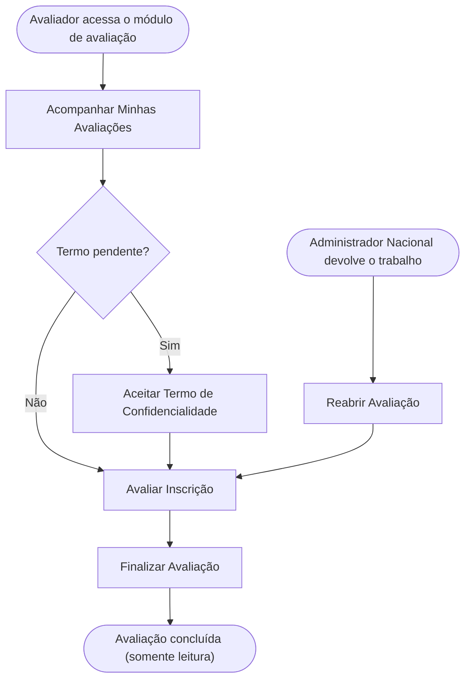

<!-- docqui: 2.8.0 | prompt: PROMPT_2A | atualizado: 2026-08-25 -->
# Feature Set: Avaliação de Projetos
> **Nível 2** - Domínio: Avaliação - `AVL-AVA`

## Descrição

É o espaço de trabalho do avaliador: aceitar o termo de confidencialidade da premiação, acompanhar as inscrições que lhe foram alocadas, atribuir nota por questão e registrar o parecer, e finalizar a avaliação. A avaliação é sigilosa (aceite de termo obrigatório e ocultação da identidade do participante quando a edição é confidencial) e independente — um avaliador nunca vê as notas dos demais. Inclui a ação administrativa de reabrir uma avaliação já finalizada quando é preciso devolver o trabalho ao avaliador.

**Não faz**: alocar avaliadores (isso é Alocação de Avaliadores), consolidar o feedback ao participante (isso é Painel Administrativo de Avaliações), nem apurar médias ou fechar etapa (isso é Apuração e Devolutiva).

---

## Features

| Feature | Prioridade | Descrição |
|---|---|---|
| [**Acompanhar Minhas Avaliações**](f-acompanhar-minhas-avaliacoes.md) <small>AVL-AVA-01</small> | **P1** | Ver as premiações alocadas e o grid de inscrições a avaliar, com indicadores, prazos e filtros por premiação, etapa e status. |
| [**Aceitar Termo de Confidencialidade**](f-aceitar-termo-confidencialidade.md) <small>AVL-AVA-02</small> | **P1** | Ler e aceitar o termo da premiação antes de acessar os dados dos participantes; registro único por avaliador e premiação. |
| [**Avaliar Inscrição**](f-avaliar-inscricao.md) <small>AVL-AVA-03</small> | **P1** | Atribuir nota de 1 a 5 por questão (salva progressivamente) e redigir o parecer individual da inscrição designada. |
| [**Finalizar Avaliação**](f-finalizar-avaliacao.md) <small>AVL-AVA-04</small> | **P1** | Concluir a avaliação após pontuar todas as questões e registrar o parecer, deixando o registro somente leitura. |
| [**Reabrir Avaliação**](f-reabrir-avaliacao.md) <small>AVL-AVA-05</small> | **P2** | Reverter uma avaliação finalizada para Em andamento, preservando as notas, para devolver o trabalho ao avaliador. |
| [**Consultar Outros Avaliadores**](f-consultar-outros-avaliadores.md) <small>AVL-AVA-06</small> | **P2** | Ver quantos outros avaliam o mesmo projeto e em que pé está cada um, sob apelido numerado e sem revelar notas. |
| [**Consultar Premiações do Avaliador**](f-consultar-premiacoes-avaliador.md) <small>AVL-AVA-07</small> | **P1** | Ver, ao entrar, as premiações em que há projetos a avaliar, o avanço em cada uma e o aviso de termo pendente. |

---

## Fluxo Principal

---

## Dependências entre features

- Acompanhar Minhas Avaliações lista apenas as inscrições alocadas ao avaliador em Alocação de Avaliadores; sem alocação não há o que avaliar.
- Aceitar Termo de Confidencialidade é um gate: enquanto o termo ativo da premiação estiver pendente, Avaliar Inscrição fica bloqueada; premiação sem termo (ou com termo desativado) libera o acesso direto.
- Finalizar Avaliação exige todas as questões pontuadas e o parecer com o mínimo de caracteres, e é bloqueada quando a etapa está fechada.
- Reabrir Avaliação atua sobre uma avaliação já finalizada e só é possível com a etapa Aberta; depois dela, a inscrição volta para Avaliar Inscrição.

---

## Telas

| Tela | Caminho de menu | Rota (implementada) | Features atendidas | Descrição |
|---|---|---|---|---|
| Seleção de Premiação | ⚠️ a conferir | `/avaliacao` | **Consultar Premiações do Avaliador** <small>AVL-AVA-07</small> | Cartões das premiações alocadas com status do termo (pendente/aceito) e contadores por situação |
| Aceite do Termo | — | `/avaliacao/premiacao/:premiacaoId/termo` | **Aceitar Termo de Confidencialidade** <small>AVL-AVA-02</small> | Leitura do termo (texto ou anexo) e confirmação de aceite |
| Painel do Avaliador | Minhas Avaliações | `/avaliacao/premiacao/:premiacaoId` | **Acompanhar Minhas Avaliações** <small>AVL-AVA-01</small> | Grid de cartões das inscrições alocadas, com indicadores e filtros |
| Avaliação da Inscrição | — | `/avaliacao/:alocacaoId` | **Avaliar Inscrição** <small>AVL-AVA-03</small> · **Finalizar Avaliação** <small>AVL-AVA-04</small> · **Consultar Outros Avaliadores** <small>AVL-AVA-06</small> | Pontuação por questão, parecer, anexos, histórico da própria avaliação e andamento dos demais avaliadores do projeto |
| Alocação por Inscrição | — | `/avaliacao-admin/alocacao-participante` | **Reabrir Avaliação** <small>AVL-AVA-05</small> | Ação de desfinalizar a alocação (Administrador Nacional, etapa Aberta) |
---

## Permissões por perfil

> **Fonte única de permissões** deste Feature Set. As features (N3) não tratam de perfis nem permissões — qualquer acesso novo entra nesta matriz.

Perfis: **Avaliador** `PIT.4`, **Administrador Nacional** `PIT.1`.

| Perfil | Acompanhar Minhas Avaliações | Aceitar Termo | Avaliar Inscrição | Finalizar Avaliação | Reabrir Avaliação |
|---|---|---|---|---|---|
| **Avaliador** | ✓ | ✓ | ✓ | ✓ | — |
| **Administrador Nacional** | — | — | — | — | ✓ |

* **Avaliador** — acessa somente as inscrições alocadas ao próprio usuário autenticado; nunca vê as notas ou pareceres dos demais avaliadores.
* **Administrador Nacional** — não pontua inscrições; dispõe apenas de Reabrir Avaliação (desfinalizar), a única ação administrativa deste Feature Set.

---

## Changelog

| Data | Autor | Tipo | Descrição |
|---|---|---|---|
| 2026-08-25 | Engenharia reversa (docqui) | N2 criado | Gerado do N1, das HUs e do inventário APF |

---

*Links: [N1 do domínio](../README.md) · [INDEX geral](../../INDEX.md)*
