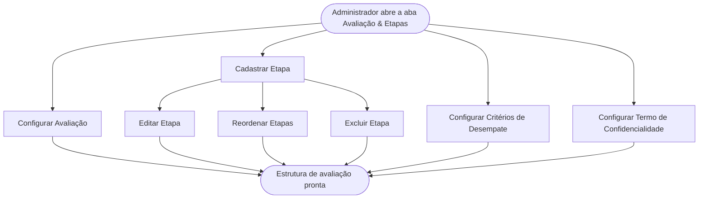

<!-- docqui: 2.8.0 | prompt: PROMPT_2A | atualizado: 2026-08-25 -->
# Feature Set: Etapas e Configuração da Avaliação
> **Nível 2** - Domínio: Avaliação - `AVL-ETA`

## Descrição

Concentra a montagem do subsistema de avaliação de uma edição: o modo de avaliação (confidencial ou aberta, exibição da média de etapas anteriores e quantidade de avaliadores por inscrição), as etapas eliminatórias sequenciais (até cinco, com ordem, período e perfis autorizados a operá-las), os critérios automáticos de desempate por tipo de participante e o termo de confidencialidade exigido do avaliador. É a porta de entrada da avaliação: define o ritmo da premiação, quem opera cada fase e como a aprovação avança em cascata.

**Não faz**: alocar avaliadores, registrar notas ou apurar resultados (isso é Alocação, Avaliação de Projetos e Apuração e Devolutiva); nem define o questionário avaliado (isso é Configuração da Premiação).

---

## Features

| Feature | Prioridade | Descrição |
|---|---|---|
| [**Configurar Avaliação**](f-configurar-avaliacao.md) <small>AVL-ETA-01</small> | **P1** | Definir o modo de avaliação da edição: confidencial ou aberta, exibição da média de etapas anteriores e quantidade de avaliadores por inscrição. |
| [**Cadastrar Etapa**](f-cadastrar-etapa.md) <small>AVL-ETA-02</small> | **P1** | Criar uma etapa eliminatória com nome, período e perfis autorizados a operá-la. |
| [**Editar Etapa**](f-editar-etapa.md) <small>AVL-ETA-03</small> | **P1** | Alterar os dados de uma etapa ainda não fechada. |
| [**Excluir Etapa**](f-excluir-etapa.md) <small>AVL-ETA-04</small> | **P2** | Remover uma etapa da premiação quando não há alocações ativas nela. |
| [**Reordenar Etapas**](f-reordenar-etapa.md) <small>AVL-ETA-05</small> | **P2** | Alterar a ordem relativa das etapas enquanto nenhuma etapa estiver fechada. |
| [**Configurar Critérios de Desempate**](f-configurar-criterios-desempate.md) <small>AVL-ETA-06</small> | **P1** | Definir, por tipo de participante, a lista ordenada de questões aplicada para quebrar empates de média (modelo lexicográfico). |
| [**Configurar Termo de Confidencialidade**](f-configurar-termo-confidencialidade.md) <small>AVL-ETA-07</small> | **P2** | Cadastrar, substituir ou desativar o termo de confidencialidade (texto ou anexo) exigido do avaliador na premiação. |

---

## Fluxo Principal

---

## Dependências entre features

- Editar, Reordenar e Excluir Etapa exigem ao menos uma etapa já cadastrada por Cadastrar Etapa.
- Reordenar Etapas fica bloqueada quando há ao menos uma etapa fechada; Excluir Etapa fica bloqueada quando há alocações de avaliadores ativas na etapa (a remoção das alocações é feita em Alocação de Avaliadores).
- Configurar Critérios de Desempate depende de haver tipos de participante e questões de avaliação já definidos na Configuração da Premiação, e fica bloqueada durante a janela de fechamento de uma etapa.
- Configurar Avaliação e Configurar Termo de Confidencialidade são independentes das demais.

---

## Telas

| Tela | Caminho de menu | Rota (implementada) | Features atendidas | Descrição |
|---|---|---|---|---|
| Aba Avaliação & Etapas | Premiação › [edição] › Avaliação & Etapas | `/configuracao-premiacao/premiacoes/:premiacaoId/configurar` *(nó Premiação → aba **Avaliação & Etapas**)* | **Configurar Avaliação** <small>AVL-ETA-01</small> · **Reordenar Etapas** <small>AVL-ETA-05</small> · **Excluir Etapa** <small>AVL-ETA-04</small> | Modo de avaliação, fluxo visual e cards das etapas com ações |
| Editor de Etapa | — | `/configuracao-premiacao/premiacoes/:premiacaoId/configurar` *(nó Premiação → aba **Avaliação & Etapas**)* (diálogo) | **Cadastrar Etapa** <small>AVL-ETA-02</small> · **Editar Etapa** <small>AVL-ETA-03</small> | Diálogo que captura nome, período e perfis autorizados |
| Critérios de Desempate | — | `/premiacoes/:id/avaliacao-etapas#criterios` | **Configurar Critérios de Desempate** <small>AVL-ETA-06</small> | Seleção e reordenação lexicográfica das questões por tipo de participante |
| Termo de Confidencialidade | — | `/configuracao-premiacao/premiacoes/:premiacaoId/configurar` *(aba **Avaliação & Etapas** → “Termo de Confidencialidade do Avaliador”)* | **Configurar Termo de Confidencialidade** <small>AVL-ETA-07</small> | Cadastro, substituição e desativação do termo (texto ou anexo) |
---

## Permissões por perfil

> **Fonte única de permissões** deste Feature Set. As features (N3) não tratam de perfis nem permissões — qualquer acesso novo entra nesta matriz.

Perfis: **Administrador Nacional** `PIT.1`, **Administrador Regional** `PIT.3`.

| Perfil | Configurar Avaliação | Cadastrar Etapa | Editar Etapa | Excluir Etapa | Reordenar Etapas | Critérios de Desempate | Termo de Confidencialidade |
|---|---|---|---|---|---|---|---|
| **Administrador Nacional** | ✓ | ✓ | ✓ | ✓ | ✓ | ✓ | ✓ |
| **Administrador Regional** | — | — | — | — | — | — | ✓ |

* **Administrador Nacional** — configura toda a estrutura de avaliação da edição; conforme a HU-024, a aba Avaliação & Etapas pertence à configuração da premiação e não é operada pelo Regional.
* **Administrador Regional** — pode consultar (somente leitura) etapas e critérios de desempate, mas a escrita é do Nacional; o termo de confidencialidade é o único item cuja configuração é compartilhada com o Regional (HU-029). ⚠️ *(perfil de escrita do termo a confirmar)*

---

## Changelog

| Data | Autor | Tipo | Descrição |
|---|---|---|---|
| 2026-08-25 | Engenharia reversa (docqui) | N2 criado | Gerado do N1, das HUs e do inventário APF |

---

*Links: [N1 do domínio](../README.md) · [INDEX geral](../../INDEX.md)*
