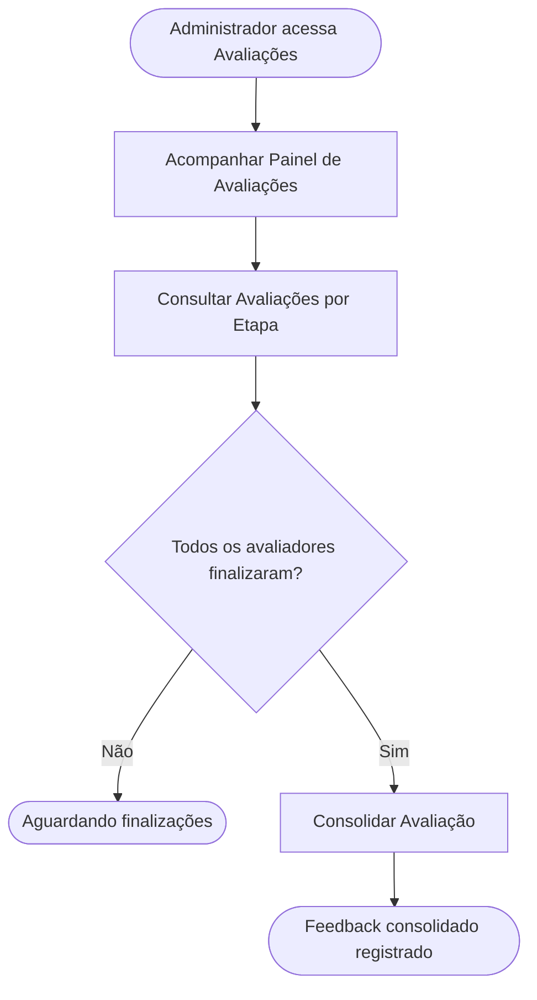

<!-- docqui: 2.8.0 | prompt: PROMPT_2A | atualizado: 2026-08-28 -->
# Feature Set: Painel Administrativo de Avaliações
> **Nível 2** - Domínio: Avaliação - `AVL-PAI`

## Descrição

Dá ao administrador a visão consolidada das avaliações em andamento e o espaço para transformar os pareceres individuais dos avaliadores em um único feedback consolidado — a voz oficial da banca — divulgado ao participante. Apresenta uma árvore por inscrição × etapa com indicadores e filtros, o detalhe com as notas por questão e o parecer de cada avaliador (auditáveis), e o editor de consolidação. A consolidação só é liberada depois que todos os avaliadores alocados finalizam. O acompanhamento é recortável por estado (UF) — com o Administrador Regional restrito às suas UFs — e mostra o andamento da consolidação de cada estado; fechado o estado na etapa, o feedback consolidado das suas inscrições deixa de ser alterável. A confidencialidade da edição não se aplica ao administrador, que enxerga todos os dados.

**Não faz**: gerar a devolutiva com apoio de IA nem liberar a devolutiva respeitando a data da etapa (isso é Apuração e Devolutiva), atribuir notas (isso é Avaliação de Projetos), nem apurar médias ou fechar etapa (isso é Apuração e Devolutiva).

---

## Features

| Feature | Prioridade | Descrição |
|---|---|---|
| [**Acompanhar Painel de Avaliações**](f-acompanhar-painel-avaliacoes.md) <small>AVL-PAI-01</small> | **P1** | Consultar a árvore de avaliações por inscrição × etapa, com KPIs agregados, filtros por premiação, etapa, estado (UF) e status de consolidação, busca e o andamento da consolidação por estado. |
| [**Consultar Avaliações por Etapa**](f-consultar-avaliacoes-etapa.md) <small>AVL-PAI-02</small> | **P1** | Ver o detalhe de uma inscrição em uma etapa: avaliadores, status, notas por questão (auditoria) e o parecer individual de cada avaliador. |
| [**Consolidar Avaliação**](f-consolidar-avaliacao.md) <small>AVL-PAI-03</small> | **P1** | Redigir e salvar o feedback consolidado da inscrição na etapa, com pré-visualização e marcação de rastreabilidade de apoio de IA; bloqueado depois de fechado o estado da inscrição na etapa. |
| [**Exportar Relatório de Avaliadores**](f-exportar-relatorio-avaliadores.md) <small>AVL-PAI-04</small> | **P2** | Gerar em planilha o acompanhamento por avaliador — totais por situação e a lista das avaliações do recorte consultado. |

---

## Fluxo Principal

---

## Dependências entre features

- Consultar Avaliações por Etapa parte de uma linha selecionada em Acompanhar Painel de Avaliações.
- Consolidar Avaliação só é habilitada quando todos os avaliadores alocados para a inscrição na etapa estão com a avaliação finalizada em Avaliação de Projetos.
- A visibilidade do painel é regida pela capability de cada etapa definida em Etapas e Configuração da Avaliação: o Regional só vê as inscrições das etapas em que seu perfil está autorizado.
- Sobre essa visibilidade incide o recorte geográfico: o Regional alcança apenas as inscrições dos estados (UFs) aos quais está vinculado, tanto na seleção de estado quanto no andamento da consolidação por estado.
- O feedback consolidado de todas as inscrições de um estado é pré-requisito do fechamento daquele estado em Encerrar Etapa por UF (`AVL-APU-03`, Apuração e Devolutiva), que em contrapartida trava a alteração do texto consolidado das inscrições do estado fechado.
- O texto consolidado registrado aqui é o mesmo registro trabalhado em Apuração e Devolutiva (geração por IA e revisão humana); a divisão entre os dois Feature Sets é documental. ⚠️ *(fronteira consolidação × devolutiva a confirmar com o produto)*

---

## Telas

| Tela | Caminho de menu | Rota (implementada) | Features atendidas | Descrição |
|---|---|---|---|---|
| Lista de Avaliações | Premiação › Avaliações | `/avaliacao-admin/avaliacoes` | **Acompanhar Painel de Avaliações** <small>AVL-PAI-01</small> | Árvore inscrição × etapa com KPIs, filtros (inclusive por estado), resumo de consolidação por estado e ações por linha |
| Detalhe da Avaliação | — | `/avaliacao-admin/avaliacoes/:inscricaoId/etapa/:etapaId` | **Consultar Avaliações por Etapa** <small>AVL-PAI-02</small> · **Consolidar Avaliação** <small>AVL-PAI-03</small> | Abas por avaliador, drawer de auditoria de notas e editor de consolidação |
---

## Permissões por perfil

> **Fonte única de permissões** deste Feature Set. As features (N3) não tratam de perfis nem permissões — qualquer acesso novo entra nesta matriz.

Perfis: **Administrador Nacional** `PIT.1`, **Administrador Regional** `PIT.3`.

| Perfil | Acompanhar Painel | Consultar por Etapa | Consolidar Avaliação |
|---|---|---|---|
| **Administrador Nacional** | ✓ | ✓ | ✓ |
| **Administrador Regional** | ✓ | ✓ | ✓ |

* **Administrador Nacional** — vê e consolida todas as inscrições, sem restrição geográfica, e acompanha o andamento da consolidação de todos os estados.
* **Administrador Regional** — vê e consolida apenas as inscrições das etapas em que a capability autoriza seu perfil, restrito aos estados (UFs) aos quais está vinculado: a seleção de estado e o andamento da consolidação por estado trazem somente essas UFs; o autor da consolidação é sempre registrado.
* **Nenhum perfil** altera o feedback consolidado das inscrições de um estado já fechado na etapa — reabrir o estado é ação de Apuração e Devolutiva, exclusiva do Administrador Nacional. → ver `AVL-APU-12` (Reabrir Etapa por UF).

---

## Changelog

| Data | Autor | Tipo | Descrição |
|---|---|---|---|
| 2026-09-01 | Especificação (docqui) | Referência atualizada | A reabertura por estado deixa de constar como feature prevista e não especificada — `AVL-APU-12` **Reabrir Etapa por UF** ganhou N3 nesta data |
| 2026-08-28 | Impacto SP05 (docqui) | N2 alterado | Recorte por estado (UF) do Administrador Regional, andamento da consolidação por estado e trava de consolidação após o fechamento do estado |
| 2026-08-25 | Engenharia reversa (docqui) | N2 criado | Gerado do N1, das HUs e do inventário APF |

---

*Links: [N1 do domínio](../README.md) · [INDEX geral](../../INDEX.md)*
