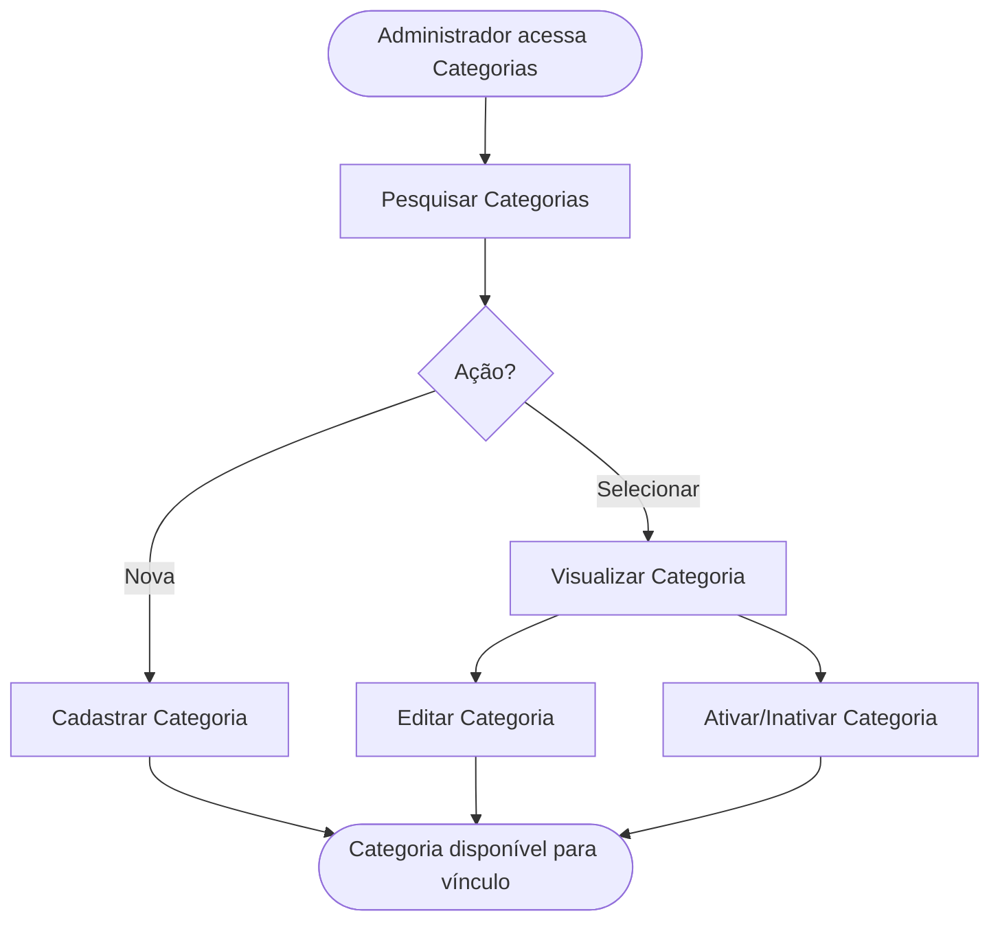

<!-- docqui: 4.1.0 | prompt: PROMPT_2A | atualizado: 2026-10-04 -->
# Feature Set: Categorias
> **Nível 2** - Major Feature Set: Configuração da Premiação - `CFG-CAT`

## Descrição

Concentra o cadastro e a manutenção das categorias da premiação — o segundo nível da estrutura, que agrupa modalidades dentro de uma edição. A categoria pode ser criada no catálogo administrativo (reutilizável entre edições) ou pela criação rápida na árvore de configuração do prêmio.

**Não faz**: vincular a categoria à premiação ou a modalidades à categoria (isso é Vínculos e Ofertas) nem avaliar as inscrições da categoria.

---

## Features

| Feature | Descrição |
|---|---|
| [**Pesquisar Categorias**](f-pesquisar-categoria.md) <small>CFG-CAT-01</small> | Localizar categorias por nome e situação no catálogo administrativo. |
| [**Cadastrar Categoria**](f-cadastrar-categoria.md) <small>CFG-CAT-02</small> | Registrar uma nova categoria, no catálogo ou por criação rápida na árvore. |
| [**Editar Categoria**](f-editar-categoria.md) <small>CFG-CAT-03</small> | Alterar nome e descrição de uma categoria. |
| [**Visualizar Categoria**](f-visualizar-categoria.md) <small>CFG-CAT-04</small> | Ver os detalhes de uma categoria e os prêmios a que está vinculada. |
| [**Ativar/Inativar Categoria**](f-ativar-inativar-categoria.md) <small>CFG-CAT-05</small> | Alternar a situação ativa/inativa da categoria (exclusão lógica). |

---

## Fluxo Principal

---

## Dependências entre features

- Editar, Visualizar e Ativar/Inativar exigem uma categoria localizada por Pesquisar Categorias.
- Cadastrar não depende de outras features; a criação rápida na árvore cria a categoria já vinculada ao prêmio (o vínculo em si pertence a Vínculos e Ofertas).
- A inativação de uma categoria não cascateia para as modalidades filhas.

---

## Telas

| Tela | Caminho de menu | Rota (implementada) | Features atendidas | Descrição |
|---|---|---|---|---|
| Catálogo de Categorias | ⚠️ a conferir | `/categorias` | **Pesquisar Categorias** <small>CFG-CAT-01</small> · **Ativar/Inativar Categoria** <small>CFG-CAT-05</small> | Lista paginada com busca por nome e situação e ação de situação |
| Formulário de Categoria | ⚠️ a conferir | `/categorias/novo` | **Cadastrar Categoria** <small>CFG-CAT-02</small> · **Editar Categoria** <small>CFG-CAT-03</small> | Formulário de dados gerais (nome, descrição) |
| Detalhe da Categoria | ⚠️ a conferir | `/categorias/:id/visualizar` | **Visualizar Categoria** <small>CFG-CAT-04</small> | Exibição dos dados e da aba de vínculos com prêmios |

---

## Permissões por perfil

> **Fonte única de permissões** deste Feature Set. As features (N3) não tratam de perfis nem permissões — qualquer acesso novo entra nesta matriz.

Perfis: **Administrador Nacional** `PIT.1`, **Administrador Regional** `PIT.3`.

| Perfil | Pesquisar | Cadastrar | Editar | Ativar/Inativar |
|---|---|---|---|---|
| **Administrador Nacional** | ✓ | ✓ | ✓ | ✓ |
| **Administrador Regional** | ✓ | — | — | — |

* **Administrador Nacional** — perfil máster que monta e mantém a estrutura da edição.
* **Administrador Regional** — visualiza o catálogo; acesso de escrita ⚠️ *(a confirmar — as HUs citam um perfil de operação de prêmio não previsto nos perfis do produto).*

---

## Changelog

| Data | Autor | Tipo | Descrição |
|---|---|---|---|
| 2026-10-04 | Regeneração 4.1.0 (docqui) | Regenerado | Artefato regenerado com o engine 4.1.0: carimbo, subtítulo com *Major Feature Set*, tabela de Features sem a coluna Prioridade (perfil `requisitos`), tabela de Telas separada da régua seguinte e rodapé com o nome do N1. Mantida a coluna Caminho de menu, convenção desta instância |
| 2026-08-25 | Engenharia reversa (docqui) | N2 criado | Gerado do N1, da HU-004 e do inventário APF |

---

*Links: [N1 Configuração da Premiação](../README.md) · [INDEX geral](../../INDEX.md)*
