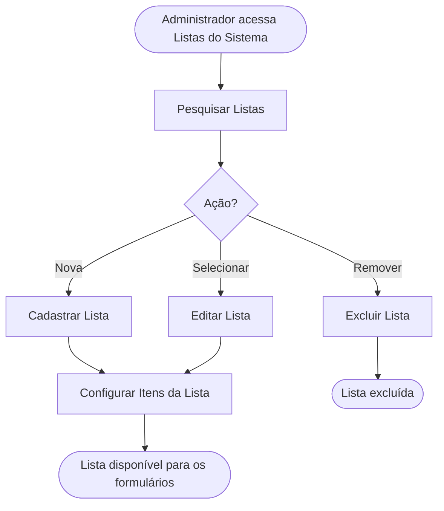

<!-- docqui: 4.1.0 | prompt: PROMPT_2A | atualizado: 2026-10-04 -->
# Feature Set: Listas do Sistema
> **Nível 2** - Major Feature Set: Configuração da Premiação - `CFG-LIS`

## Descrição

Mantém as listas de valores reutilizáveis (ex.: UFs do Brasil, gêneros) usadas como fonte de opções dos campos de seleção dos formulários dinâmicos de inscrição. Cada lista tem um código único, um nome e uma coleção de itens ordenados, com valor e texto exibido ao participante.

**Não faz**: definir os campos de formulário que consomem as listas (isso é Tipos de Participante) nem preencher a inscrição do participante.

---

## Features

| Feature | Descrição |
|---|---|
| [**Pesquisar Listas**](f-pesquisar-lista.md) <small>CFG-LIS-01</small> | Localizar listas por nome e código, com paginação. |
| [**Cadastrar Lista**](f-cadastrar-lista.md) <small>CFG-LIS-02</small> | Registrar uma nova lista com nome e código único. |
| [**Editar Lista**](f-editar-lista.md) <small>CFG-LIS-03</small> | Alterar o nome ou o código de uma lista. |
| [**Excluir Lista**](f-excluir-lista.md) <small>CFG-LIS-04</small> | Remover uma lista do sistema (exclusão lógica). |
| [**Configurar Itens da Lista**](f-configurar-itens-lista.md) <small>CFG-LIS-05</small> | Adicionar, reordenar e remover os itens (valor e texto) da lista. |

---

## Fluxo Principal

---

## Dependências entre features

- Editar, Excluir e Configurar Itens da Lista exigem uma lista localizada por Pesquisar Listas.
- Configurar Itens da Lista só é habilitada após a lista ter sido salva; em criação, a gestão de itens fica bloqueada até o primeiro salvamento dos dados básicos.
- O código da lista é único no sistema; a exclusão é lógica — a lista deixa de aparecer na listagem e no seletor dos formulários, mas não é apagada.
- Alterar os itens de uma lista afeta imediatamente todos os campos de seleção que a referenciam, inclusive em inscrições em andamento. ⚠️ *(impacto a comunicar ao administrador antes de editar listas em uso)*

---

## Telas

| Tela | Caminho de menu | Rota (implementada) | Features atendidas | Descrição |
|---|---|---|---|---|
| Lista de Listas do Sistema | ⚠️ a conferir | `/configuracao-premiacao/listas-sistema` | **Pesquisar Listas** <small>CFG-LIS-01</small> · **Excluir Lista** <small>CFG-LIS-04</small> | Tabela paginada com filtros de nome e código e ação de exclusão |
| Formulário da Lista (aba Dados) | ⚠️ a conferir | `/configuracao-premiacao/listas-sistema/novo` | **Cadastrar Lista** <small>CFG-LIS-02</small> · **Editar Lista** <small>CFG-LIS-03</small> | Nome e código; ao salvar, habilita a aba de itens |
| Itens da Lista (aba Itens) | ⚠️ a conferir | `/configuracao-premiacao/listas-sistema/:listaSistemaId/editar` *(itens editados no próprio formulário)* | **Configurar Itens da Lista** <small>CFG-LIS-05</small> | Tabela de itens com valor, texto, ordem e ações de manutenção |

---

## Permissões por perfil

> **Fonte única de permissões** deste Feature Set. As features (N3) não tratam de perfis nem permissões — qualquer acesso novo entra nesta matriz.

Perfis: **Administrador Nacional** `PIT.1`, **Administrador Regional** `PIT.3`.

| Perfil | Pesquisar | Cadastrar/Editar | Configurar itens | Excluir |
|---|---|---|---|---|
| **Administrador Nacional** | ✓ | ✓ | ✓ | ✓ |
| **Administrador Regional** | ✓ | — | — | — |

* **Administrador Nacional** — perfil máster; as listas são recurso transversal reutilizado por toda a plataforma.
* **Administrador Regional** — consulta as listas; acesso de escrita ⚠️ *(a confirmar — HU-012 cita apenas o perfil Administrador para a manutenção).*

---

## Changelog

| Data | Autor | Tipo | Descrição |
|---|---|---|---|
| 2026-10-04 | Regeneração 4.1.0 (docqui) | Regenerado | Artefato regenerado com o engine 4.1.0: carimbo, subtítulo com *Major Feature Set*, tabela de Features sem a coluna Prioridade (perfil `requisitos`), tabela de Telas separada da régua seguinte e rodapé com o nome do N1. Mantida a coluna Caminho de menu, convenção desta instância |
| 2026-08-25 | Engenharia reversa (docqui) | N2 criado | Gerado do N1, da HU-012 e do inventário APF |

---

*Links: [N1 Configuração da Premiação](../README.md) · [INDEX geral](../../INDEX.md)*
