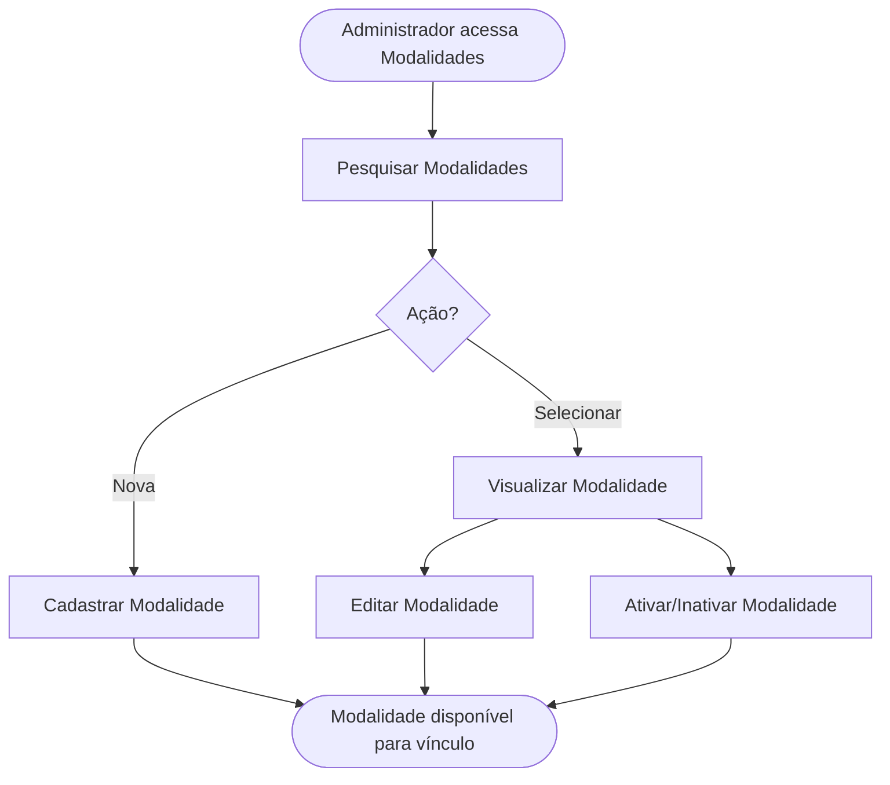

<!-- docqui: 2.8.0 | prompt: PROMPT_2A | atualizado: 2026-08-25 -->
# Feature Set: Modalidades
> **Nível 2** - Domínio: Configuração da Premiação - `CFG-MOD`

## Descrição

Concentra o cadastro e a manutenção das modalidades da premiação — o terceiro nível da estrutura, subordinado à categoria, que define as formas de participação. A modalidade tem período de inscrição próprio e link de regulamento, permitindo controle temporal independente das datas globais do prêmio.

**Não faz**: vincular a modalidade à categoria da edição nem definir os tipos de participante da modalidade (isso é Vínculos e Ofertas); também não conduz a inscrição.

---

## Features

| Feature | Prioridade | Descrição |
|---|---|---|
| [**Pesquisar Modalidades**](f-pesquisar-modalidade.md) <small>CFG-MOD-01</small> | **P1** | Localizar modalidades por nome e situação no catálogo administrativo. |
| [**Cadastrar Modalidade**](f-cadastrar-modalidade.md) <small>CFG-MOD-02</small> | **P1** | Registrar uma nova modalidade com período de inscrição e regulamento. |
| [**Editar Modalidade**](f-editar-modalidade.md) <small>CFG-MOD-03</small> | **P1** | Alterar dados, período de inscrição e link de regulamento da modalidade. |
| [**Visualizar Modalidade**](f-visualizar-modalidade.md) <small>CFG-MOD-04</small> | **P2** | Ver os detalhes da modalidade e as categorias e prêmios vinculados. |
| [**Ativar/Inativar Modalidade**](f-ativar-inativar-modalidade.md) <small>CFG-MOD-05</small> | **P2** | Alternar a situação ativa/inativa da modalidade (exclusão lógica). |

---

## Fluxo Principal

---

## Dependências entre features

- Editar, Visualizar e Ativar/Inativar exigem uma modalidade localizada por Pesquisar Modalidades.
- Cadastrar não depende de outras features; a criação rápida na árvore cria a modalidade já vinculada à categoria (o vínculo em si pertence a Vínculos e Ofertas).
- O período de inscrição só é válido quando a data de fim é posterior à de início; a inativação não cascateia para os tipos de participante filhos.

---

## Telas

| Tela | Caminho de menu | Rota (implementada) | Features atendidas | Descrição |
|---|---|---|---|---|
| Catálogo de Modalidades | ⚠️ a conferir | `/modalidades` | **Pesquisar Modalidades** <small>CFG-MOD-01</small> · **Ativar/Inativar Modalidade** <small>CFG-MOD-05</small> | Lista paginada com busca por nome e situação e ação de situação |
| Formulário de Modalidade | ⚠️ a conferir | `/modalidades/novo` | **Cadastrar Modalidade** <small>CFG-MOD-02</small> · **Editar Modalidade** <small>CFG-MOD-03</small> | Formulário com nome, descrição, regulamento e período de inscrição |
| Detalhe da Modalidade | ⚠️ a conferir | `/modalidades/:id/visualizar` | **Visualizar Modalidade** <small>CFG-MOD-04</small> | Exibição dos dados e da aba de vínculos com categorias e prêmios |
---

## Permissões por perfil

> **Fonte única de permissões** deste Feature Set. As features (N3) não tratam de perfis nem permissões — qualquer acesso novo entra nesta matriz.

Perfis: **Administrador Nacional** `PIT.1`, **Administrador Regional** `PIT.3`.

| Perfil | Pesquisar | Cadastrar | Editar | Ativar/Inativar |
|---|---|---|---|---|
| **Administrador Nacional** | ✓ | ✓ | ✓ | ✓ |
| **Administrador Regional** | ✓ | — | — | — |

* **Administrador Nacional** — perfil máster que monta e mantém a estrutura da edição.
* **Administrador Regional** — visualiza o catálogo; acesso de escrita ⚠️ *(a confirmar — as HUs citam um perfil de operação de prêmio não previsto nos perfis do produto).*

---

## Changelog

| Data | Autor | Tipo | Descrição |
|---|---|---|---|
| 2026-08-25 | Engenharia reversa (docqui) | N2 criado | Gerado do N1, da HU-005 e do inventário APF |

---

*Links: [N1 do domínio](../README.md) · [INDEX geral](../../INDEX.md)*
