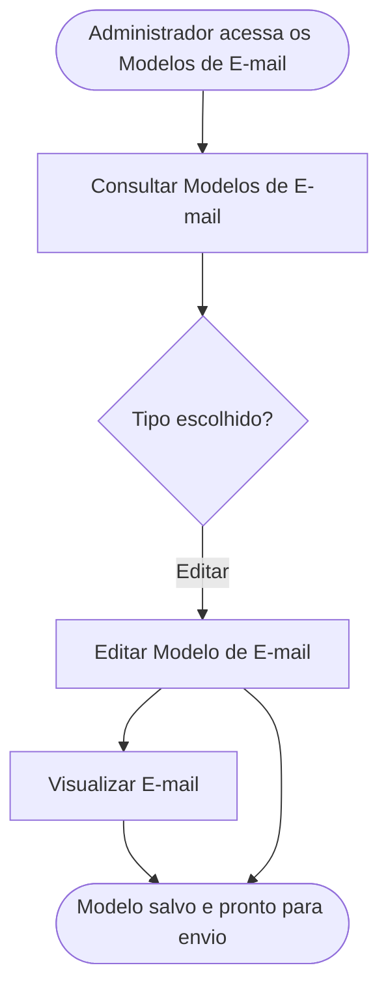

<!-- docqui: 2.23.0 | prompt: PROMPT_2A | atualizado: 2026-10-04 -->
# Feature Set: Modelos de E-mail
> **Nível 2** - Domínio: Configuração da Premiação - `CFG-EMA`

## Descrição

Configura os modelos de e-mail transacional de cada edição — os cinco tipos disparados pelo sistema: ajuste solicitado, inscrição aprovada, inscrição rejeitada, devolução ao administrador e **feedback disponível**. O administrador personaliza o assunto e o corpo com placeholders, pré-visualiza o resultado e pode restaurar o modelo padrão do sistema.

**Não faz**: enviar os e-mails (o disparo ocorre nos fluxos de Validação e Avaliação) nem definir os eventos que disparam cada modelo.

---

## Features

| Feature | Prioridade | Descrição |
|---|---|---|
| [**Consultar Modelos de E-mail**](f-consultar-modelo-email.md) <small>CFG-EMA-01</small> | **P1** | Ver os cinco tipos de e-mail da edição com o status de cada um. |
| [**Editar Modelo de E-mail**](f-editar-modelo-email.md) <small>CFG-EMA-02</small> | **P1** | Personalizar assunto e corpo com placeholders, ou restaurar o padrão. |
| [**Visualizar E-mail**](f-visualizar-email.md) <small>CFG-EMA-03</small> | **P2** | Pré-visualizar o e-mail renderizado antes de salvar. |

---

## Fluxo Principal

---

## Dependências entre features

- Editar Modelo de E-mail e Visualizar E-mail partem de um dos cinco tipos exibidos por Consultar Modelos de E-mail.
- Visualizar E-mail apenas renderiza o HTML — não substitui os placeholders, que só são resolvidos no momento do envio real.
- Restaurar o modelo padrão é uma ação dentro de Editar Modelo de E-mail e exige confirmação.
- Cada edição tem o seu próprio conjunto de modelos, independente das demais edições.

---

## Telas

| Tela | Caminho de menu | Rota (implementada) | Features atendidas | Descrição |
|---|---|---|---|---|
| Lista de Modelos de E-mail | ⚠️ a conferir | `/configuracao-premiacao/premiacoes/:premiacaoId/configurar` *(nó Premiação → aba **Termos & E-mails**)* | **Consultar Modelos de E-mail** <small>CFG-EMA-01</small> | Cartões dos cinco tipos, com ícone, rótulo e severidade |
| Diálogo de Edição de Modelo | ⚠️ a conferir | `/configuracao-premiacao/premiacoes/:premiacaoId/configurar` *(aba **Termos & E-mails** → diálogo do template)* (modal) | **Editar Modelo de E-mail** <small>CFG-EMA-02</small> · **Visualizar E-mail** <small>CFG-EMA-03</small> | Editor de assunto e corpo, botões de placeholder, preview e restaurar padrão |
---

## Permissões por perfil

> **Fonte única de permissões** deste Feature Set. As features (N3) não tratam de perfis nem permissões — qualquer acesso novo entra nesta matriz.

Perfis: **Administrador Nacional** `PIT.1`, **Administrador Regional** `PIT.3`.

| Perfil | Consultar | Editar | Visualizar |
|---|---|---|---|
| **Administrador Nacional** | ✓ | ✓ | ✓ |
| **Administrador Regional** | ✓ | — | ✓ |

* **Administrador Nacional** — perfil máster que configura os modelos de e-mail da edição.
* **Administrador Regional** — consulta e pré-visualiza os modelos disparados na validação; edição ⚠️ *(a confirmar — HU-021 cita apenas o perfil Administrador para a edição).*

---

## Changelog

| Data | Autor | Tipo | Descrição |
|---|---|---|---|
| 2026-08-25 | Engenharia reversa (docqui) | N2 criado | Gerado do N1, da HU-021 e do inventário APF |

---

*Links: [N1 do domínio](../README.md) · [INDEX geral](../../INDEX.md)*
