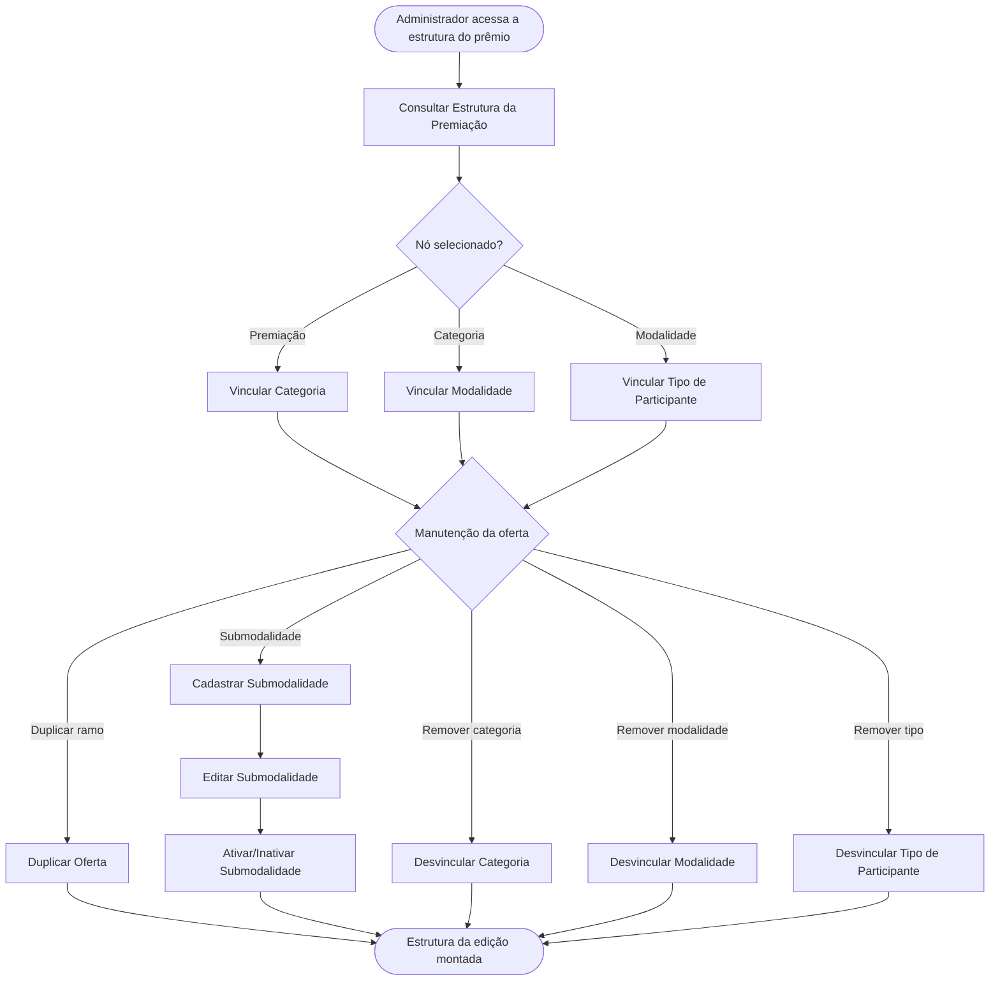

<!-- docqui: 4.1.0 | prompt: PROMPT_2A | atualizado: 2026-10-04 -->
# Feature Set: Vínculos e Ofertas
> **Nível 2** - Major Feature Set: Configuração da Premiação - `CFG-VIN`

## Descrição

Monta a estrutura da edição cruzando tipo de participante × modalidade × categoria (a oferta) na árvore hierárquica do prêmio. Vincula e desvincula categorias, modalidades e tipos de participante — existentes no catálogo ou criados no mesmo passo —, duplica ramos inteiros para reaproveitamento e mantém as submodalidades (ofertas) da edição.

**Não faz**: cadastrar os itens do catálogo em si (Categorias, Modalidades e Tipos de Participante têm Feature Sets próprios) nem criar a edição (Prêmios).

---

## Features

| Feature | Descrição |
|---|---|
| [**Consultar Estrutura da Premiação**](f-consultar-estrutura-premiacao.md) <small>CFG-VIN-01</small> | Navegar a árvore Premiação > Categorias > Modalidades > Tipos de Participante. |
| [**Vincular Categoria**](f-vincular-categoria.md) <small>CFG-VIN-02</small> | Associar uma categoria à edição, ou criá-la e vinculá-la num só passo. |
| [**Desvincular Categoria**](f-desvincular-categoria.md) <small>CFG-VIN-03</small> | Remover o vínculo da categoria com a edição (exclusão lógica do vínculo). |
| [**Vincular Modalidade**](f-vincular-modalidade.md) <small>CFG-VIN-04</small> | Associar uma modalidade à categoria da edição, ou criá-la e vinculá-la. |
| [**Desvincular Modalidade**](f-desvincular-modalidade.md) <small>CFG-VIN-05</small> | Remover o vínculo da modalidade com a categoria (exclusão lógica do vínculo). |
| [**Vincular Tipo de Participante**](f-vincular-tipo-participante.md) <small>CFG-VIN-06</small> | Associar um tipo de participante à modalidade, compondo a oferta. |
| [**Desvincular Tipo de Participante**](f-desvincular-tipo-participante.md) <small>CFG-VIN-07</small> | Remover o vínculo do tipo com a modalidade (exclusão lógica do vínculo). |
| [**Duplicar Oferta**](f-duplicar-oferta.md) <small>CFG-VIN-08</small> | Copiar um ramo da estrutura (categoria, modalidade ou tipo) com toda a subestrutura. |
| [**Cadastrar Submodalidade**](f-cadastrar-submodalidade.md) <small>CFG-VIN-09</small> | Registrar uma submodalidade (oferta) da estrutura. ⚠️ *(relação submodalidade ↔ oferta a confirmar)* |
| [**Editar Submodalidade**](f-editar-submodalidade.md) <small>CFG-VIN-10</small> | Alterar os dados de uma submodalidade. ⚠️ *(a confirmar)* |
| [**Ativar/Inativar Submodalidade**](f-ativar-inativar-submodalidade.md) <small>CFG-VIN-11</small> | Alternar a situação de uma submodalidade (exclusão lógica). |

---

## Fluxo Principal

---

## Dependências entre features

- Todas as operações de vínculo e de submodalidade partem de Consultar Estrutura da Premiação (a árvore do prêmio selecionado).
- Vincular Categoria exige a edição já criada (Prêmios); Vincular Modalidade exige uma categoria já vinculada; Vincular Tipo de Participante exige uma modalidade já vinculada.
- Desvincular remove o vínculo (exclusão lógica da junção) sem excluir o item do catálogo correspondente.
- Duplicar Oferta copia um ramo (categoria, modalidade ou tipo) com toda a sua subestrutura, agilizando o reaproveitamento entre edições.
- Editar e Ativar/Inativar Submodalidade exigem uma submodalidade previamente cadastrada.

---

## Telas

| Tela | Caminho de menu | Rota (implementada) | Features atendidas | Descrição |
|---|---|---|---|---|
| Árvore de Configuração do Prêmio | ⚠️ a conferir | `/configuracao-premiacao/premiacoes/:premiacaoId/configurar` *(árvore de estrutura, à esquerda)* | **Consultar Estrutura da Premiação** <small>CFG-VIN-01</small> · **Desvincular Categoria** <small>CFG-VIN-03</small> · **Desvincular Modalidade** <small>CFG-VIN-05</small> · **Desvincular Tipo de Participante** <small>CFG-VIN-07</small> · **Duplicar Oferta** <small>CFG-VIN-08</small> | Sidebar com a árvore da hierarquia e ações por nó |
| Diálogo de Vínculo | ⚠️ a conferir | `/configuracao-premiacao/premiacoes/:premiacaoId/configurar` *(árvore de estrutura, à esquerda)* (modal) | **Vincular Categoria** <small>CFG-VIN-02</small> · **Vincular Modalidade** <small>CFG-VIN-04</small> · **Vincular Tipo de Participante** <small>CFG-VIN-06</small> | Lista o catálogo disponível e permite criar e vincular no mesmo passo |
| Submodalidades da Oferta | ⚠️ a conferir | `/configuracao-premiacao/premiacoes/:premiacaoId/configurar` *(nó Tipo de Participante → aba **Geral**)* | **Cadastrar Submodalidade** <small>CFG-VIN-09</small> · **Editar Submodalidade** <small>CFG-VIN-10</small> · **Ativar/Inativar Submodalidade** <small>CFG-VIN-11</small> | Manutenção das submodalidades (ofertas) da estrutura |

---

## Permissões por perfil

> **Fonte única de permissões** deste Feature Set. As features (N3) não tratam de perfis nem permissões — qualquer acesso novo entra nesta matriz.

Perfis: **Administrador Nacional** `PIT.1`, **Administrador Regional** `PIT.3`.

| Perfil | Consultar | Vincular | Desvincular | Duplicar | Submodalidades |
|---|---|---|---|---|---|
| **Administrador Nacional** | ✓ | ✓ | ✓ | ✓ | ✓ |
| **Administrador Regional** | ✓ | — | — | — | — |

* **Administrador Nacional** — perfil máster que monta a estrutura completa da edição.
* **Administrador Regional** — consulta a estrutura; acesso de escrita ⚠️ *(a confirmar — as HUs citam um perfil de operação de prêmio não previsto nos perfis do produto).*

---

## Changelog

| Data | Autor | Tipo | Descrição |
|---|---|---|---|
| 2026-10-04 | Regeneração 4.1.0 (docqui) | Regenerado | Artefato regenerado com o engine 4.1.0: carimbo, subtítulo com *Major Feature Set*, tabela de Features sem a coluna Prioridade (perfil `requisitos`), tabela de Telas separada da régua seguinte e rodapé com o nome do N1. Mantida a coluna Caminho de menu, convenção desta instância |
| 2026-08-25 | Engenharia reversa (docqui) | N2 criado | Gerado do N1, da HU-011 e do inventário APF |

---

*Links: [N1 Configuração da Premiação](../README.md) · [INDEX geral](../../INDEX.md)*
