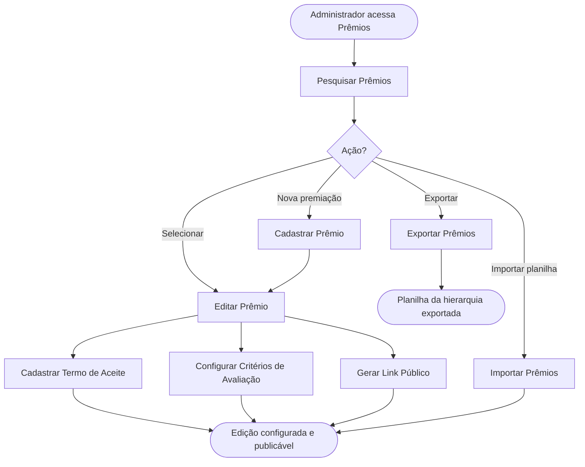

<!-- docqui: 2.8.0 | prompt: PROMPT_2A | atualizado: 2026-08-25 -->
# Feature Set: Prêmios
> **Nível 2** - Domínio: Configuração da Premiação - `CFG-PRE`

## Descrição

Concentra a criação e a manutenção da edição da premiação — o nível-raiz da estrutura — com seus dados, identidade visual, links públicos de inscrição, termos de aceite e critérios de avaliação. Também reaproveita edições anteriores por exportação e importação de toda a hierarquia em planilha.

**Não faz**: cadastrar categorias, modalidades ou tipos de participante (Feature Sets próprios) nem vinculá-los à edição (Vínculos e Ofertas); os modelos de e-mail têm Feature Set próprio.

---

## Features

| Feature | Prioridade | Descrição |
|---|---|---|
| [**Pesquisar Prêmios**](f-pesquisar-premio.md) <small>CFG-PRE-01</small> | **P1** | Localizar edições por nome e período, com paginação. |
| [**Cadastrar Prêmio**](f-cadastrar-premio.md) <small>CFG-PRE-02</small> | **P1** | Registrar uma nova edição com nome, descrição, datas e banner. |
| [**Editar Prêmio**](f-editar-premio.md) <small>CFG-PRE-03</small> | **P1** | Alterar os dados da edição e acessar termos, links e critérios. |
| [**Ativar/Inativar Prêmio**](f-ativar-inativar-premio.md) <small>CFG-PRE-04</small> | **P2** | Alternar a situação da edição (exclusão lógica), sem cascata para filhos. |
| [**Exportar Prêmios**](f-exportar-premio.md) <small>CFG-PRE-05</small> | **P2** | Gerar planilha com toda a hierarquia da edição para reaproveitamento. |
| [**Importar Prêmios**](f-importar-premio.md) <small>CFG-PRE-06</small> | **P2** | Criar uma nova edição a partir de planilha, com resumo do que foi criado. |
| [**Gerar Link Público**](f-gerar-link-publico.md) <small>CFG-PRE-07</small> | **P1** | Emitir o link público de inscrição para um tipo de participante configurado. |
| [**Consultar Links Públicos**](f-consultar-link-publico.md) <small>CFG-PRE-08</small> | **P2** | Ver os links públicos já emitidos da edição. |
| [**Cadastrar Termo de Aceite**](f-cadastrar-termo-aceite.md) <small>CFG-PRE-09</small> | **P1** | Registrar um termo (título e texto), marcável como obrigatório. |
| [**Editar Termo de Aceite**](f-editar-termo-aceite.md) <small>CFG-PRE-10</small> | **P2** | Alterar o título, o texto ou a obrigatoriedade de um termo. |
| [**Excluir Termo de Aceite**](f-excluir-termo-aceite.md) <small>CFG-PRE-11</small> | **P2** | Remover um termo da edição (exclusão lógica). |
| [**Configurar Critérios de Avaliação**](f-configurar-criterios-avaliacao.md) <small>CFG-PRE-12</small> | **P2** | Definir os critérios e pesos usados na apuração. ⚠️ *(derivado do data-model — sem HU dedicada, a confirmar)* |
| [**Carregar Imagem de Configuração**](f-carregar-imagem-configuracao.md) <small>CFG-PRE-13</small> | **P2** | Subir as imagens da identidade visual da premiação e obter o endereço público de cada uma. ⚠️ *(sem tela que a consuma — ver `global/CONFORMIDADE-CODIGO.md` § 4)* |

---

## Fluxo Principal

---

## Dependências entre features

- Editar, Ativar/Inativar e Exportar exigem um prêmio localizado por Pesquisar Prêmios.
- Cadastrar Termo de Aceite, Editar/Excluir Termo, Gerar Link Público, Consultar Links Públicos e Configurar Critérios de Avaliação só ficam disponíveis com o prêmio já criado (em modo de edição).
- Gerar Link Público exige que o tipo de participante escolhido tenha formulário e ao menos um enquadramento configurados (Tipos de Participante) e que a oferta exista (Vínculos e Ofertas).
- Importar Prêmios sempre cria uma edição nova — não atualiza uma existente.

---

## Telas

| Tela | Caminho de menu | Rota (implementada) | Features atendidas | Descrição |
|---|---|---|---|---|
| Lista de Prêmios | ⚠️ a conferir | `/configuracao-premiacao/premiacoes` | **Pesquisar Prêmios** <small>CFG-PRE-01</small> · **Ativar/Inativar Prêmio** <small>CFG-PRE-04</small> · **Exportar Prêmios** <small>CFG-PRE-05</small> · **Importar Prêmios** <small>CFG-PRE-06</small> | Lista paginada com filtros de nome e período e ações de planilha |
| Formulário do Prêmio | ⚠️ a conferir | `/configuracao-premiacao/premiacoes/novo` | **Cadastrar Prêmio** <small>CFG-PRE-02</small> · **Editar Prêmio** <small>CFG-PRE-03</small> | Dados da edição; após criar, segue em modo de edição |
| Termos de Aceite do Prêmio | ⚠️ a conferir | `/configuracao-premiacao/premiacoes/:premiacaoId/configurar` *(nó Premiação → aba **Termos & E-mails**)* | **Cadastrar Termo de Aceite** <small>CFG-PRE-09</small> · **Editar Termo de Aceite** <small>CFG-PRE-10</small> · **Excluir Termo de Aceite** <small>CFG-PRE-11</small> | Tabela de termos com editor de texto e marcação de obrigatório |
| Links Públicos de Inscrição | ⚠️ a conferir | `/configuracao-premiacao/premiacoes/:premiacaoId/configurar` *(aba **Dados** → botão “Links Públicos”)* | **Gerar Link Público** <small>CFG-PRE-07</small> · **Consultar Links Públicos** <small>CFG-PRE-08</small> | Diálogo em cascata para gerar e listar os links por tipo de participante |
| Critérios de Avaliação do Prêmio | ⚠️ a conferir | ⚠️ *sem tela implementada* (o botão de critérios de **desempate** vive em `/configuracao-premiacao/premiacoes/:premiacaoId/configurar` → aba **Avaliação & Etapas**) | **Configurar Critérios de Avaliação** <small>CFG-PRE-12</small> | Definição de critérios e pesos da edição |
| Identidade Visual da Premiação | ⚠️ a conferir | ⚠️ *sem tela implementada* (a carga da imagem existe apenas como operação de serviço) | **Carregar Imagem de Configuração** <small>CFG-PRE-13</small> | Envio do logotipo, do banner e do ícone da premiação, com o endereço público de cada imagem |
---

## Permissões por perfil

> **Fonte única de permissões** deste Feature Set. As features (N3) não tratam de perfis nem permissões — qualquer acesso novo entra nesta matriz.

Perfis: **Administrador Nacional** `PIT.1`, **Administrador Regional** `PIT.3`.

| Perfil | Pesquisar | Cadastrar/Editar | Configurar (termos/links/critérios) | Exportar/Importar | Ativar/Inativar |
|---|---|---|---|---|---|
| **Administrador Nacional** | ✓ | ✓ | ✓ | ✓ | ✓ |
| **Administrador Regional** | ✓ | — | — | — | — |

* **Administrador Nacional** — perfil máster que configura e conduz a edição da premiação.
* **Administrador Regional** — consulta as edições; acesso de escrita ⚠️ *(a confirmar — as HUs citam um perfil de operação de prêmio não previsto nos perfis do produto).*

---

## Changelog

| Data | Autor | Tipo | Descrição |
|---|---|---|---|
| 2026-08-25 | Engenharia reversa (docqui) | N2 criado | Gerado do N1, das HUs 001/002/003 e do inventário APF |

---

*Links: [N1 do domínio](../README.md) · [INDEX geral](../../INDEX.md)*
