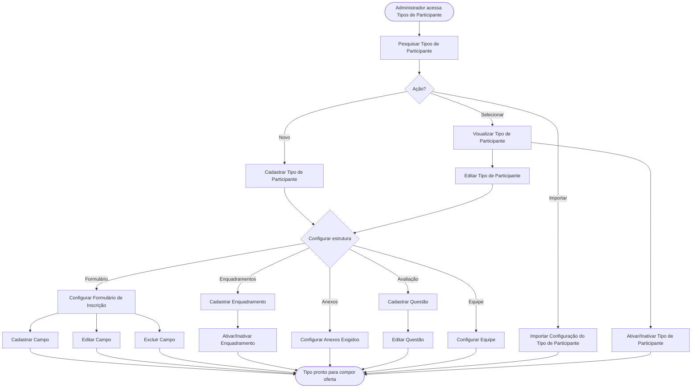

<!-- docqui: 2.8.0 | prompt: PROMPT_2A | atualizado: 2026-08-25 -->
# Feature Set: Tipos de Participante
> **Nível 2** - Domínio: Configuração da Premiação - `CFG-TIP`

## Descrição

Concentra o cadastro do tipo de participante — o quarto nível da estrutura, o mais rico em configuração — e de toda a sua estrutura de inscrição e avaliação: formulário dinâmico, campos, enquadramentos, anexos exigidos, questionário de avaliação e configuração de equipe. Cada tipo tem, no máximo, um formulário e um questionário vigentes.

**Não faz**: vincular o tipo a modalidades e categorias, nem compor a oferta (Vínculos e Ofertas); também não conduz a inscrição do participante nem a avaliação em si (Inscrição e Avaliação).

---

## Features

| Feature | Prioridade | Descrição |
|---|---|---|
| [**Pesquisar Tipos de Participante**](f-pesquisar-tipo-participante.md) <small>CFG-TIP-01</small> | **P1** | Localizar tipos de participante por nome e situação. |
| [**Cadastrar Tipo de Participante**](f-cadastrar-tipo-participante.md) <small>CFG-TIP-02</small> | **P1** | Registrar um novo tipo, com opção de inscrição em equipe. |
| [**Editar Tipo de Participante**](f-editar-tipo-participante.md) <small>CFG-TIP-03</small> | **P1** | Alterar os dados gerais e as opções de equipe do tipo. |
| [**Visualizar Tipo de Participante**](f-visualizar-tipo-participante.md) <small>CFG-TIP-04</small> | **P2** | Ver os dados, os vínculos e o resumo dos recursos configurados. |
| [**Ativar/Inativar Tipo de Participante**](f-ativar-inativar-tipo-participante.md) <small>CFG-TIP-05</small> | **P2** | Alternar a situação do tipo (exclusão lógica), sem cascata para as sub-configurações. |
| [**Configurar Formulário de Inscrição**](f-configurar-formulario.md) <small>CFG-TIP-06</small> | **P1** | Montar o formulário dinâmico do tipo, no modo simples ou em etapas. |
| [**Cadastrar Campo**](f-cadastrar-campo.md) <small>CFG-TIP-07</small> | **P1** | Adicionar um campo tipado ao formulário, com suas regras. |
| [**Editar Campo**](f-editar-campo.md) <small>CFG-TIP-08</small> | **P2** | Alterar rótulo, obrigatoriedade e demais propriedades de um campo. |
| [**Excluir Campo**](f-excluir-campo.md) <small>CFG-TIP-09</small> | **P2** | Remover um campo do formulário (exclusão lógica quando já há inscrições). |
| [**Cadastrar Enquadramento**](f-cadastrar-enquadramento.md) <small>CFG-TIP-10</small> | **P1** | Registrar uma subdivisão classificatória do tipo (ex.: ano/série). |
| [**Ativar/Inativar Enquadramento**](f-ativar-inativar-enquadramento.md) <small>CFG-TIP-11</small> | **P2** | Alternar a situação de um enquadramento; o enquadramento "Geral" é protegido. |
| [**Configurar Anexos Exigidos**](f-configurar-anexo.md) <small>CFG-TIP-12</small> | **P1** | Definir os documentos exigidos, com formato, tamanho e obrigatoriedade. |
| [**Cadastrar Questão**](f-cadastrar-questao.md) <small>CFG-TIP-13</small> | **P1** | Adicionar uma questão (discursiva ou objetiva) ao questionário de avaliação. |
| [**Editar Questão**](f-editar-questao.md) <small>CFG-TIP-14</small> | **P2** | Alterar enunciado, peso, alternativas e ordem de uma questão. |
| [**Configurar Equipe**](f-configurar-equipe.md) <small>CFG-TIP-15</small> | **P2** | Definir os tipos de vínculo e os campos extras dos membros da equipe. |
| [**Importar Configuração do Tipo de Participante**](f-importar-configuracao.md) <small>CFG-TIP-16</small> | **P3** | Trazer a estrutura de inscrição/avaliação de outra fonte via planilha. ⚠️ *(escopo da importação a confirmar frente à importação da edição em Prêmios)* |

---

## Fluxo Principal

---

## Dependências entre features

- Editar, Visualizar e Ativar/Inativar exigem um tipo localizado por Pesquisar Tipos de Participante.
- As configurações de estrutura (formulário, campos, enquadramentos, anexos, questionário e equipe) só ficam disponíveis após o tipo ter sido criado.
- Cadastrar, Editar e Excluir Campo ocorrem dentro de Configurar Formulário de Inscrição; a exclusão de campo já usado por inscrições é lógica, não física.
- Ativar/Inativar Enquadramento não se aplica ao enquadramento "Geral", criado automaticamente com o tipo e protegido contra inativação.
- Configurar Equipe só é habilitada quando o tipo permite inscrição em equipe.
- Cada tipo tem no máximo um formulário e um questionário; Importar Configuração traz essa estrutura pronta de outra fonte.

---

## Telas

| Tela | Caminho de menu | Rota (implementada) | Features atendidas | Descrição |
|---|---|---|---|---|
| Catálogo de Tipos de Participante | ⚠️ a conferir | `/tipos-participante` | **Pesquisar Tipos de Participante** <small>CFG-TIP-01</small> · **Ativar/Inativar Tipo de Participante** <small>CFG-TIP-05</small> · **Importar Configuração do Tipo de Participante** <small>CFG-TIP-16</small> | Lista paginada com busca, situação e importação |
| Formulário do Tipo (aba Geral) | ⚠️ a conferir | `/tipos-participante/novo` | **Cadastrar Tipo de Participante** <small>CFG-TIP-02</small> · **Editar Tipo de Participante** <small>CFG-TIP-03</small> | Dados gerais e opção de equipe |
| Detalhe do Tipo de Participante | ⚠️ a conferir | `/tipos-participante/:id/visualizar` | **Visualizar Tipo de Participante** <small>CFG-TIP-04</small> | Dados, vínculos e resumo de recursos |
| Construtor de Formulário | ⚠️ a conferir | `/configuracao-premiacao/premiacoes/:premiacaoId/configurar` *(nó Tipo de Participante → aba **Formulário de Inscrição**)* | **Configurar Formulário de Inscrição** <small>CFG-TIP-06</small> · **Cadastrar Campo** <small>CFG-TIP-07</small> · **Editar Campo** <small>CFG-TIP-08</small> · **Excluir Campo** <small>CFG-TIP-09</small> | Construtor visual com campos, modo e etapas |
| Enquadramentos | ⚠️ a conferir | `/configuracao-premiacao/premiacoes/:premiacaoId/configurar` *(nó Tipo de Participante → aba **Sub Modalidades**)* | **Cadastrar Enquadramento** <small>CFG-TIP-10</small> · **Ativar/Inativar Enquadramento** <small>CFG-TIP-11</small> | Lista de enquadramentos com diálogo de cadastro |
| Anexos Exigidos | ⚠️ a conferir | `/configuracao-premiacao/premiacoes/:premiacaoId/configurar` *(nó Tipo de Participante → aba **Anexos**)* | **Configurar Anexos Exigidos** <small>CFG-TIP-12</small> | Configuração dos documentos exigidos e preview |
| Construtor de Questionário | ⚠️ a conferir | `/configuracao-premiacao/premiacoes/:premiacaoId/configurar` *(nó Tipo de Participante → aba **Avaliação**)* | **Cadastrar Questão** <small>CFG-TIP-13</small> · **Editar Questão** <small>CFG-TIP-14</small> | Construtor de questões, pesos e alternativas |
| Configuração de Equipe | ⚠️ a conferir | `/configuracao-premiacao/premiacoes/:premiacaoId/configurar` *(nó Tipo de Participante → aba **Equipe**)* | **Configurar Equipe** <small>CFG-TIP-15</small> | Tipos de vínculo e campos extras dos membros |
---

## Permissões por perfil

> **Fonte única de permissões** deste Feature Set. As features (N3) não tratam de perfis nem permissões — qualquer acesso novo entra nesta matriz.

Perfis: **Administrador Nacional** `PIT.1`, **Administrador Regional** `PIT.3`.

| Perfil | Pesquisar | Cadastrar/Editar | Configurar estrutura | Importar | Ativar/Inativar |
|---|---|---|---|---|---|
| **Administrador Nacional** | ✓ | ✓ | ✓ | ✓ | ✓ |
| **Administrador Regional** | ✓ | — | — | — | — |

* **Administrador Nacional** — perfil máster que monta a estrutura de inscrição e avaliação de cada tipo.
* **Administrador Regional** — consulta os tipos; acesso de escrita ⚠️ *(a confirmar — as HUs citam um perfil de operação de prêmio não previsto nos perfis do produto).*

---

## Changelog

| Data | Autor | Tipo | Descrição |
|---|---|---|---|
| 2026-08-25 | Engenharia reversa (docqui) | N2 criado | Gerado do N1, das HUs 006 a 010 e do inventário APF |

---

*Links: [N1 do domínio](../README.md) · [INDEX geral](../../INDEX.md)*
