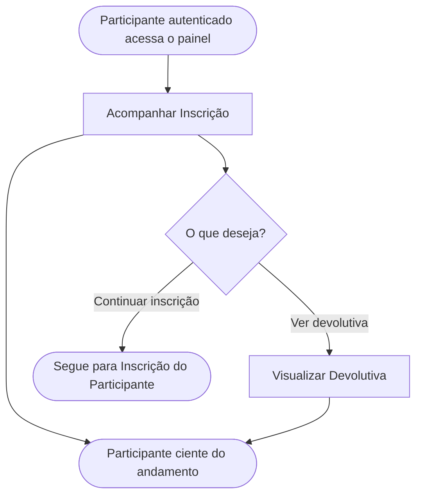

<!-- docqui: 4.1.0 | prompt: PROMPT_2A | atualizado: 2026-10-04 -->
# Feature Set: Acompanhamento
> **Nível 2** - Major Feature Set: Inscrição - `INS-ACO`

## Descrição

Reúne o painel do participante para acompanhar as suas inscrições e a avaliação recebida. Apresenta a visão consolidada de cada inscrição — estatísticas e status atual — e dá acesso à devolutiva liberada após a avaliação, cumprindo a transparência ponta a ponta prometida ao inscrito.

**Não faz**: preencher ou finalizar a inscrição (Inscrição do Participante), produzir a devolutiva ou as notas (Avaliação) nem listar os avisos in-app (Notificações). ⚠️ *(a devolutiva é produzida pela Avaliação e apenas consultada aqui; recurso apoiado por IA em evolução, conforme o N0)*

---

## Features

| Feature | Descrição |
|---|---|
| [**Acompanhar Inscrição**](f-acompanhar-inscricao.md) <small>INS-ACO-01</small> | Visualizar o painel do participante com estatísticas e a lista das inscrições, cada uma com categoria, modalidade, tipo de participante e status. |
| [**Visualizar Devolutiva**](f-visualizar-devolutiva.md) <small>INS-ACO-02</small> | Consultar a devolutiva consolidada da avaliação de uma inscrição, após liberação pela Avaliação. |

---

## Fluxo Principal

---

## Dependências entre features

- Acompanhar Inscrição não depende de outras features; é a porta de entrada do participante ao sistema após a autenticação.
- Visualizar Devolutiva é alcançada a partir de Acompanhar Inscrição e pressupõe uma inscrição já avaliada, com a devolutiva liberada pela Avaliação.
- A partir do acompanhamento, inscrições editáveis conduzem à jornada de Inscrição do Participante (INS-PAR) e o sino de avisos ao Feature Set Notificações (INS-NOT).

---

## Telas

| Tela | Caminho de menu | Rota (implementada) | Features atendidas | Descrição |
|---|---|---|---|---|
| Dashboard do Participante | ⚠️ a conferir | `/participante/dashboard` | **Acompanhar Inscrição** <small>INS-ACO-01</small> | Saudação personalizada, cards estatísticos e lista de cards de inscrição com status e ação |
| Devolutiva da Inscrição | ⚠️ a conferir | `/inscricao/minha/:inscricaoId?tab=feedbacks` | **Visualizar Devolutiva** <small>INS-ACO-02</small> | Feedback consolidado da avaliação, exibido somente após a revisão humana e a liberação |

---

## Permissões por perfil

> **Fonte única de permissões** deste Feature Set. As features (N3) não tratam de perfis nem permissões — qualquer acesso novo entra nesta matriz.

Perfis: **Participante** `PIT.2`.

| Perfil | Acompanhar | Visualizar Devolutiva |
|---|---|---|
| **Participante** | ✓ | ✓ |

* **Participante** — acompanha apenas as próprias inscrições e a respectiva devolutiva.

---

## Changelog

| Data | Autor | Tipo | Descrição |
|---|---|---|---|
| 2026-10-04 | Regeneração 4.1.0 (docqui) | Regenerado | Artefato regenerado com o engine 4.1.0: carimbo, subtítulo com *Major Feature Set*, tabela de Features sem a coluna Prioridade (perfil `requisitos`), tabela de Telas separada da régua seguinte e rodapé com o nome do N1. Mantida a coluna Caminho de menu, convenção desta instância |
| 2026-08-25 | Engenharia reversa (docqui) | N2 criado | Gerado do N1, da HU-016 e do inventário APF (módulo Inscrição) |

---

*Links: [N1 Inscrição](../README.md) · [INDEX geral](../../INDEX.md)*
