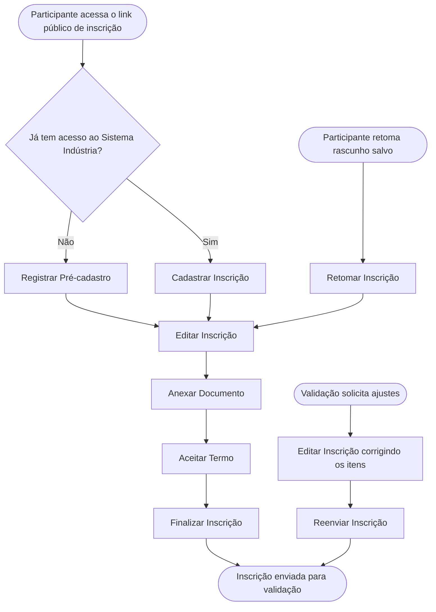

<!-- docqui: 4.1.0 | prompt: PROMPT_2A | atualizado: 2026-10-04 -->
# Feature Set: Inscrição do Participante
> **Nível 2** - Major Feature Set: Inscrição - `INS-PAR`

## Descrição

Concentra a jornada de inscrição do participante no Prêmio, do acesso ao link público até o envio para validação: iniciar o rascunho, preencher o formulário dinâmico e o questionário, enviar documentos, cadastrar a equipe, aceitar os termos e finalizar — sempre com salvamento automático e a possibilidade de salvar e retomar o trabalho. Quando a Validação solicita ajustes, o participante corrige os itens apontados e reenvia a inscrição.

**Não faz**: definir a estrutura do formulário, os termos e a configuração de anexos (Configuração da Premiação), conferir e aprovar ou rejeitar a inscrição (Validação), avaliar o projeto (Avaliação) nem autenticar o participante ou gerir sua senha (Acesso e Gestão / SSO). ⚠️

---

## Features

| Feature | Descrição |
|---|---|
| [**Cadastrar Inscrição**](f-cadastrar-inscricao.md) <small>INS-PAR-01</small> | Iniciar uma nova inscrição em rascunho a partir do link público, criando o registro de trabalho do participante. |
| [**Editar Inscrição**](f-editar-inscricao.md) <small>INS-PAR-02</small> | Preencher e alterar os dados da inscrição em andamento — formulário dinâmico, questionário e equipe — com salvamento automático. |
| [**Finalizar Inscrição**](f-finalizar-inscricao.md) <small>INS-PAR-03</small> | Submeter a inscrição para validação após a checagem dos itens obrigatórios, gerando o número de protocolo. |
| [**Reenviar Inscrição**](f-reenviar-inscricao.md) <small>INS-PAR-04</small> | Reenviar para validação uma inscrição que teve ajustes solicitados, depois de corrigidos os itens apontados. |
| [**Anexar Documento**](f-anexar-documento.md) <small>INS-PAR-05</small> | Enviar os documentos obrigatórios e opcionais exigidos pela configuração de anexos da premiação. |
| [**Aceitar Termo**](f-aceitar-termo.md) <small>INS-PAR-06</small> | Registrar o aceite dos termos obrigatórios e opcionais necessários para concluir a inscrição. |
| [**Retomar Inscrição**](f-retomar-inscricao.md) <small>INS-PAR-07</small> | Reabrir um rascunho salvo e continuar o preenchimento de onde parou. |
| [**Registrar Pré-cadastro**](f-registrar-pre-cadastro.md) <small>INS-PAR-08</small> | Informar nome e e-mail no link público para obter acesso ao Sistema Indústria e já ter a inscrição da oferta criada. |

> ⚠️ O verbo *Anexar* (INS-PAR-05) está fora da lista de verbos canônicos do framework; foi mantido por fidelidade à HU-015 e ao inventário APF. No N3, reconciliar (ex.: *Enviar Documento*) ou adotar o verbo via `VOCABULARY-OVERRIDES`.

---

## Fluxo Principal

---

## Dependências entre features

- Editar Inscrição, Anexar Documento, Aceitar Termo e Finalizar Inscrição exigem uma inscrição já iniciada por Cadastrar Inscrição.
- Retomar Inscrição pressupõe um rascunho previamente salvo por Cadastrar ou Editar Inscrição, e conduz de volta ao preenchimento.
- Finalizar Inscrição só é habilitada quando os anexos obrigatórios foram enviados (Anexar Documento) e todos os termos obrigatórios foram aceitos (Aceitar Termo).
- Reenviar Inscrição aplica-se apenas a inscrições com ajuste solicitado pela Validação, depois de o participante corrigir os itens por Editar Inscrição e Anexar Documento.
- Registrar Pré-cadastro atende quem chega pelo link público sem conta no Sistema Indústria: com nome e e-mail, a pessoa obtém o acesso e já tem a inscrição da oferta criada, seguindo direto para o preenchimento.
- Cadastrar Inscrição parte do acesso ao link público; o perfil Público realiza o pré-cadastro/login (identidade via Acesso e Gestão / SSO ⚠️) e passa a atuar como Participante.

---

## Telas

| Tela | Caminho de menu | Rota (implementada) | Features atendidas | Descrição |
|---|---|---|---|---|
| Landing Pública de Inscrição | ⚠️ a conferir | `/inscricao/:token` | **Registrar Pré-cadastro** <small>INS-PAR-08</small> · **Cadastrar Inscrição** <small>INS-PAR-01</small> | Página de entrada com a identidade visual da premiação e a jornada em passos: informar nome e e-mail, verificar o e-mail, entrar e seguir para a inscrição |
| Formulário de Inscrição | ⚠️ a conferir | `/inscricao/formulario/:inscricaoId` | **Editar Inscrição** <small>INS-PAR-02</small> · **Anexar Documento** <small>INS-PAR-05</small> · **Retomar Inscrição** <small>INS-PAR-07</small> | Formulário dinâmico em capítulos, com salvamento automático, indicador de progresso e navegação lateral |
| Termos e Finalização | ⚠️ a conferir | `/inscricao/termos/:inscricaoId` | **Aceitar Termo** <small>INS-PAR-06</small> · **Finalizar Inscrição** <small>INS-PAR-03</small> · **Reenviar Inscrição** <small>INS-PAR-04</small> | Aceite dos termos obrigatórios e opcionais e submissão da inscrição para validação |

---

## Permissões por perfil

> **Fonte única de permissões** deste Feature Set. As features (N3) não tratam de perfis nem permissões — qualquer acesso novo entra nesta matriz.

Perfis: **Participante** `PIT.2`, **Público**.

| Perfil | Cadastrar | Editar | Finalizar | Reenviar | Anexar | Aceitar Termo | Retomar |
|---|---|---|---|---|---|---|---|
| **Participante** | ✓ | ✓ | ✓ | ✓ | ✓ | ✓ | ✓ |
| **Público** | ✓ | — | — | — | — | — | — |

* **Participante** — realiza e conduz a própria inscrição, do início ao envio.
* **Público** — acesso não autenticado ao link público; ao iniciar, faz o pré-cadastro/login e passa a atuar como Participante nas demais ações. ⚠️ *(identidade e autenticação são de Acesso e Gestão / SSO; o pré-cadastro com senha descrito na HU-015 diverge do login corporativo previsto no N0 — confirmar)*

---

## Changelog

| Data | Autor | Tipo | Descrição |
|---|---|---|---|
| 2026-10-04 | Regeneração 4.1.0 (docqui) | Regenerado | Artefato regenerado com o engine 4.1.0: carimbo, subtítulo com *Major Feature Set*, tabela de Features sem a coluna Prioridade (perfil `requisitos`), tabela de Telas separada da régua seguinte e rodapé com o nome do N1. Mantida a coluna Caminho de menu, convenção desta instância |
| 2026-08-25 | Engenharia reversa (docqui) | N2 criado | Gerado do N1, da HU-015 e do inventário APF (módulo Inscrição) |

---

*Links: [N1 Inscrição](../README.md) · [INDEX geral](../../INDEX.md)*
