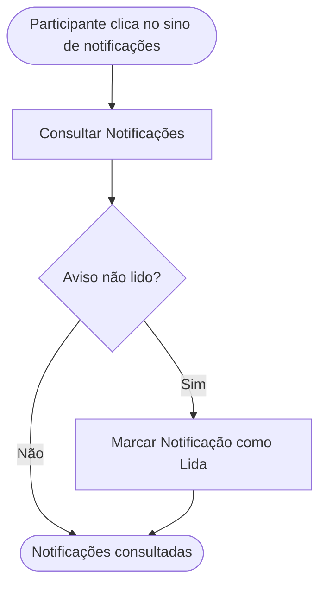

<!-- docqui: 2.8.0 | prompt: PROMPT_2A | atualizado: 2026-08-25 -->
# Feature Set: Notificações
> **Nível 2** - Domínio: Inscrição - `INS-NOT`

## Descrição

Entrega ao participante os avisos in-app sobre o andamento da sua inscrição — solicitação de ajuste, aprovação, rejeição, reenvio e disponibilidade da devolutiva. Apresenta o painel lateral com as últimas notificações e a contagem de não lidas no sino, e permite marcar cada aviso como lido.

**Não faz**: gerar os eventos que originam os avisos (Validação e Avaliação), enviar e-mails ao participante (Configuração da Premiação / Modelos de E-mail) nem tratar avisos a avaliadores e administradores. ⚠️ *(a HU-022 também descreve avisos a Avaliador/Administrador — consumidos nos respectivos domínios, embora o mecanismo de notificação seja compartilhado)*

---

## Features

| Feature | Prioridade | Descrição |
|---|---|---|
| [**Consultar Notificações**](f-consultar-notificacao.md) <small>INS-NOT-01</small> | **P1** | Abrir o painel com as últimas notificações do participante e ver a contagem de não lidas no sino. |
| [**Marcar Notificação como Lida**](f-marcar-notificacao-lida.md) <small>INS-NOT-02</small> | **P2** | Marcar um aviso como lido, atualizando o painel e o badge de não lidas. |

> ⚠️ O verbo *Marcar* (INS-NOT-02) está fora da lista de verbos canônicos do framework; foi mantido por fidelidade à HU-022 e ao inventário APF ("Marcar Notificação como Lida"). No N3, reconciliar o verbo ou adotá-lo via `VOCABULARY-OVERRIDES`.

---

## Fluxo Principal

---

## Dependências entre features

- Marcar Notificação como Lida exige uma notificação previamente listada por Consultar Notificações.
- Consultar Notificações não depende de outras features; os avisos são gerados automaticamente por eventos das inscrições (solicitação de ajuste, aprovação, rejeição, reenvio) e da avaliação.

---

## Telas

| Tela | Caminho de menu | Rota (implementada) | Features atendidas | Descrição |
|---|---|---|---|---|
| Sino e Painel de Notificações | ⚠️ a conferir | *(sem rota própria — painel lateral aberto pelo sino no cabeçalho da área do participante)* | **Consultar Notificações** <small>INS-NOT-01</small> · **Marcar Notificação como Lida** <small>INS-NOT-02</small> | Painel lateral aberto pelo sino, com as últimas 15 notificações, badge de não lidas e marcação de leitura |
---

## Permissões por perfil

> **Fonte única de permissões** deste Feature Set. As features (N3) não tratam de perfis nem permissões — qualquer acesso novo entra nesta matriz.

Perfis: **Participante** `PIT.2`.

| Perfil | Consultar | Marcar como Lida |
|---|---|---|
| **Participante** | ✓ | ✓ |

* **Participante** — vê e marca apenas os próprios avisos, relativos às suas inscrições. ⚠️ *(avisos a Avaliador/Administrador da HU-022 são tratados nos respectivos domínios)*

---

## Changelog

| Data | Autor | Tipo | Descrição |
|---|---|---|---|
| 2026-08-25 | Engenharia reversa (docqui) | N2 criado | Gerado do N1, da HU-022 e do inventário APF (módulo Inscrição) |

---

*Links: [N1 do domínio](../README.md) · [INDEX geral](../../INDEX.md)*
