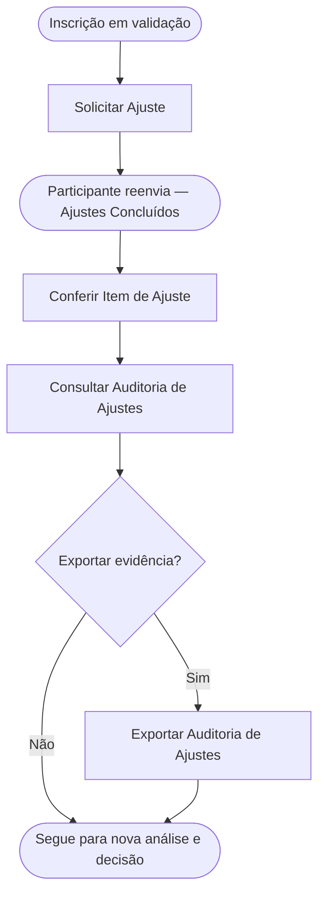

<!-- docqui: 4.1.0 | prompt: PROMPT_2A | atualizado: 2026-10-04 -->
# Feature Set: Ajustes da Inscrição
> **Nível 2** - Major Feature Set: Validação - `VAL-AJU`

## Descrição

Trata do ciclo de ajustes da inscrição durante a validação: o administrador solicita correções ao participante e, quando a inscrição retorna, audita por rodada o que foi efetivamente alterado. Preserva o histórico de cada rodada — o que foi solicitado e o que mudou entre a solicitação e o reenvio — e permite exportar essa auditoria como evidência documental.

**Não faz**: decidir a aprovação ou a rejeição da inscrição (isso é Análise e Decisão) nem realizar os ajustes em si, que são atendidos pelo participante no domínio Inscrição.

---

## Features

| Feature | Descrição |
|---|---|
| [**Solicitar Ajuste**](f-solicitar-ajuste.md) <small>VAL-AJU-01</small> | Pedir correções ao participante em uma inscrição em validação, com de 1 a 10 itens; a inscrição passa a Aguardando Ajuste e o participante é notificado por e-mail. |
| [**Consultar Auditoria de Ajustes**](f-consultar-auditoria-ajustes.md) <small>VAL-AJU-02</small> | Visualizar, por rodada, o que o participante alterou entre a solicitação e o reenvio, agrupado por superfície (respostas, documentos, equipe), com filtro de apenas alterações. |
| [**Exportar Auditoria de Ajustes**](f-exportar-auditoria-ajustes.md) <small>VAL-AJU-03</small> | Exportar em CSV todas as rodadas de ajuste fechadas da inscrição, uma linha por alteração, para evidência documental. |
| [**Conferir Item de Ajuste**](f-conferir-item-ajuste.md) <small>VAL-AJU-04</small> | Marcar, item a item, quais dos ajustes solicitados já foram atendidos, com o resumo do que ainda falta antes da decisão. |

---

## Fluxo Principal

---

## Dependências entre features

- Consultar Auditoria de Ajustes e Exportar Auditoria de Ajustes só ficam disponíveis quando existe ao menos uma rodada de ajuste fechada (solicitada por Solicitar Ajuste e reenviada pelo participante).
- Exportar Auditoria de Ajustes parte da mesma auditoria aberta por Consultar Auditoria de Ajustes.
- Solicitar Ajuste parte de uma inscrição Em Validação (Análise e Decisão) e abre uma rodada auditável; ao concluir os ajustes, o administrador retorna àquele Feature Set para aprovar ou rejeitar.
- Conferir Item de Ajuste é a marcação, item a item, dos ajustes já atendidos (contador X/Y da HU-019), feita na barra de conferência do Detalhe da Inscrição depois do reenvio; virou feature própria na conferência com o código de 2026-08-28 e ainda não tem contagem APF ⚠️.

---

## Telas

| Tela | Caminho de menu | Rota (implementada) | Features atendidas | Descrição |
|---|---|---|---|---|
| Diálogo de Solicitação de Ajuste | ⚠️ a conferir | `/validacao-inscricao/inscricoes/:inscricaoId/detalhe` (diálogo) | **Solicitar Ajuste** <small>VAL-AJU-01</small> | Lista dinâmica de 1 a 10 itens de ajuste (mínimo 10 caracteres cada) e itens pendentes de ciclos anteriores |
| Auditoria de Ajustes | ⚠️ a conferir | `/validacao-inscricao/inscricoes/:inscricaoId/detalhe` (popup) | **Consultar Auditoria de Ajustes** <small>VAL-AJU-02</small> · **Exportar Auditoria de Ajustes** <small>VAL-AJU-03</small> | Comparação por rodada (solicitado × reenviado) com tags de alteração, filtro "apenas alterações" e exportação CSV |
| Barra de Conferência de Ajustes | ⚠️ a conferir | `/validacao-inscricao/inscricoes/:inscricaoId/detalhe` | **Conferir Item de Ajuste** <small>VAL-AJU-04</small> | Lista dos itens solicitados com marcação de atendido, resumo "conferidos N de M" e as ações de decisão |

---

## Permissões por perfil

> **Fonte única de permissões** deste Feature Set. As features (N3) não tratam de perfis nem permissões — qualquer acesso novo entra nesta matriz.

Perfis: **Administrador Nacional** `PIT.1`, **Administrador Regional** `PIT.3`.

| Perfil | Solicitar Ajuste | Consultar Auditoria | Exportar Auditoria |
|---|---|---|---|
| **Administrador Nacional** | ✓ | ✓ | ✓ |
| **Administrador Regional** | ✓ | ✓ | ✓ |

* **Administrador Regional** — solicita ajustes e audita apenas inscrições das UFs a que está vinculado; cada rodada é registrada com responsável, data e itens solicitados.
* **Administrador Nacional** — atua sobre inscrições de qualquer UF. ⚠️ *(as HUs 019 e 026 citam o perfil "Administrador"/"Administrador Nacional" — mapeamento a confirmar.)*

---

## Changelog

| Data | Autor | Tipo | Descrição |
|---|---|---|---|
| 2026-10-04 | Regeneração 4.1.0 (docqui) | Regenerado | Artefato regenerado com o engine 4.1.0: carimbo, subtítulo com *Major Feature Set*, tabela de Features sem a coluna Prioridade (perfil `requisitos`), tabela de Telas separada da régua seguinte e rodapé com o nome do N1. Mantida a coluna Caminho de menu, convenção desta instância |
| 2026-08-25 | Engenharia reversa (docqui) | N2 criado | Gerado do N1, das HUs 019 e 026 e do inventário APF |

---

*Links: [N1 Validação](../README.md) · [INDEX geral](../../INDEX.md)*
