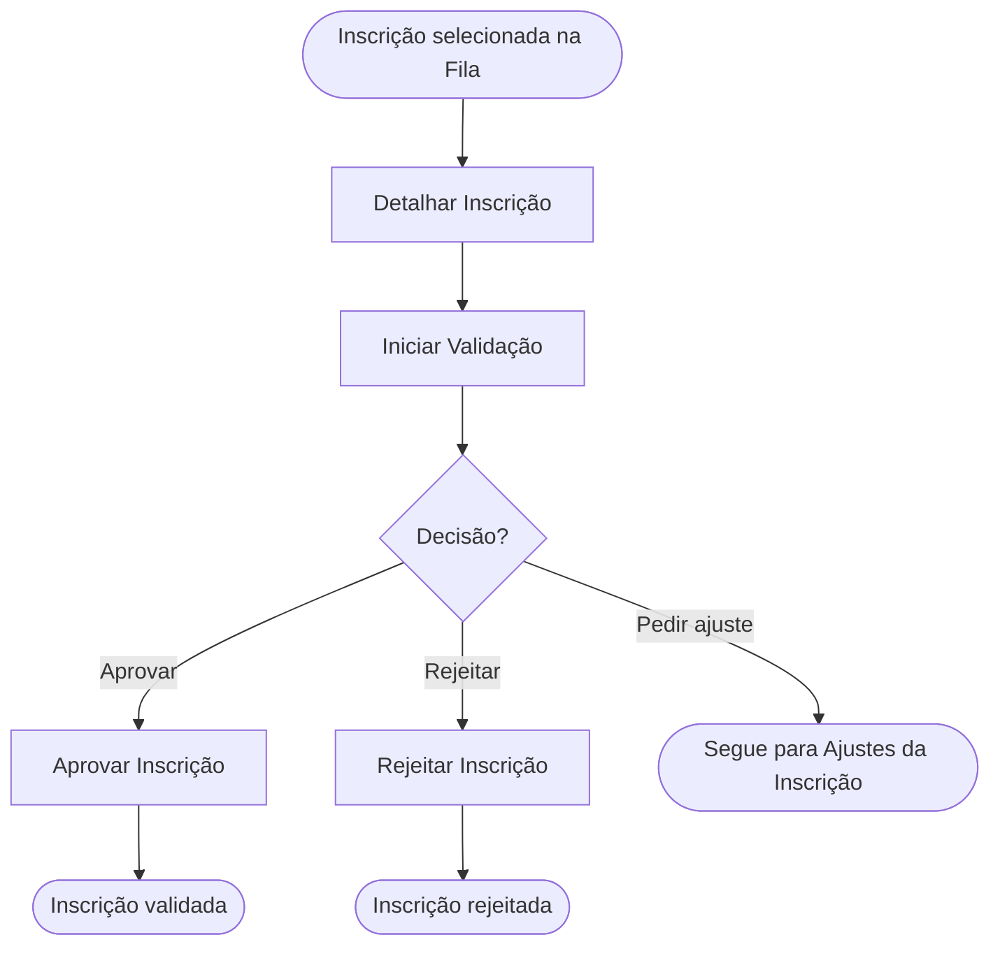

<!-- docqui: 2.8.0 | prompt: PROMPT_2A | atualizado: 2026-08-25 -->
# Feature Set: Análise e Decisão
> **Nível 2** - Domínio: Validação - `VAL-ANA`

## Descrição

Concentra a análise detalhada da inscrição e a decisão do administrador sobre ela. A partir do detalhe completo — dados do formulário, questionário, documentos, equipe, termos e histórico —, o administrador inicia a validação e a conclui aprovando ou rejeitando a inscrição, sempre com o parecer registrado. Aprovar e Rejeitar são ações distintas: cada uma é uma feature própria, com regras de parecer diferentes.

**Não faz**: pesquisar ou listar a fila de inscrições (isso é Fila e Painel de Validação) nem solicitar ajustes e auditar rodadas (isso é Ajustes da Inscrição); também não edita nem exclui a inscrição em si.

---

## Features

| Feature | Prioridade | Descrição |
|---|---|---|
| [**Detalhar Inscrição**](f-detalhar-inscricao.md) <small>VAL-ANA-01</small> | **P1** | Abrir o detalhe completo da inscrição em modo leitura: KPIs de progresso, seções retráteis (formulário, questionário, documentos, equipe, termos) e o histórico de validação em timeline. |
| [**Iniciar Validação**](f-iniciar-validacao.md) <small>VAL-ANA-02</small> | **P1** | Assumir para análise uma inscrição finalizada, mudando a situação de Finalizada para Em Validação. |
| [**Aprovar Inscrição**](f-aprovar-inscricao.md) <small>VAL-ANA-03</small> | **P1** | Concluir a validação aprovando a inscrição, com parecer opcional; a inscrição passa a Validada e segue para a avaliação. |
| [**Rejeitar Inscrição**](f-rejeitar-inscricao.md) <small>VAL-ANA-04</small> | **P1** | Concluir a validação rejeitando a inscrição, com parecer obrigatório; a inscrição passa a Rejeitada. |
| [**Editar Inscrição Validada**](f-editar-inscricao-validada.md) <small>VAL-ANA-05</small> | **P2** | Corrigir os dados de uma inscrição já validada mediante justificativa, guardando o estado antes e depois da correção. |
| [**Excluir Inscrição Validada**](f-excluir-inscricao-validada.md) <small>VAL-ANA-06</small> | **P2** | Retirar da premiação uma inscrição já validada mediante justificativa, com os dados preservados para auditoria. |

---

## Fluxo Principal

---

## Dependências entre features

- Iniciar Validação, Aprovar Inscrição e Rejeitar Inscrição exigem a inscrição aberta por Detalhar Inscrição.
- Iniciar Validação só se aplica a inscrições com situação Finalizada; Aprovar e Rejeitar só ficam disponíveis após Iniciar Validação (situação Em Validação).
- A partir do detalhe, o administrador também pode Solicitar Ajuste (VAL-AJU) em vez de decidir; após os ajustes atendidos, retorna a este Feature Set para aprovar ou rejeitar.
- ⚠️ O inventário APF lista, sob a validação, transações administrativas de Editar Inscrição e Excluir Inscrição (origem PIEL_Validar_Inscricoes) sem HU dedicada; por ora ficam fora do escopo destes Feature Sets (editar/excluir a inscrição pertence a Inscrição) — confirmar se são ações de override do administrador.

---

## Telas

| Tela | Caminho de menu | Rota (implementada) | Features atendidas | Descrição |
|---|---|---|---|---|
| Detalhe da Inscrição | — | `/validacao-inscricao/inscricoes/:inscricaoId/detalhe` | **Detalhar Inscrição** <small>VAL-ANA-01</small> · **Iniciar Validação** <small>VAL-ANA-02</small> · **Aprovar Inscrição** <small>VAL-ANA-03</small> · **Rejeitar Inscrição** <small>VAL-ANA-04</small> | Página com dados completos, KPIs de progresso, seções retráteis, histórico e ações de decisão |
| Diálogo de Validação | — | `/validacao-inscricao/inscricoes/:inscricaoId/detalhe` (diálogo) | **Aprovar Inscrição** <small>VAL-ANA-03</small> · **Rejeitar Inscrição** <small>VAL-ANA-04</small> | Diálogo de confirmação com parecer obrigatório de no mínimo 10 caracteres nas duas decisões e resumo dos itens de ajuste conferidos |
| Edição Administrativa da Inscrição | — | `/validacao-inscricao/inscricoes/:inscricaoId/detalhe` (painel) | **Editar Inscrição Validada** <small>VAL-ANA-05</small> | Painel que reabre respostas, enquadramento, equipe e anexos em modo editável, com justificativa obrigatória |
| Diálogo de Exclusão da Inscrição | — | `/validacao-inscricao/inscricoes/:inscricaoId/detalhe` (diálogo) | **Excluir Inscrição Validada** <small>VAL-ANA-06</small> | Confirmação da retirada da inscrição da premiação, com justificativa obrigatória |
---

## Permissões por perfil

> **Fonte única de permissões** deste Feature Set. As features (N3) não tratam de perfis nem permissões — qualquer acesso novo entra nesta matriz.

Perfis: **Administrador Nacional** `PIT.1`, **Administrador Regional** `PIT.3`.

| Perfil | Detalhar | Iniciar Validação | Aprovar | Rejeitar |
|---|---|---|---|---|
| **Administrador Nacional** | ✓ | ✓ | ✓ | ✓ |
| **Administrador Regional** | ✓ | ✓ | ✓ | ✓ |

* **Administrador Regional** — analisa e decide apenas inscrições das UFs a que está vinculado; toda decisão fica registrada com responsável, data e parecer.
* **Administrador Nacional** — decide sobre inscrições de qualquer UF. ⚠️ *(a HU 018 cita o perfil "Administrador", aqui mapeado para Administrador Nacional — confirmar.)*

---

## Changelog

| Data | Autor | Tipo | Descrição |
|---|---|---|---|
| 2026-08-25 | Engenharia reversa (docqui) | N2 criado | Gerado do N1, da HU 018 e do inventário APF |

---

*Links: [N1 do domínio](../README.md) · [INDEX geral](../../INDEX.md)*
