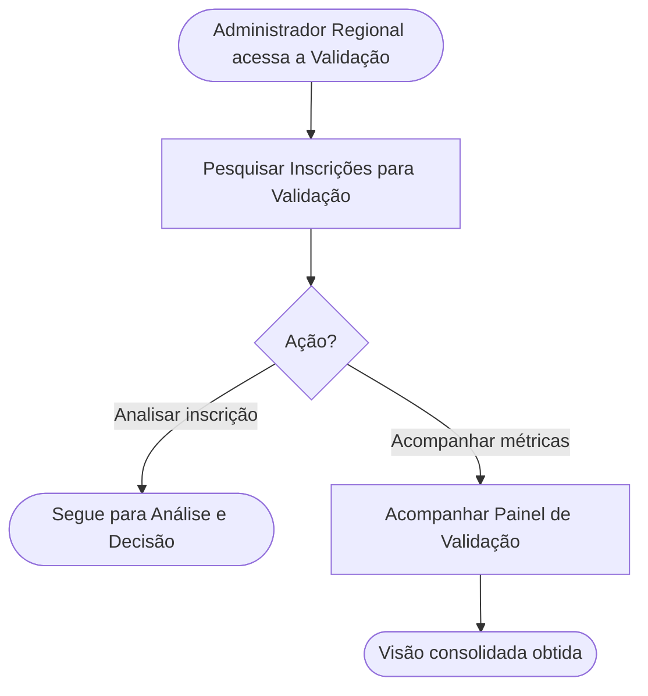

<!-- docqui: 2.8.0 | prompt: PROMPT_2A | atualizado: 2026-08-28 -->
# Feature Set: Fila e Painel de Validação
> **Nível 2** - Domínio: Validação - `VAL-FIL`

## Descrição

Reúne a porta de entrada da validação: a fila das inscrições submetidas em cada UF, com filtros em cascata e cards de indicadores por status, e o painel gerencial que consolida as métricas de validação em gráficos. É onde o administrador localiza a inscrição a analisar, acompanha o andamento consolidado antes de decidir e exporta o histórico das inscrições que sustentam as métricas. Para o Administrador Regional, o escopo é sempre restrito às UFs a que ele está vinculado.

**Não faz**: analisar a inscrição ou decidir sobre ela (isso é Análise e Decisão) nem solicitar ajustes e auditar rodadas (isso é Ajustes da Inscrição).

---

## Features

| Feature | Prioridade | Descrição |
|---|---|---|
| [**Pesquisar Inscrições para Validação**](f-pesquisar-inscricao.md) <small>VAL-FIL-01</small> | **P1** | Localizar inscrições por UF, premiação, categoria, modalidade, tipo de participante e status, com cards KPI de filtro rápido e tabela paginada. |
| [**Exportar Histórico do Painel de Validação**](f-exportar-historico-painel.md) <small>VAL-FIL-03</small> | **P2** | Levar para fora do sistema, em planilha, o histórico das inscrições que sustentam as métricas do painel — uma linha por inscrição, com nome e telefone do participante. |
| [**Acompanhar Painel de Validação**](f-acompanhar-painel-validacao.md) <small>VAL-FIL-02</small> | **P2** | Acompanhar as métricas de validação de uma premiação em gráficos de distribuição por status e por categoria ou UF. |

---

## Fluxo Principal

---

## Dependências entre features

- Acompanhar Painel de Validação é alcançado a partir da fila (botão Dashboard Gerencial) e retorna a ela; as duas features partem da mesma seleção de UF e premiação, mas são independentes entre si.
- Abrir o detalhe de uma inscrição a partir da fila leva às features de Análise e Decisão (VAL-ANA), que exigem a inscrição localizada aqui.
- Ambas as features aplicam o vínculo regional do administrador (definido em Acesso e Gestão) como recorte obrigatório de UF.
- A exportação do histórico do painel e os acessos aos relatórios administrativos a partir da fila são privativos do Administrador Nacional desde a SP05 (recurso APIPIT.22) — ver Permissões por perfil.

---

## Telas

| Tela | Caminho de menu | Rota (implementada) | Features atendidas | Descrição |
|---|---|---|---|---|
| Fila de Validação | Premiação › Validação de Inscrições | `/validacao-inscricao/inscricoes` | **Pesquisar Inscrições para Validação** <small>VAL-FIL-01</small> | Filtros em cascata, cards KPI por status, tabela paginada (10/20/50) e os acessos aos relatórios administrativos |
| Dashboard Gerencial de Validação | — | `/validacao-inscricao/dashboard` | **Acompanhar Painel de Validação** <small>VAL-FIL-02</small> | Gráfico de distribuição por status, barras empilhadas por categoria ou UF e a exportação do histórico em planilha |
---

## Permissões por perfil

> **Fonte única de permissões** deste Feature Set. As features (N3) não tratam de perfis nem permissões — qualquer acesso novo entra nesta matriz.

Perfis: **Administrador Nacional** `PIT.1`, **Administrador Regional** `PIT.3`.

| Perfil | Pesquisar | Acompanhar Painel | Exportar Histórico do Painel |
|---|---|---|---|
| **Administrador Nacional** | ✓ | ✓ | ✓ |
| **Administrador Regional** | ✓ | ✓ | — |

* **Administrador Regional** — vê e filtra apenas as inscrições e métricas das UFs a que está vinculado (UF é filtro obrigatório; com uma única UF, é aplicada silenciosamente).
* **Administrador Nacional** — acesso a todas as UFs. ⚠️ *(as HUs 017 e 023 citam o perfil "Administrador", aqui mapeado para Administrador Nacional — confirmar.)*
* **Exportar Histórico do Painel de Validação** (`VAL-FIL-03`) — feature própria desde a decisão de produto de 2026-09-01, exclusiva do Administrador Nacional (recurso APIPIT.22): o Regional continua acompanhando as métricas das suas UFs, mas não exporta o histórico.
* **Relatórios administrativos alcançados pela fila** — as ações "Relatório de Inscrições" (`AVL-APU-10`, que cobre a consulta em tela e a exportação, especificada em 2026-08-28) e "Inscrições Paradas" (`AVL-APU-06`) ficam ocultas para o Administrador Regional pelo mesmo recurso APIPIT.22; as features em si pertencem ao Feature Set Apuração e Devolutiva. A restrição de perfil foi confirmada em 2026-09-01.

---

## Changelog

| Data | Autor | Tipo | Descrição |
|---|---|---|---|
| 2026-09-01 | Especificação (docqui) | Feature acrescentada | `VAL-FIL-03` **Exportar Histórico do Painel de Validação** ganha N3 próprio, separada de `VAL-FIL-02` **Acompanhar Painel de Validação** pela decisão de produto de 2026-09-01. O Feature Set passa a ter 3 features |
| 2026-08-28 | Impacto SP05 (docqui) | Matriz alterada | Exportação do histórico do painel restrita ao Administrador Nacional (APIPIT.22); registrados os acessos aos relatórios administrativos ocultos ao Regional |
| 2026-08-25 | Engenharia reversa (docqui) | N2 criado | Gerado do N1, das HUs 017 e 023 e do inventário APF |

---

*Links: [N1 do domínio](../README.md) · [INDEX geral](../../INDEX.md)*
